# 网站使用CLOUDFLARE(CF境外CDN加速站)来使用SAAS优选自选IP教程

**简单介绍**
CloudFlare SAAS，简单来说是为了给自助建站类似的网站，而提供的用户自定义域名接入的功能。
比如您做一个系统，可以给用户开通分站等功能，您希望通过api的方式将您的用户自己的域名解析到CloudFlare当中，而不是直接解析到源站。
考虑到本文章是为了让大家使用自选IP,因此在思路上将不会以上述分站的逻辑来解释说明。

**其他说明**
由于CloudFlare官方IP是泛播路由，意味着同一个IP在不同地区不同运营商所链接的机房是不同的。
因此公共优选并不适合非网站用途，如果需要建议使用CloudflareSpeedTest项目自行测试本地最优的IP地址。
完整文章一共写了多篇，本帖子删减了一些，如果需要更加完整的教程请访问以下链接获取。
https://www.baota.me/tag/cloudflare.html
创作不易，转载请留链接，感谢支持。

**准备事项**
CloudFlare账户：
注册不难就不说了。不过需要贝宝以及海外银行卡认证来开通CloudFlare SAAS（自定义主机名）功能。
[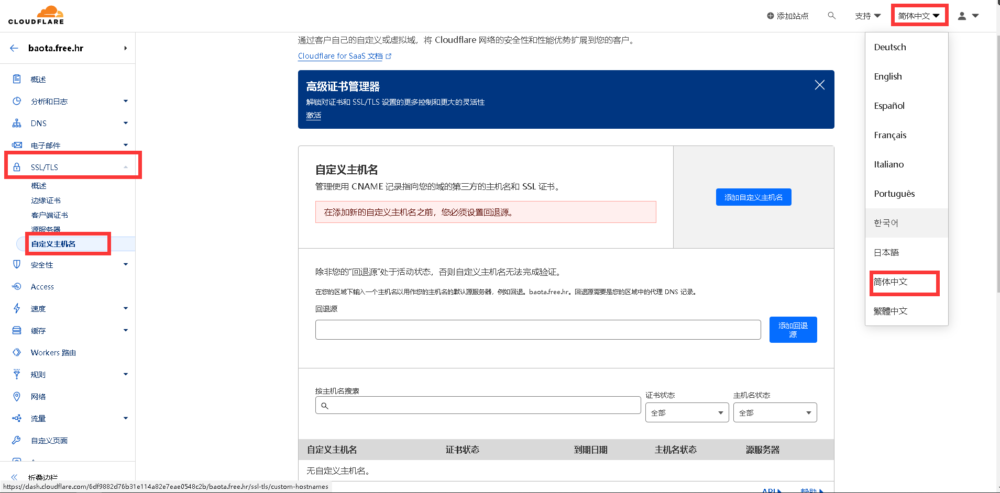](https://www.xgiu.com/content/uploadfile/202403/c4461709385849.png)

**网站域名：**
用于建站并使用自选IP的域名，并且该域名的DNS解析服务器不能使用CloudFlare，因为严格来讲CloudFlare是支持DNS解析的CDN服务，您使用该DNS解析会造成CDN配置冲突。
请注意如果你使用www或者@主机名做站，您应该理解为这是两个网站域名，如www.youname.com、youname.com。
文章示例中会使用web.baota.me，域名在华为云解析。

**回源域名：**
该域名NS将被CloudFlare接管，因此无法用于自选IP等用途。
如果您要接入的网站域名较多，请尽可能的选择长久使用的域名，而不是年抛域名。
不然年抛域名到期后需要耗费很多时间用来迁移域名。
可以使用一些免费域名如eu.org，或其他比较低价的域名如.free.hr、6位数字.xyz，需要注意不是所有二级域名都支持ns接入到CloudFlare的。可以在下面文章中查看并获取其他后缀的域名。
https://www.baota.me/post-410.html
本文章将使用在dash.gacjie.cn注册的baota.free.hr域名。

**1.回源域名NS接入到CloudFlare**

如果您的回源域名已经NS添加到CloudFlare，此步可以跳过。

将回源域名(baota.free.hr)添加到CloudFlare,应该不难就不一步一步的写了。

[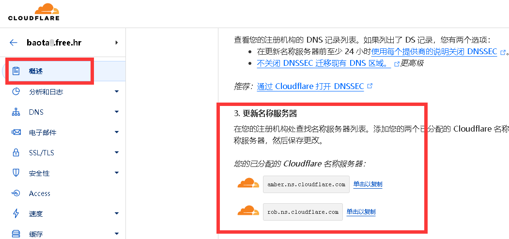](https://www.xgiu.com/content/uploadfile/202403/bb961709385849.png)


**2.回源域名创建回退源地址**

[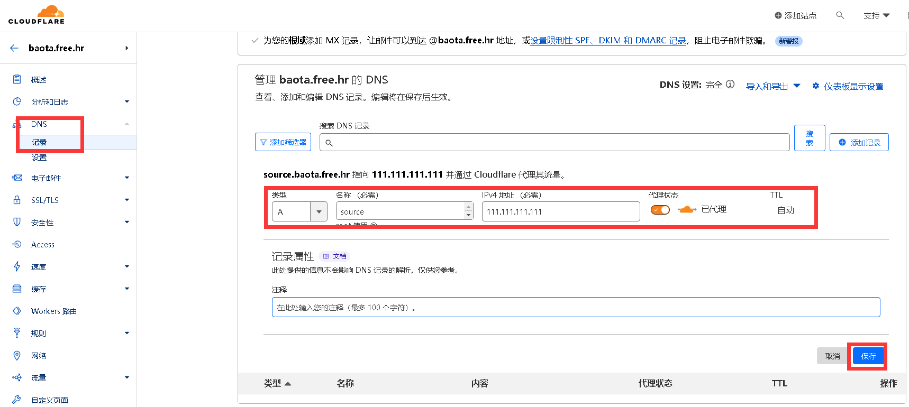](https://www.xgiu.com/content/uploadfile/202403/16c21709385849.png)

> source可以是@也可以是任意的子域名前缀，但我比较建议使用子域名创建。
>
> 111.111.111.111是你的网站源服务器，您可以改为您的源站IP地址。
>
> 代理状态(小云朵),请务必开启，如果关闭您后续添加在自定义主机名里面的网站域名将全部回源。


**3.自定义主机名添加回退源地址**

[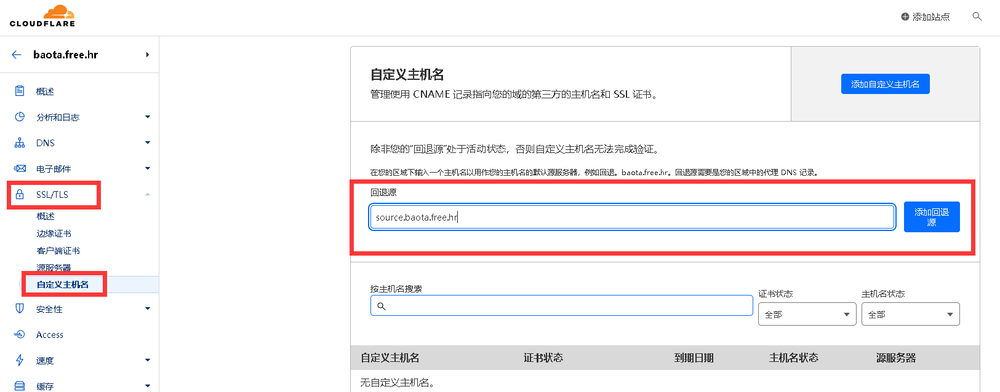](https://www.xgiu.com/content/uploadfile/202403/03861709385849.png)

**source.baota.free.hr**是上一步创建的回退源地址，请改为您创建的域名。

**4.自定义主机名添加网站域名**

确保回退源已经生效，然后点击右上角的添加自定义主机名。

[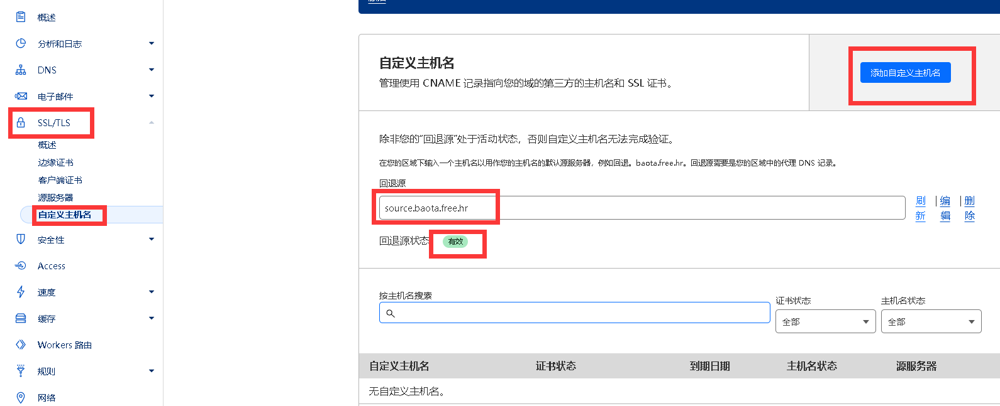](https://www.xgiu.com/content/uploadfile/202403/f42d1709385849.png)

填写您的网站域名，这里的**web.baota.me**是示例域名

[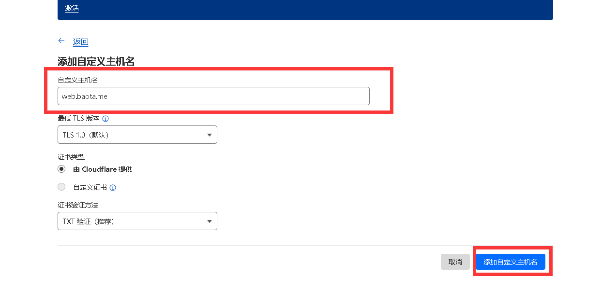](https://www.xgiu.com/content/uploadfile/202403/f14d1709385849.png)

复制自定义主机名的 DCV 委派提供的信息用来下一步的域名验证。

[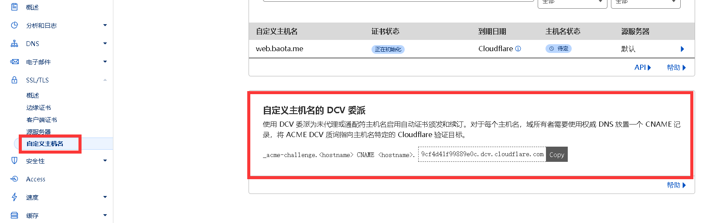](https://www.xgiu.com/content/uploadfile/202403/c3a91709385849.png)

到您的网站域名NS解析服务商，添加DCV 委派验证记录。

[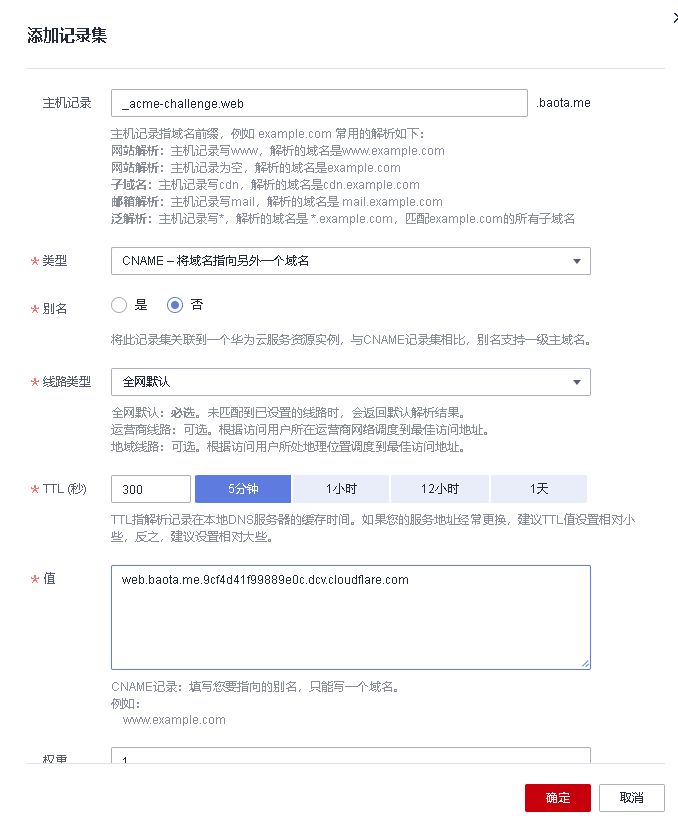](https://www.xgiu.com/content/uploadfile/202403/8dbd1709385849.png)

```
这里使用的域名是web.baota.me 因此主机名为：_acme-challenge.web 值为：web.baota.me.9cf4d41f99889e0c.dcv.cloudflare.com

如果我使用的是baota.me 主机名应该为： _acme-challenge 值为：baota.me.9cf4d41f99889e0c.dcv.cloudflare.com

如果我使用的是www.baota.me 主机名应该为：_acme-challenge.www 值为：www.baota.me.9cf4d41f99889e0c.dcv.cloudflare.com
```


**5.添加网站域名的解析记录指向回退源**

[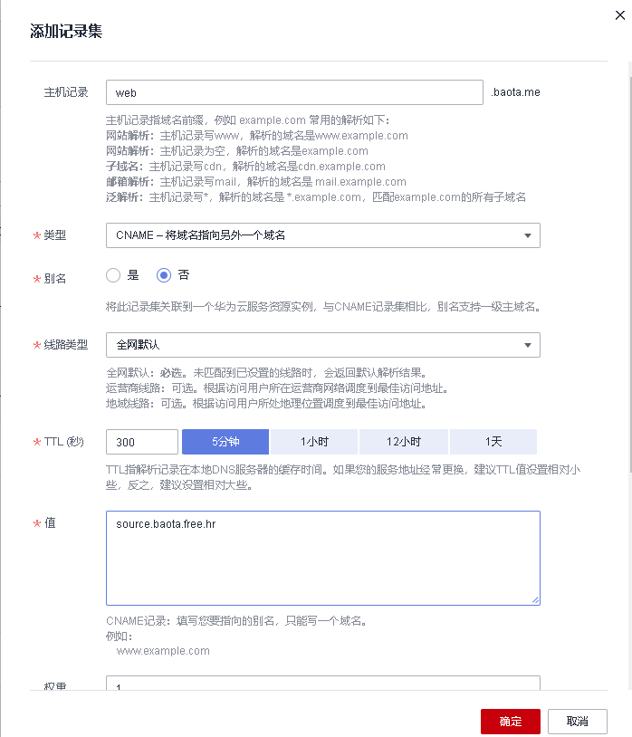](https://www.xgiu.com/content/uploadfile/202403/cf881709385849.png)

**6.浏览器访问一次网站域名**

**7.正常情况下**，刷新一下CloudFlare自定义主机名页面，应该已经完成验证了，如果没有可能要等待一段时间，或者需要检查上述配置是否出错。

[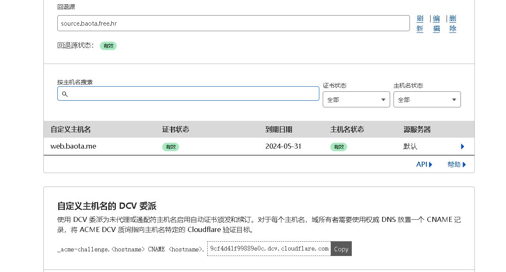](https://www.xgiu.com/content/uploadfile/202403/80ff1709385849.png)

**8.补一张图用于解析配置检查**

[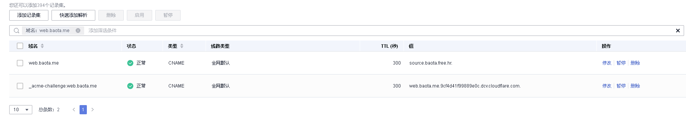](https://www.xgiu.com/content/uploadfile/202403/b7fe1709385849.png)

**挑选域名**
由于CNAME地址会有被污染、域名所有者不维护等情况，为了方便更新，该列表会单独一个页面展示。本文章将使用cloudflare.182682.xyz域名来做示例优选域名。


1.CloudFlare公共优选Cname域名列表
https://www.baota.me/post-411.html


2.炸了吗HTTP网站测速工具
https://zhale.me/http/

3.使用炸了吗网站测速工具测试网址使用指定公共优选地址的速度

[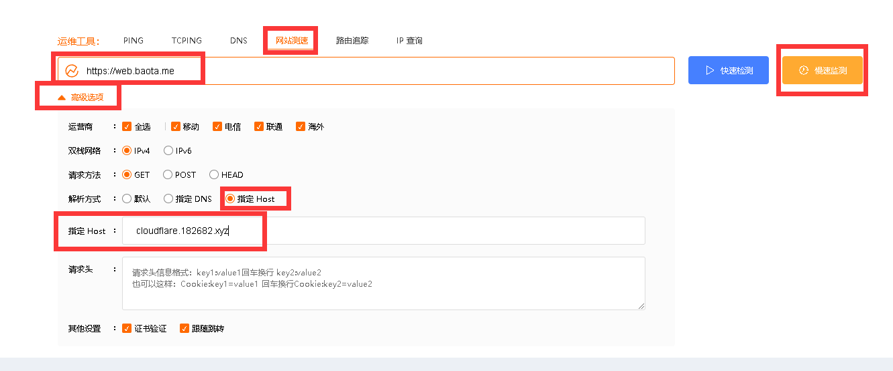](https://www.xgiu.com/content/uploadfile/202403/17341709385849.png)

**4.建议说明**
1.挑选时不要只看小地图，应该根据平均访问速度，最大访问速度，失败节点数等综合判断。

2.因为有些非官方的优选IP不支持80或者443端口。
因此测试时建议对http、https链接单独测试。

3.如果您的网站并发过低建议使用慢速监测。
快速测试：模拟用户同时访问指定网站
慢速监测：模拟用户依次访问指定网站

**解析域名**

将优选域名解析到国内线路上

[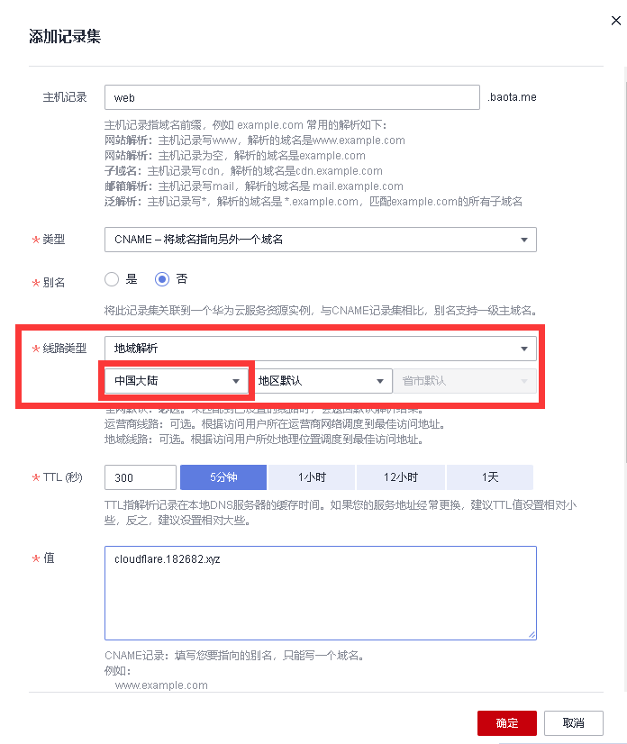](https://www.xgiu.com/content/uploadfile/202403/a08e1709385849.png)

补充截图用于校验设置

[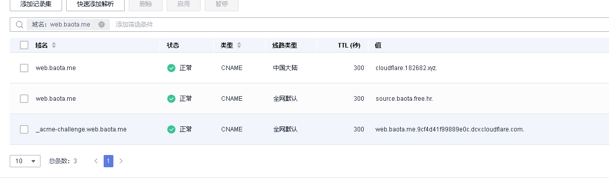](https://www.xgiu.com/content/uploadfile/202403/36941709385849.png)

**建议说明**
1.国外线路解析到回退源域名是为了避免被监测到删除已添加的网站域名。

2.优选域名一般都会只优选国内线路，因此国外线路大概率没有配置。

3.默认回退源域名一般情况下，国外访问最近策略，会比自定义IP效果要好。

**CF2DNS自动更新使用教程**
教程正在编写中........


缓存首页以及html页面

[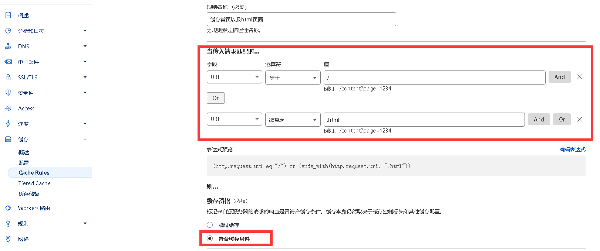](https://www.xgiu.com/content/uploadfile/202403/d4601709385849.png)

