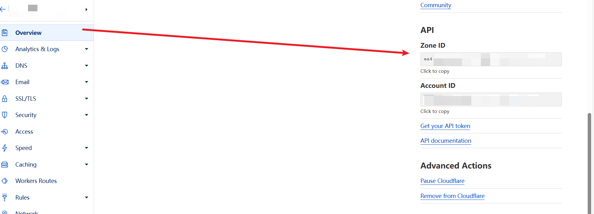
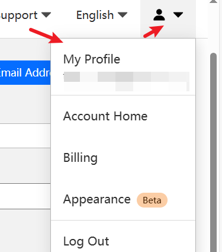
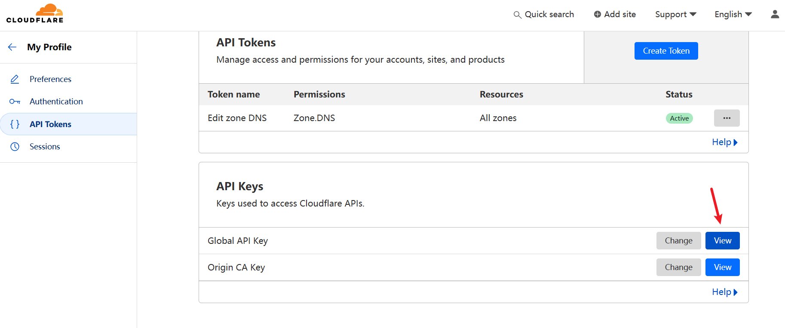
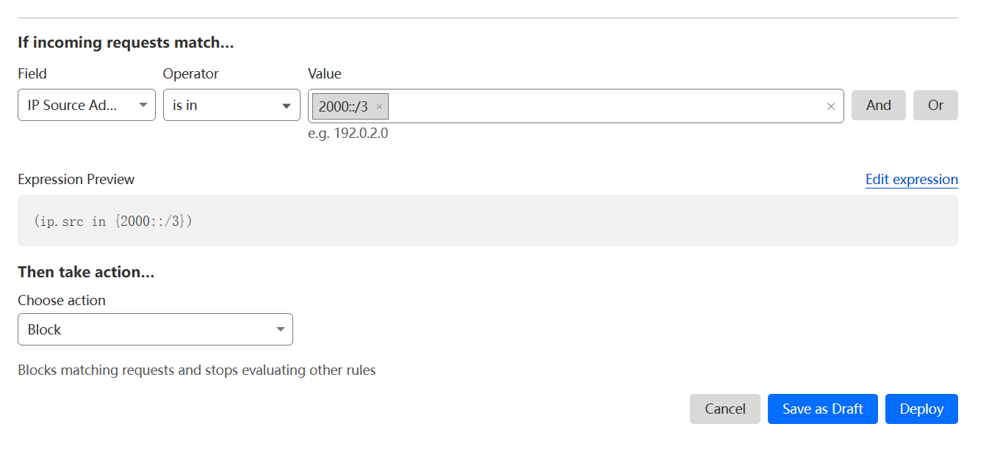

# Cloudflare完全禁用IPv6

PV6是互联网协议的发展趋势，而且IPV6兼容现在的互联网，能支持IPV6的网络情况下设备会优先访问IPV6地址。

cloudflare是一家CDN行业的大厂，它们的节点不仅支持IPV4/IPV6访问，还支持IPV6回源，尤其是对于攻击的防御基本是无限的，默认使用是很省心的。

但是有些时候，可能不需要客户端的访问(比如谷子之前加入统计鸟的积分计划，貌似不统计IPV6的流量)

开启了小云朵的网站，Cloudflare默认会为网站分配IPv4以及IPv6，且免费版默认不可以通过面板关闭。
关闭IPv6在某些场景下可能很有帮助，以下两步可以完全禁用Cloudflare分配的IPv6解析。

**第一步**。获取key以及需要关闭ipv6解析的域名的zone id。
zone id获取

**key获取**




```
curl -X PATCH "https://api.cloudflare.com/client/v4/zones/替换成你的zone id/settings/ipv6" \
     -H "X-Auth-Email: 登录邮箱" \
     -H "X-Auth-Key: 替换成你的key" \
     -H "Content-Type: application/json" \
     -d '{
        "value": "off"
     }'
```

**第二步**。防火墙禁止ipv6访问。
