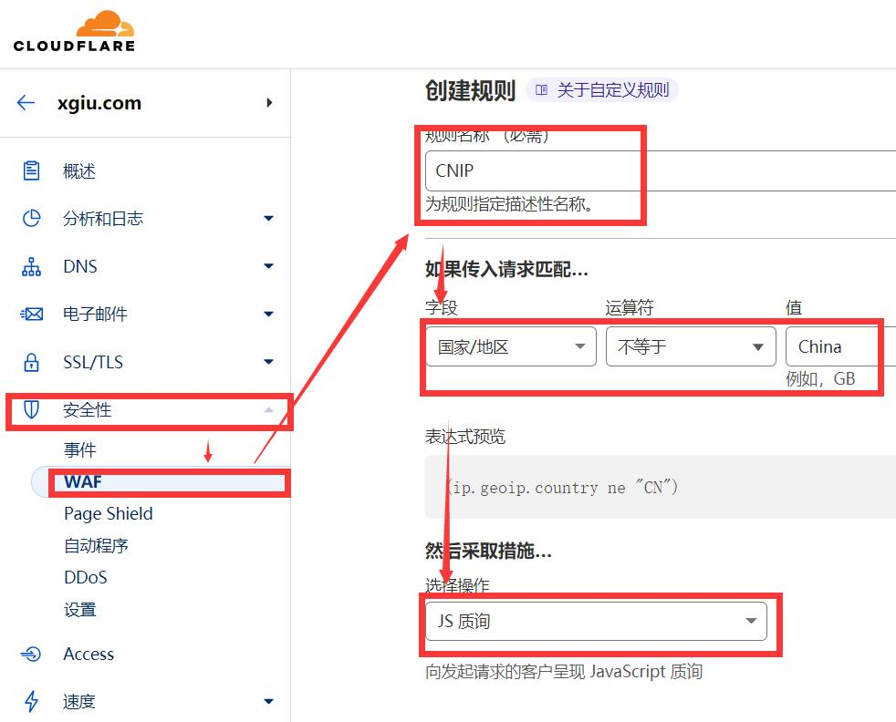
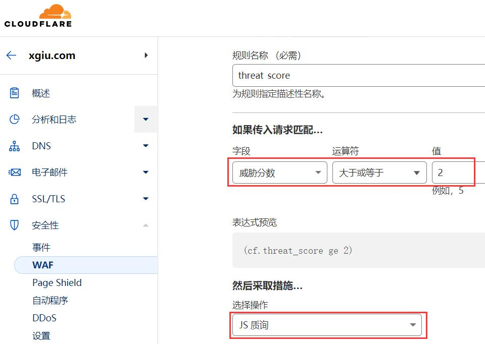
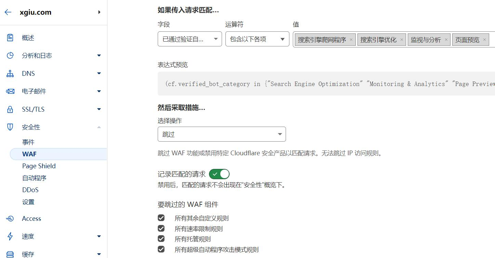

# WAF防火墙规则设定这两条就够了

在之前的被打过程中，很容易看到国内的网络环境好一些，所以攻击烈度不会很高也不会很持久，来自海外ip的攻击不仅量大，而且持续时间长，很容易导致小站无法正常访问。所以第一步，先将境外IP设置为需要验证访问。

1：对海外IP添加验证
登录CloudFlare官网，然后选择域名，在安全性设置当中创建WAF规则，将非国内的IP设置为验证才能访问。毕竟都是中文站，来自境外的访问就多验证一下吧。

2：开启恶意访问自动识别
免费用户能够创建五条规则，第二条规则是自动识别来访的IP有无恶意，实测类似Keyword这样如果是含有不规则码，会自动被CF阻止。

同样在安全性设置当中创建WAF规则，传入匹配的时候选择威胁分数，填写大于或者等于2，选择操作阻止或者JS验证都可以。

谷子在之前看到有教程，将“自动验证的程序”设置为阻止，在后续的日志当中发现，竟然将来自搜索引擎的蜘蛛也都拦截了。如果一定要设置，可以选择跳过所有可能的蜘蛛等程序。

