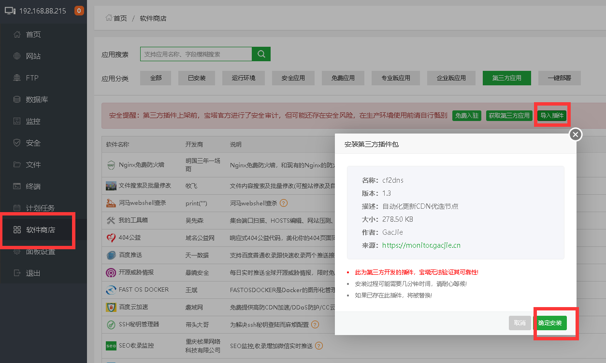
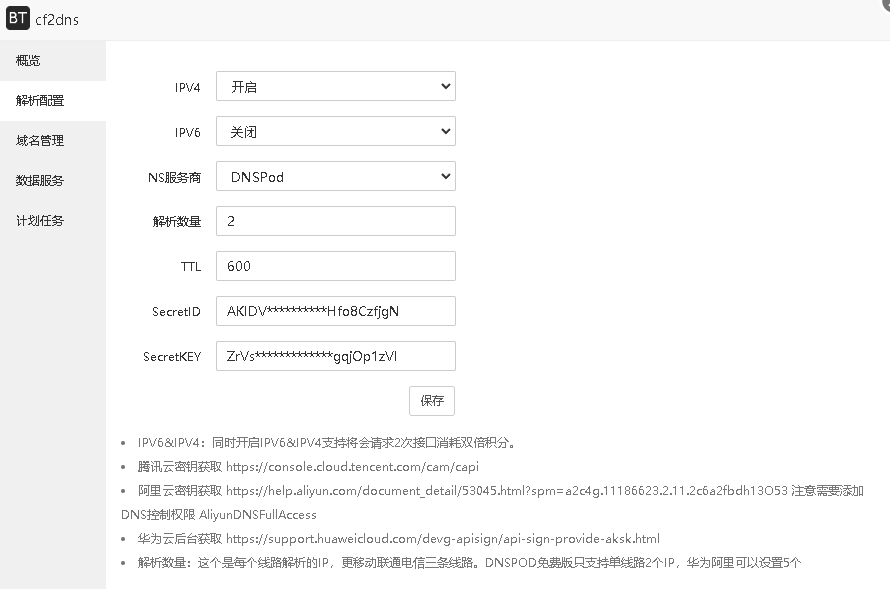
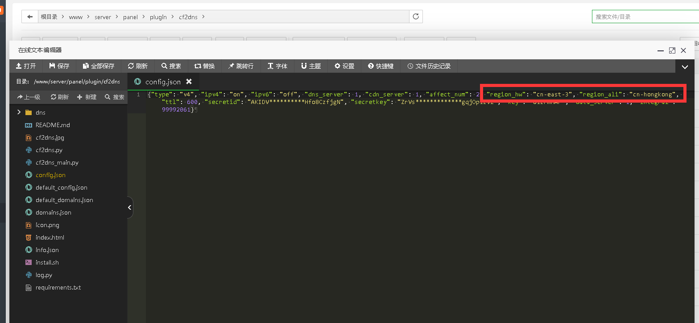
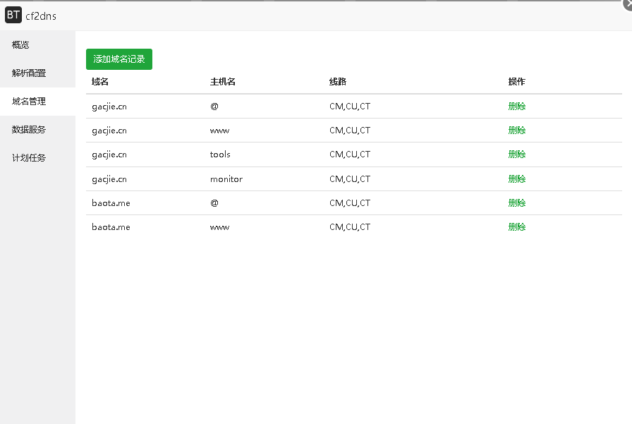
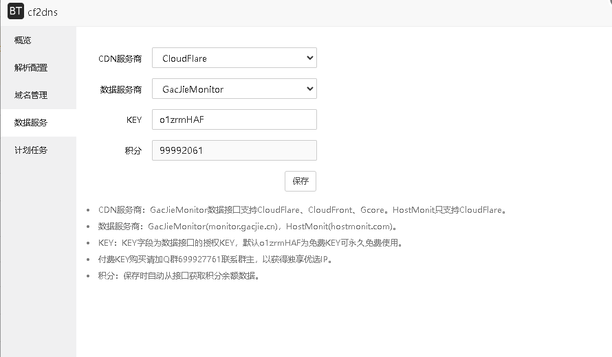
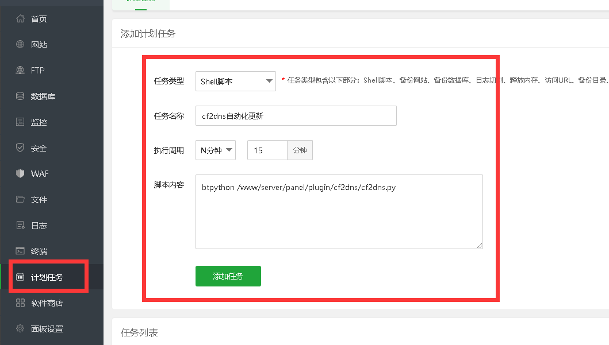
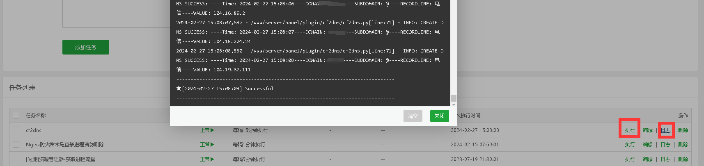

# 使用宝塔cf2dns插件更新CloudFlare优选IP

##### 简单介绍

为了方便部署，因此将原项目github.com/ddgth/cf2dns做成了宝塔插件。
功能上主要用于将CloudFlare CloudFront Gcore优选IP地址解析到您的域名记录中。

##### 准备事项

使用本教程前请先查看文章 [CloudFlare SAAS(cname) 接入网站域名](http://localhost:3000/#/Cloudflare/CloudFlareSAAS接入网站域名) 使用SAAS功能接入后再查看本教程操作。

**域名**

描述

请将您的域名ns服务商修改更换为，腾讯云、阿里云、华为云国内版。
可以使用非网站域名使用cname方式，提供服务。

**宝塔Linux面板**

描述

需要一台安装了宝塔Linux面板的服务器用来安装插件。

##### 项目地址

https://github.com/gacjie/cf2dns/

##### 下载插件

https://github.com/gacjie/cf2dns/releases/latest

##### 注意事项

插件安装时请关闭宝塔系统加固插件，会终止安装脚本的执行。
插件只会更新电信、移动、联通三网线路的IP，因此还需要将回退源设置到默认线路上。
使用插件前请确保您的网站域名使用cname或saas方式接入，并且域名解析在dnspod、华为云、阿里云。

##### 安装插件

##### 配置DNS接口信息

描述

IPV6&IPV4：同时开启IPV6&IPV4支持将会请求2次接口消耗双倍积分。

腾讯云密钥获取 https://console.cloud.tencent.com/cam/capi

阿里云密钥获取 https://help.aliyun.com/document_detail/53045.html?spm=a2c4g.11186623.2.11.2c6a2fbdh13O53 注意需要添加DNS控制权限 AliyunDNSFullAccess

华为云后台获取 https://support.huaweicloud.com/devg-apisign/api-sign-provide-aksk.html

解析数量：这个是每个线路解析的IP，更移动联通电信三条线路。DNSPOD免费版只支持单线路2个IP，华为阿里可以设置5个

##### 国际版配置

描述

由于我没有国际版账户，因此没法开发测试，已知阿里云华为云可以把地域改为账号所在地域即可使用国际版账号。

华为云可用地区区域代码 https://developer.huaweicloud.com/endpoint?DNS

阿里云可用地区区域代码
https://help.aliyun.com/document_detail/2355662.html?spm=a2c4g.2355663.0.0.6a5e1e84twtIER

##### 网站域名

描述

默认的域名为示例域名，请自行删除。

域名必须提前添加接入到您使用的NS解析服务商。

##### 配置IP数据服务商

描述

CDN服务商：GacJieMonitor数据接口支持CloudFlare、CloudFront、Gcore。HostMonit只支持CloudFlare。

数据服务商：GacJieMonitor(monitor.gacjie.cn)，HostMonit(hostmonit.com)。

KEY：KEY字段为数据接口的授权KEY，默认o1zrmHAF为免费KEY可永久免费使用。

GacJieMonitor付费KEY购买请加Q群699927761联系群主，以获得独享优选IP。

积分：保存时自动从接口获取积分余额数据。

##### 设置计划任务

描述

插件不会自动配置计划任务

请配置好插件设置以及需要更新的域名后自行手动添加到宝塔计划任务中

脚本命令：btpython /www/server/panel/plugin/cf2dns/cf2dns.py

请设置15分钟以上的执行频率

配置好计划任务后，请执行一次查看日志是否运行正常。