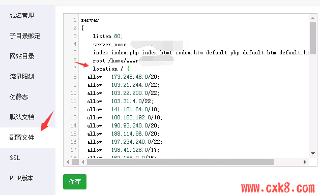

# 宝塔NGINX网站只允许CLOUDFLARE CDN的IP访问方法

对于使用Cloudflare的CDN的站长，需要设置服务器只允许来自CF的回源请求IP连接网站，这种其实有利于网站防御，也可以一定程度上减少被扫描发现源IP。方法如下：
在网站设置里面，配置文件，放置在server里面(2021-08-16更新,包含目前CF的全部回源IP段)

**Cloudflare ip:**[IP 范围 | Cloudflare](https://www.cloudflare.com/zh-cn/ips/)

```
location / {
allow   173.245.48.0/20;
allow   103.21.244.0/22;
allow   103.22.200.0/22;
allow   103.31.4.0/22;
allow   141.101.64.0/18;
allow   108.162.192.0/18;
allow   190.93.240.0/20;
allow   188.114.96.0/20;
allow   197.234.240.0/22;
allow   198.41.128.0/17;
allow   162.158.0.0/15;
allow   104.16.0.0/13;
allow   104.24.0.0/14;
allow   172.64.0.0/13;
allow   131.0.72.0/22;
allow   2400:cb00::/32;
allow   2606:4700::/32;
allow   2803:f800::/32;
allow   2405:b500::/32;
allow   2405:8100::/32;
allow   2a06:98c0::/29;
allow   2c0f:f248::/32;
  deny    all;
}
```


[](https://www.xgiu.com/content/uploadfile/202110/0af91635236292.png)

