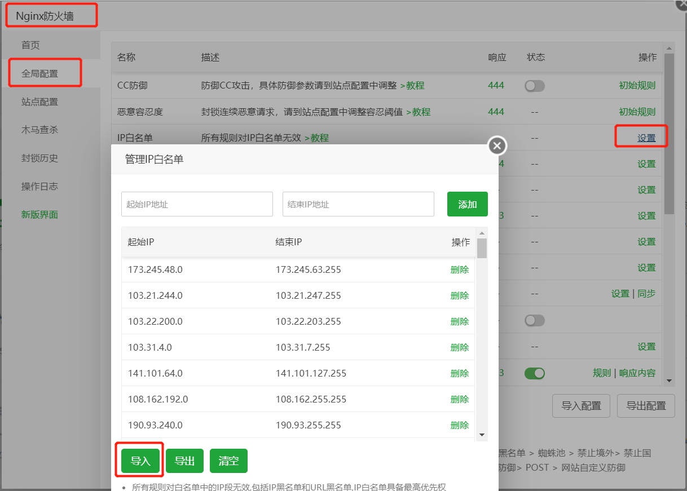

# 将CLOUDFLARE CDN[CF\]全部IP段添加/导入宝塔CC防火墙IP白名单

如果网站接入了CloudFlare，又使用宝塔环境并开启防火墙的话，会导致错误拦截。客户访问会导致提示502错误，所以在这里做个记录，同时也让其他小伙伴能够快速将 Cloudflare CDN 全部IP段加入宝塔IP白名单。

解决办法，导入CF的IP为IP白名单即可，Cloudflare CDN IPv4的宝塔白名单导入规则：

> [["131.0.72.0","131.0.75.255"],["172.64.0.0","172.71.255.255"],["104.16.0.0","104.31.255.255"],["162.158.0.0","162.159.255.255"],["198.41.128.0","198.41.255.255"],["197.234.240.0","197.234.243.255"],["188.114.96.0","188.114.111.255"],["190.93.240.0","190.93.255.255"],["108.162.192.0","108.162.255.255"],["141.101.64.0","141.101.127.255"],["103.31.4.0","103.31.7.255"],["103.22.200.0","103.22.203.255"],["103.21.244.0","103.21.247.255"],["173.245.48.0","173.245.63.255"]]

由于宝塔 Nginx 防火墙导入导出模板规则的变化，建议保存该页面。

Cloudflare IPv4 CIDR列表
173.245.48.0/20
103.21.244.0/22
103.22.200.0/22
103.31.4.0/22
141.101.64.0/18
108.162.192.0/18
190.93.240.0/20
188.114.96.0/20
197.234.240.0/22
198.41.128.0/17
162.158.0.0/15
104.16.0.0/12
172.64.0.0/13
131.0.72.0/22

Cloudflare IPv6 CIDR列表
2400:cb00::/32
2606:4700::/32
2803:f800::/32
2405:b500::/32
2405:8100::/32
2a06:98c0::/29
2c0f:f248::/32

