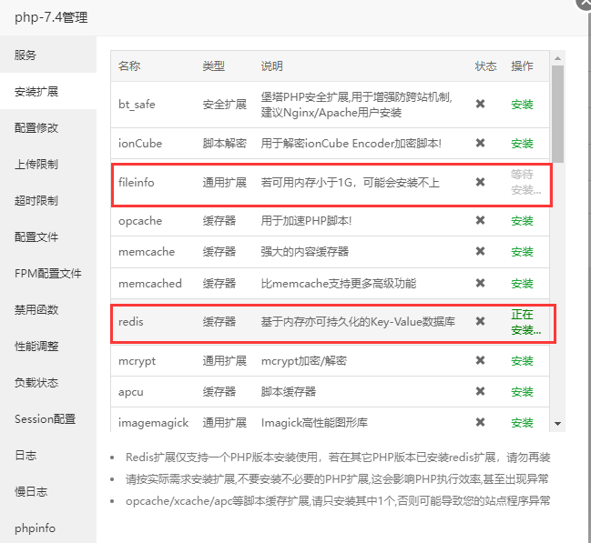
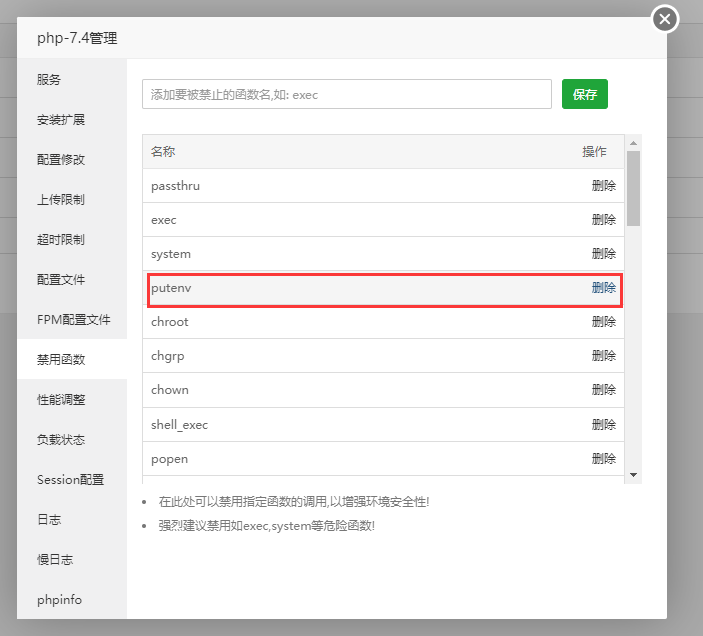
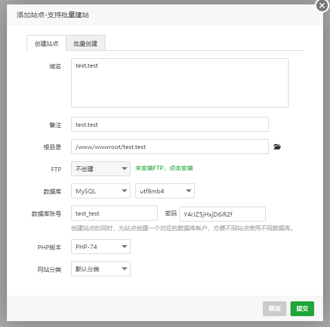
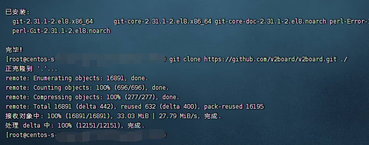
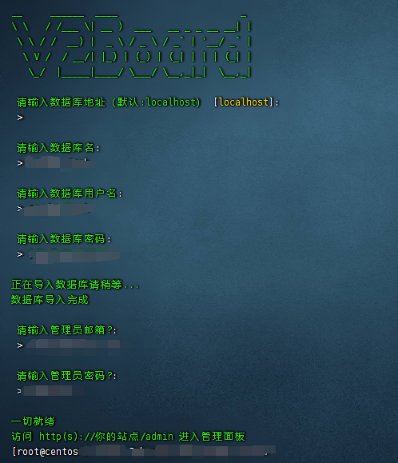
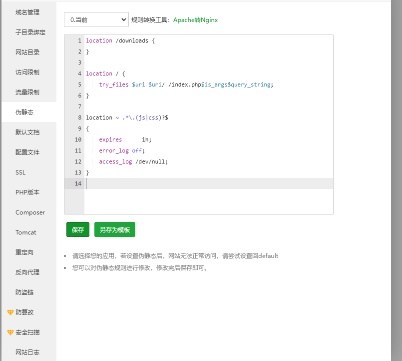

## 1.安装宝塔面板

这里以 CentOS 7+ 作为系统环境进行安装。

请务必使用 **CentOS 7+** 安装宝塔面板，其他系统可能会有未知问题。

```bash
// 最新脚本可以在宝塔官网获取bt.cn
yum install -y wget && wget -O install.sh http://download.bt.cn/install/install_6.0.sh && sh install.sh
```

安装完成后我们登陆 宝塔 进行环境的安装。

选择使用LNMP的环境安装方式勾选如下信息

- Nginx 1.17
- MySQL 5.6
- PHP 7.4

选择 快速安装 后进行安装。

## 2.安装Redis、fileinfo

软件商店 > 找到PHP 7.4点击设置 > 安装拓展 > redis,fileinfo 进行安装。



## 3.解除被禁止的函数

宝塔面板 >已安装 > PHP 7.4点击设置 > 禁用函数

将 `putenv` `proc_open` `pcntl_alarm` `pcntl_signal` 从列表中删除。



## 4.添加站点

网站 > 添加站点。

> 在 域名 填入你指向服务器的域名
> 在 数据库 选择MySQL
> 在 PHP版本 选择PHP-74



## 5.安装V2Board

通过SSH登录到服务器后访问站点路径如：/www/wwwroot/你的站点域名。

```bash
cd /www/wwwroot/你的站点域名
```

以下命令都需要在站点目录进行执行。

```bash
# 删除目录下文件
chattr -i .user.ini
rm -rf .htaccess 404.html index.html .user.ini
```

执行命令从 Github 克隆到当前目录。

```bash
git clone https://github.com/v2board/v2board.git ./
```

如果提示未找到git命令那就yum一下：yum install git -y



执行命令安装依赖包以及V2board

```bash
sh init.sh
```

根据提示完成安装


输入 yes



## 6.配置站点目录及伪静态

6.1添加完成后编辑添加的站点 > 网站目录 > 运行目录 选择 /public 保存。

6.2添加完成后编辑添加的站点 >伪静态 填入伪静态信息。

```
location /downloads {
}
 
location / {  
    try_files $uri $uri/ /index.php$is_args$query_string;  
}
 
location ~ .*\.(js|css)?$
{
    expires      1h;
    error_log off;
    access_log /dev/null; 
}
```



## 7.配置定时任务

计划任务

> 在 任务类型 选择 Shell脚本
> 在 任务名称 填写 v2board
> 在 执行周期 选择 N分钟 1
> 在 脚本内容 填写 php /www/wwwroot/网站域名/artisan schedule:run

根据上述信息添加每1分钟执行一次的定时任务。

## 8.启动队列服务

V2board的系统强依赖队列服务，正常使用V2Board必须启动队列服务。下面以宝塔中supervisor服务来守护队列服务作为演示。

软件商店 > 系统工具

找到 Supervisor管理器 进行安装，安装完成后点击 `设置 > 添加守护进程 `按照如下填写

> 在 名称 填写 V2board
> 在 启动用户 选择 www
> 在 运行目录 选择 站点目录 在 启动命令 填写 php artisan horizon 在 进程数量 填写 1

填写后点击 确定 添加即可运行。

建议重启一次服务器

至此，面板就搭建完成了，后端对接将在稍后文章中更新。

### 常见问题

Q：500错误
A：检查站点根目录权限，递归755，保证目录有可写文件的权限，也有可能是Redis扩展没有安装或者Redis没有按照造成的。你可以通过查看storage/logs下的日志来排查错误或者开启debug模式、站点设置中关闭防跨站。
