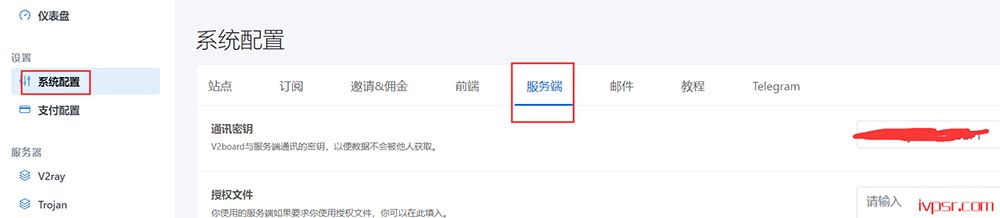
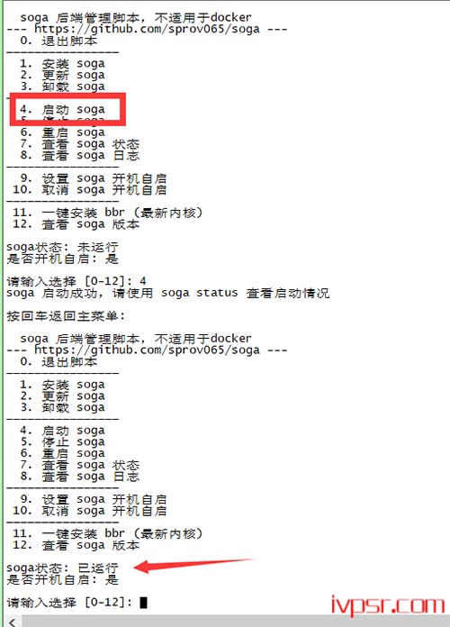

# V2Board面板 v2ray后端节点对接教程 soga脚本配置方法

# 前言

soga 是一个支持 v2ray 和 trojan 的后端（甚至支持ss）

**v2ray**

soga 后端针对 v2ray 占内存的特点使用 C 语言特别优化了 v2ray 的内存占用，在相同用户数量和 alterId 下，相对于原版 v2ray 来说可节省 40-60% 的内存空间，用户数量越多，节省的内存就越多。

**trojan**

trojan 相对于 v2ray 来说更轻量和高效，在大量用户下也几乎不占多少内存。

soga社区版提供**免费88个有效用户**，商业版年付65 USDT，个人/小众群体够用，大客户也应该用不着自己搭建吧。。。。。

# 1.前端准备工作：

## 1.搭建前端

搭建教程请查看：[宝塔面板搭建V2Board教程](https://www.xiaolanhhy.com/technology/1733.html)

## 2.设置**通讯密钥**

打开http(s)://你的面板域名/admin#/config/system


记住这个密钥，对接要用到

## 3.新建节点

新建节点（节点名称自定义，标签自定义，权限组这个在面板中预先设置好，

节点地址我没开TLS所以填的IP，如果开了节点地址要填指向的域名地址，例如www.xxxx.com,连接端口和服务端口都为443）


我们这里没开启TLS所以选择不支持，端口也是随便填的高位端口，传输协议选websocket


websocket传输协议——编辑配置


传输协议为 Websocket，必须要点击<传输协议>旁的<编辑配置>，并填写以下内容，path 可以自定义，以 / 开头

```
{
"path": "/"
}
```


**到系统配置这里，点服务端-通讯密钥这里，输入自己要设置的通讯密钥，下面对接会用的到**



## 4.soga后端部署

以下是后端节点对接部署

debian系统,先执行

```
apt-get update
apt-get install curl -y
```

一键安装&更新

```
bash <(curl -Ls https://blog.sprov.xyz/soga.sh)
```

或者，下面这个，中两个都可以用

```
bash <(curl -Ls https://raw.githubusercontent.com/sprov065/soga/master/install.sh)
```

同步时间

v2ray 节点需要进行时间同步，时间若与客户端相差太大则无法连接

CentOS 

```
yum install -y ntp
systemctl enable ntpd
ntpdate -q 0.rhel.pool.ntp.org
systemctl restart ntpd
```

Debian / Ubuntu

```
apt-get install -y ntp
systemctl enable ntp
systemctl restart ntp
```

## 5.配置soga

```
vi /etc/soga/soga.conf
```

下面是详细的配置参数，可以根据下面参考对应修改

```
# 请按照对应教程进行配置：https://github.com/sprov065/soga/wiki
type=v2board                            # 必填这个
server_type=v2ray                   # 必填这个
api=webapi                                # webapi 或 db，表示 webapi 对接或数据库对接

webapi_url=https://www.xxxx.com/          # 这里是填对接的面板地址
webapi_mukey=xxxxxx                      # 这里是V2board面板与服务端通讯的密钥

db_host=db.xxxx.com        # 数据库地址         
db_port=3306                         # 数据库端口
db_name=123                        # 数据库名
db_user=123                           # 数据库用户名
db_password=123456    # 数据库密码

node_id=8                        # 填面板添加节点对应的的ID号
soga_key=                        # 授权key，社区版无需填写，最多支持88用户，商业版无限制

cert_domain=x5.test.com          # 这里是用到tls,使用申请证书的域名  （如不使用tls，这行可以删除不用）
cert_mode=http                           # 申请模式   （如不使用tls，这行可以删除不用）
cert_key_length=ec-256            # 留空则申请RSA证书，填写ec-256或ec-384则申请ECC证书（如不使用tls，这行可以删除不用）

user_conn_limit=0                  # 限制用户连接数，0代表无限制，v2board 必填！！！ 
user_speed_limit=0                # 用户限速，0代表无限制，单位 Mbps，v2board 必填！！！
check_interval=100               # 同步前端用户、上报服务器信息等间隔时间（秒），近似值

force_close_ssl=false          # 设为true可强制关闭tls，即使前端开启tls，soga也不会开启tls，方便用户自行使用nginx、caddy等反代
forbidden_bit_torrent=true       # 设为true可禁用bt下载

default_dns=8.8.8.8,1.1.1.1           # 配置默认dns，可在此配置流媒体解锁的dns，以逗号分隔
```

## 6.启动后端

最后启动soga，输入soga回车，可以去管理脚本里看启动状态

```
soga start
```



**最后我们看面板里的亮点蓝色就是正常对接成功**


## 7.soga管理命令

```
soga - 显示管理菜单 (功能更多)
soga start - 启动 soga
soga stop - 停止 soga
soga restart - 重启 soga
soga status - 查看 soga 状态
soga enable - 设置 soga 开机自启
soga disable - 取消 soga 开机自启
soga log - 查看 soga 日志
soga update - 更新 soga
soga install - 安装 soga
soga uninstall - 卸载 soga
```