# V2Board面板 v2ray后端节点对接教程 soga脚本配置方法

# 前言

soga 是一个支持 v2ray 和 trojan 的后端（甚至支持ss）

**v2ray**

soga 后端针对 v2ray 占内存的特点使用 C 语言特别优化了 v2ray 的内存占用，在相同用户数量和 alterId 下，相对于原版 v2ray 来说可节省 40-60% 的内存空间，用户数量越多，节省的内存就越多。

**trojan**

trojan 相对于 v2ray 来说更轻量和高效，在大量用户下也几乎不占多少内存。

soga社区版提供**免费88个有效用户**，商业版年付65 USDT，个人/小众群体够用，大客户也应该用不着自己搭建吧。。。。。

# 1.前端准备工作：

## 1.搭建前端

搭建教程请查看：[宝塔面板搭建V2Board教程](https://www.xiaolanhhy.com/technology/1733.html)

## 2.设置**通讯密钥**

打开http(s)://你的面板域名/admin#/config/system

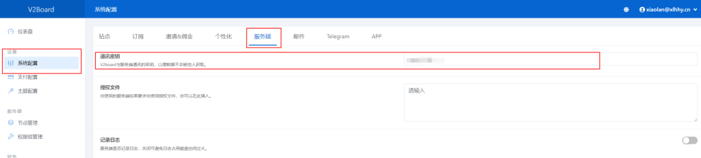

记住这个密钥，对接要用到

## 3.新建节点

新建节点（节点名称自定义，标签自定义，权限组这个在面板中预先设置好，

节点地址我没开TLS所以填的IP，如果开了节点地址要填指向的域名地址，例如www.xxxx.com,连接端口和服务端口都为443）

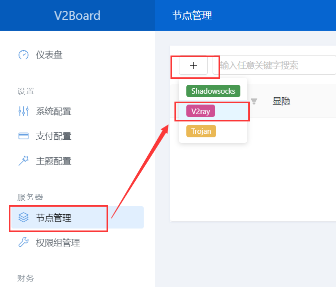

我们这里没开启TLS所以选择不支持，端口也是随便填的高位端口，传输协议选websocket

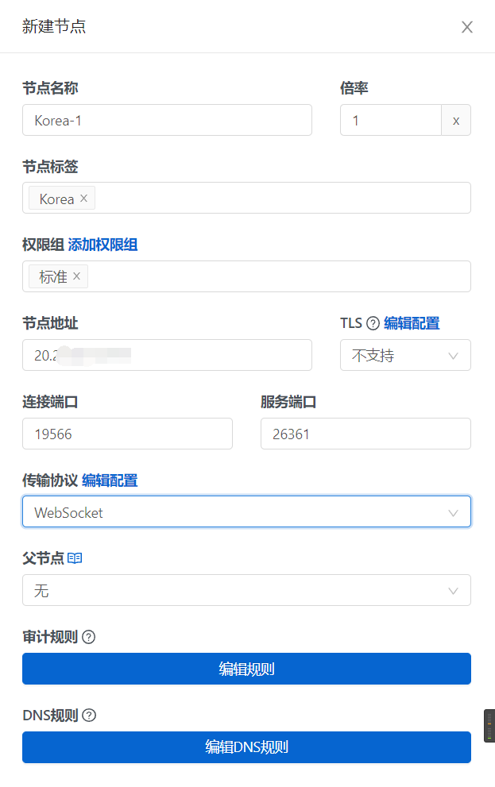

websocket传输协议——编辑配置

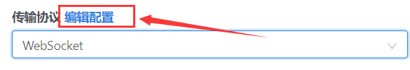

传输协议为 Websocket，必须要点击<传输协议>旁的<编辑配置>，并填写以下内容，path 可以自定义，以 / 开头

```
{
"path": "/"
}
```

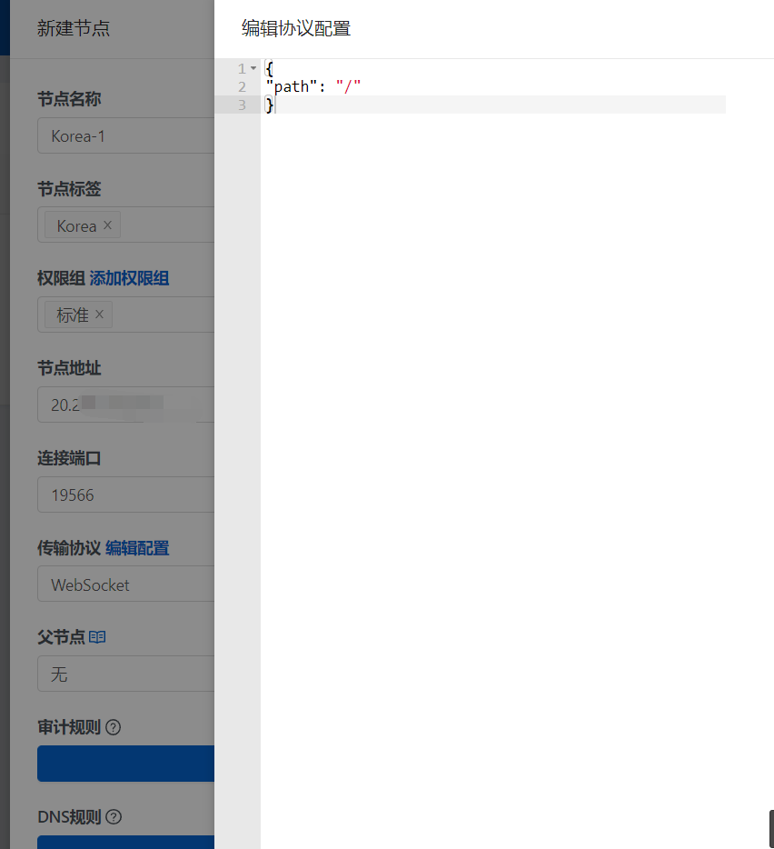

# 2.后端工作：

## 首先创建一台服务器

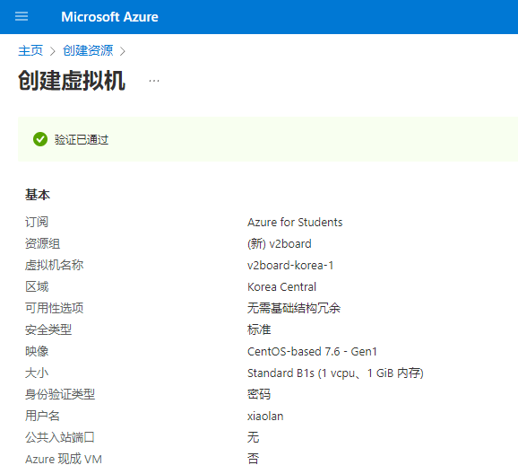

等待几分钟后，去防火墙规则里开端口，这里以Azure为例：

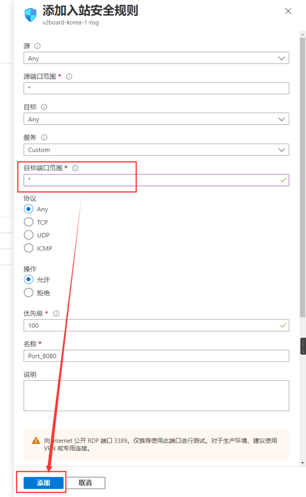

## SSH登录服务器

Azure因为禁用了root用户名直接登录，所以需要提权，如是以root用户登录服务器的请忽略此步骤。

用普通权限用户登陆

输入

```
sudo passwd root
```

输入一次普通用户的密码，再设置一个root密码两次（提示弱密码不用管）

切换root用户

```
su
```

输入刚刚设置的密码，成功提权

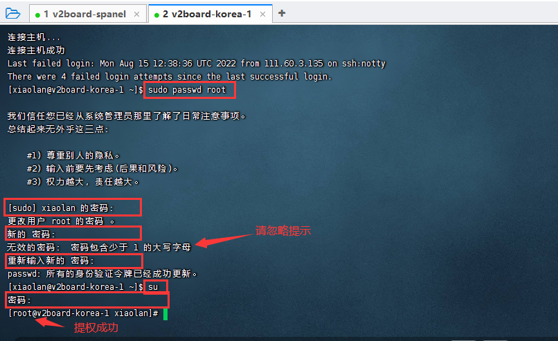

## 安装soga主程序

一键安装，安装完成不要着急启动，查看后面的教程进行对接


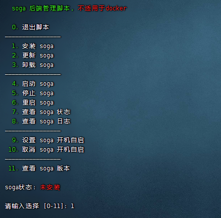

输入 1 回车

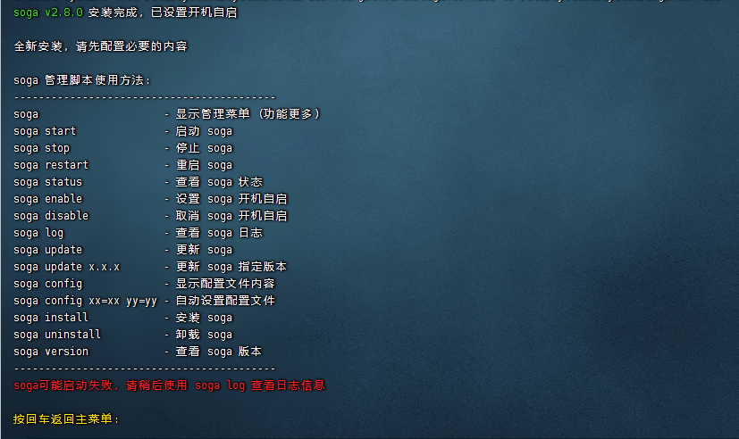

安装完成

## 配置soga

这里以Xftp为例，其他软件同

打开Xftp，新建连接：

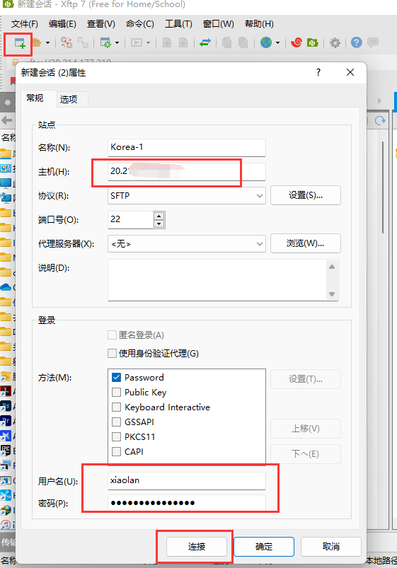

打开 /etc/soga/soga.conf 文件

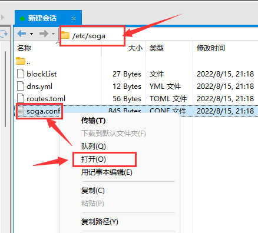

下面是详细的配置参数，可以根据下面参考对应修改

```
type=v2board                           # 必填这个(填写)
server_type=v2ray                      # 必填这个(填写)
node_id=8                              # 填面板添加节点对应的的ID号(填写)
soga_key=                              # 授权key，社区版无需填写，最多支持88用户，商业版无限制(不填写)
 
# webapi 或 db 对接任选一个
api=webapi                             # webapi 或 db，表示 webapi 对接或数据库对接(填写webapi)
 
# webapi 对接信息
webapi_url=https://www.xxxx.com/       # 这里是填对接的面板地址(填写)
webapi_mukey=xxxxxx                    # 这里是V2board面板与服务端通讯密钥(填写)
 
# db 对接信息
db_host=db.xxxx.com                    # 数据库地址(不填写)        
db_port=3306                           # 数据库端口(不填写)
db_name=123                            # 数据库名(不填写)
db_user=123                            # 数据库用户名(不填写)
db_password=123456                     # 数据库密码(不填写)
 
 
# 手动证书配置
cert_file=                             # 这里是用到tls,使用申请证书的域名  （如不使用tls，这行可以删除不用） 
key_file=                              # 这里是用到tls,使用申请证书的域名  （如不使用tls，这行可以删除不用）
 
cert_domain=x5.test.com                # 这里是用到tls,使用申请证书的域名  （如不使用tls，这行可以删除不用）
cert_mode=http                         # 申请模式   （如不使用tls，这行可以删除不用）
cert_key_length=ec-256                 # 留空则申请RSA证书，填写ec-256或ec-384则申请ECC证书（如不使用tls，这行可以删除不用）
 
user_conn_limit=0                      # 限制用户连接数，0代表无限制，v2board 必填！！！ (保持默认)
user_speed_limit=0                     # 用户限速，0代表无限制，单位 Mbps，v2board 必填！！！(保持默认)
check_interval=100                     # 同步前端用户、上报服务器信息等间隔时间（秒），近似值(保持默认)
 
force_close_ssl=false                  # 设为true可强制关闭tls，即使前端开启tls，soga也不会开启tls，方便用户自行使用nginx、caddy等反代(保持默认)
forbidden_bit_torrent=true             # 设为true可禁用bt下载(保持默认)
 
default_dns=8.8.8.8,1.1.1.1            # 配置默认dns，可在此配置流媒体解锁的dns，以逗号分隔(保持默认)
```

按Ctrl + S保存，会自动上传

## 启动后端

最后启动soga，输入soga回车，可以去管理脚本里看启动状态

```
soga start
```

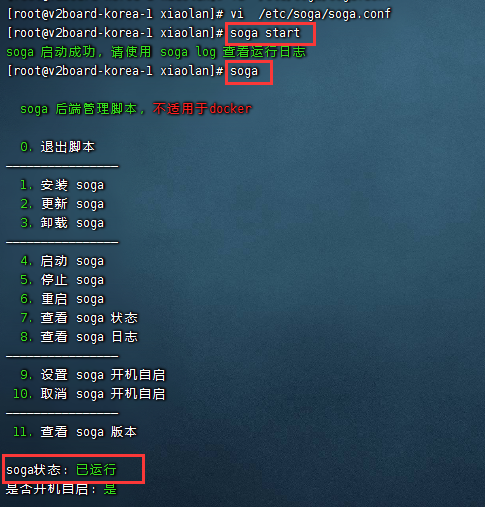

去面板看看是否对接成功


打开显隐，节点显示黄色说明对接已经成功（红色：未连接、黄色：未通信、绿色：正在通讯），因为没有用户连接，所以是已对接未通讯状态。


## soga管理命令

```
soga - 显示管理菜单 (功能更多)
soga start - 启动 soga
soga stop - 停止 soga
soga restart - 重启 soga
soga status - 查看 soga 状态
soga enable - 设置 soga 开机自启
soga disable - 取消 soga 开机自启
soga log - 查看 soga 日志
soga update - 更新 soga
soga install - 安装 soga
soga uninstall - 卸载 soga
```

至此，soga后端对接V2Board完成，后续更新V2Board正确使用方法，拜拜ヾ(•ω•`)o