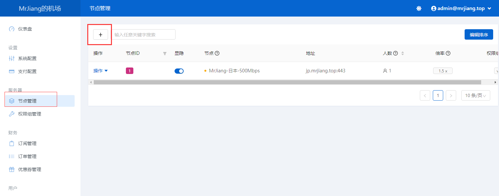
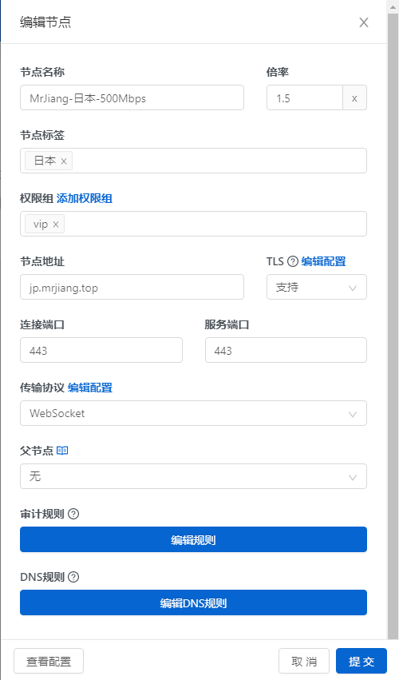
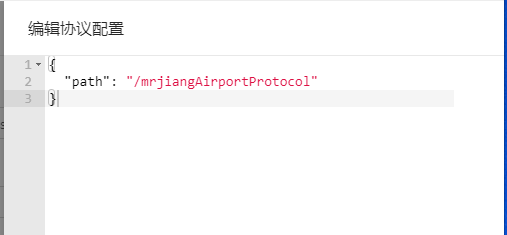
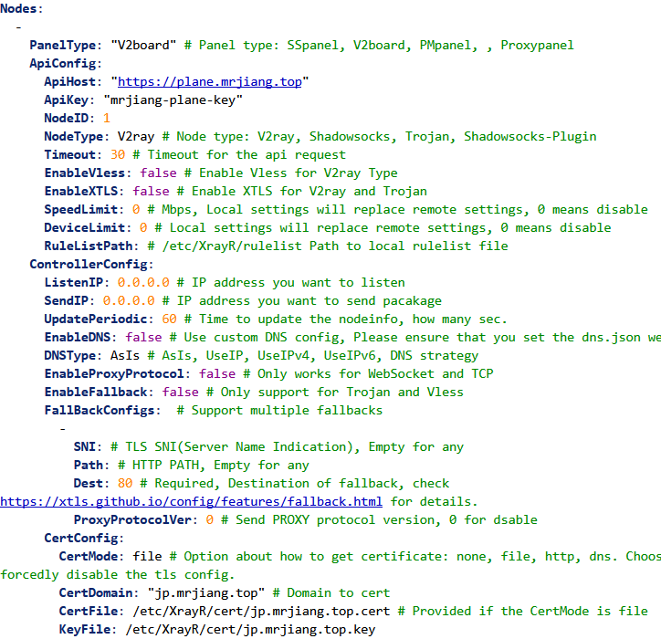

# 节点安装

## 1. 进入V2Board后台

> 后台地址/admin
> 账号密码在安装期间会要求输入
> 进入节点列表，选择一个协议（这里以v2ray为例）



## 2. 添加节点

- 节点名称、节点标签、权限组 根据自己的需求填
- 倍率指用户使用多少流量，实际扣多少倍流量
- 节点地址建议用域名（解析到节点IP），把tls勾选，端口均填443，若直接使用IP裸奔容易被墙（加入gfw黑名单）
- 协议根据自己需求填，协议配置一定要填（传输协议旁边的编辑配置按钮）

```shell
{
  "path": "/自定义"
}
```



编辑配置



## 3. 节点安装XrayR后端

用ssh连接节点
使用一键脚本安装XrayR（[Github地址](https://github.com/XrayR-project/XrayR)）

```shell
bash <(curl -Ls https://raw.githubusercontent.com/XrayR-project/XrayR-release/master/install.sh)
```

或者通过[Docker安装](https://crackair.gitbook.io/xrayr-project/xrayr-xia-zai-he-an-zhuang/install/docker)

## 4. 配置XrayR

```shell
vi /etc/XrayR/config.yml
```

添加节点（根据自己需求改，这里只显示修改的地方，[官方详细文档](https://crackair.gitbook.io/xrayr-project/xrayr-pei-zhi-wen-jian-shuo-ming/config)）

```shell
PanelType: "V2board"
    ApiConfig:
      ApiHost: "https://plane.mrjiang.top" # V2Board面板地址
      ApiKey: "**********" # V2Board后台面板-系统配置-服务端-通讯密钥
      NodeID: 1 #节点ID，添加节点时显示
      NodeType: V2ray 
      CertConfig:
        CertMode: file
        CertDomain: "jp.mrjiang.top"
        CertFile: /etc/XrayR/cert/jp.mrjiang.top.cert
        KeyFile: /etc/XrayR/cert/jp.mrjiang.top.key
```

完毕

## 5.完毕

到此已经可以正常使用了，其他诸如支付、套餐等配置，根据说明来
[V2Board使用手册](https://docs.v2board.com/)