**V2Board使用逻辑与SSPanel略有不同，在这里展示简易使用方法**

## V2Board服务端配置方法

首先登录到管理中心 https://你的域名/admin/

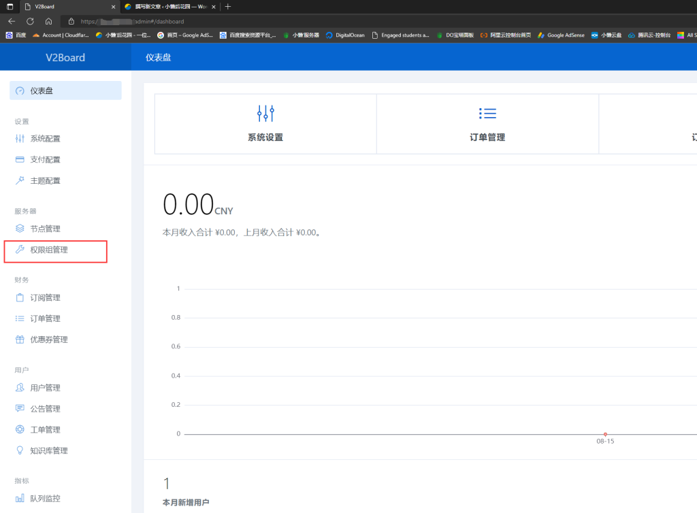

### 一，设置权限组

1.添加一个权限组

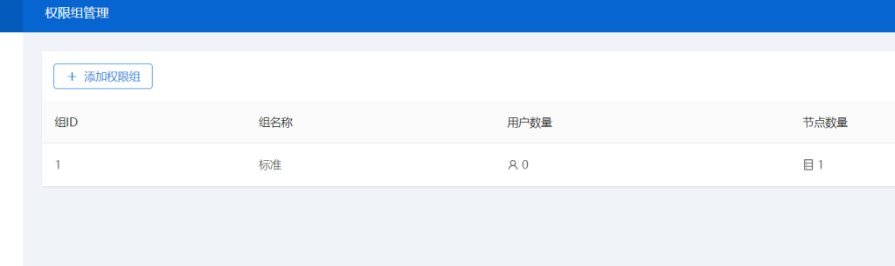

2.将节点添加到这个权限组

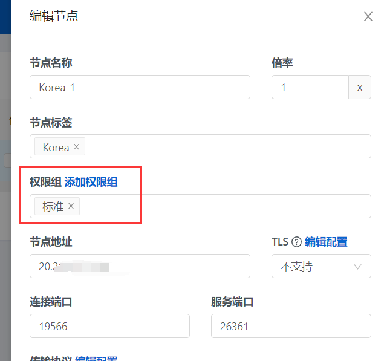

### 二，添加订阅

> 添加订阅的目的是让用户加入刚刚新建的权限组，才能有权限获取节点信息

1.在财务-订阅管理里添加一个如图订阅

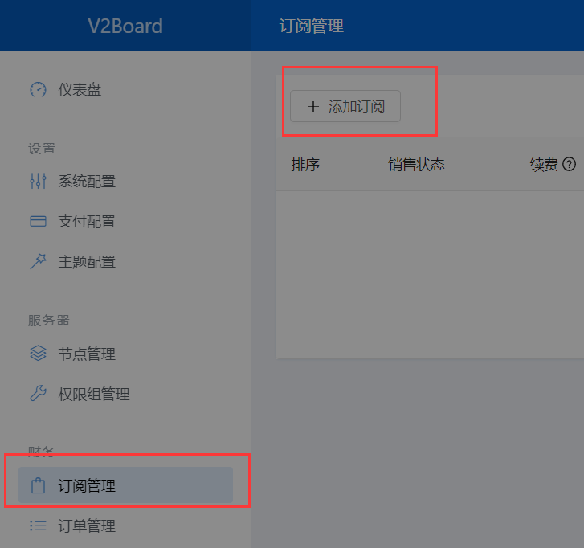

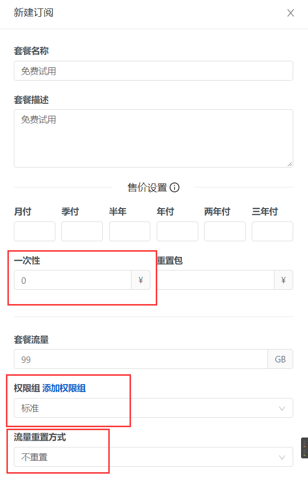

2.添加完成后把销售状态打开，把续费关闭（因为是试用，使用不可重复订购，按需操作即可）

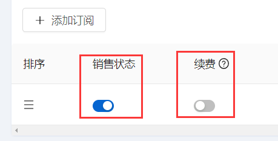

回到前台，点击购买刚刚建立的订阅

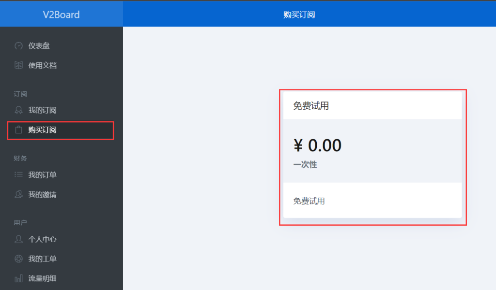

下单会生成订单，此时由于没有配置可用的支付方式，导致不能结账

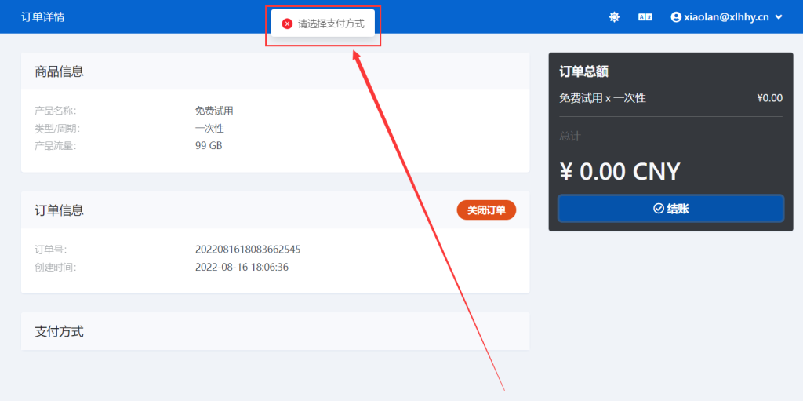

我们再回到后台，财务-订单管理里将这笔订单标记为已支付

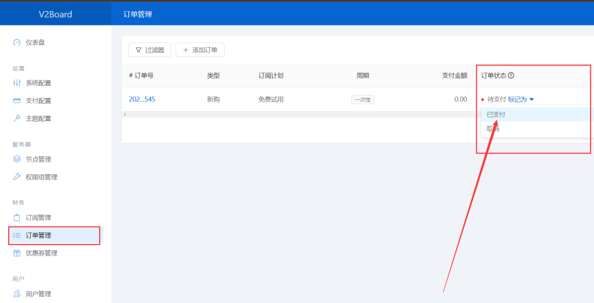

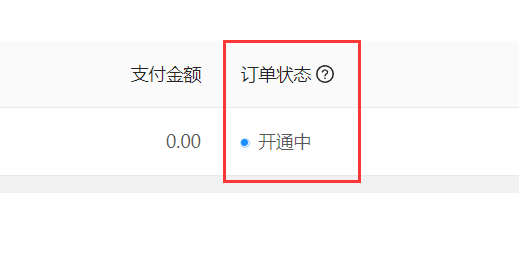

这样就开通成功了

回到前台，可以看见订阅里的节点状态

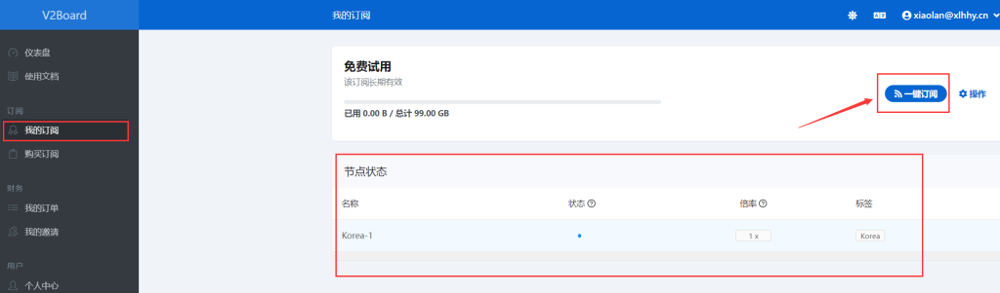

## 连接方法

1.我们选择使用订阅获取节点

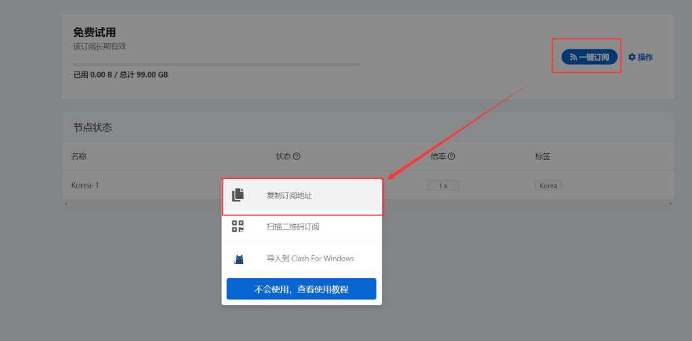

2.以V2rayN为例，其他软件同，打开V2rayN，点击 订阅-订阅设置

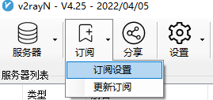

如果之前没有订阅，直接粘贴后按确定就行了，如果之前有订阅，请先点击 添加 ，再在新的文本框里粘贴再确定

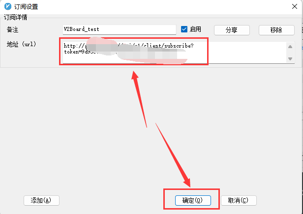

更新订阅

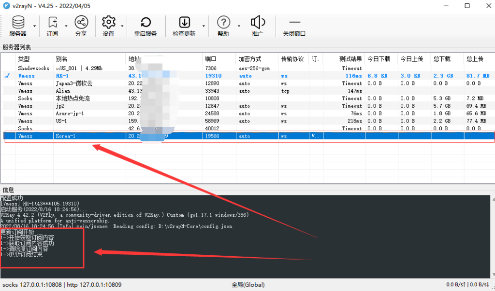

最后选择配置系统代理即可

顺便查询一下IP [设备信息在线查看](https://www.xiaolanhhy.com/go?_=46f2381e98aHR0cHM6Ly91YS54aWFvbGFuaGh5LmNvbS8%3D)