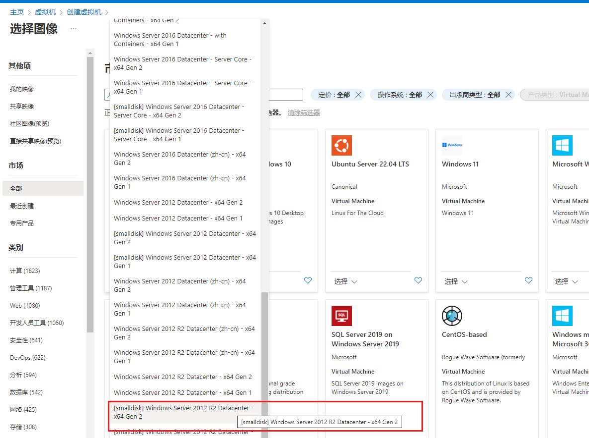

# AZ100免费额度开机利用

## AZ100注册

**注册链接**

[英文](https://azure.microsoft.com/en-us/free/students/)

[中文](https://azure.microsoft.com/zh-cn/free/students/)

注册最后一步如果出现200验证可以用下面链接跳转100
https://signup.azure.com/studentverification?offerType=1

这里只介绍我们创建虚拟机需要的，其他可以自己在官网看看

## 虚拟机创建-liunx

### 1.主页选择虚拟机创建

### 2.新建一个资源组

### 3.填写虚拟机信息

选择区域（East Asia即是香港延迟最低）

注意可用性选项选择**无需基础结构冗余**，否则后面无法切换成动态IP

安全性默认、映像按自己习惯，我这里选择Debian11

点开查看所有大小配置

选择B1s类型*该机型才符合AZ100免费服务范围*

### 4.SSH设置

选择自己SSH验证的方式，公钥或者密码登录。入站端口可以先不设置，默认打开SSH（22）端口就行，开机后再设置其他。

### 5.磁盘选择

切换到顶部磁盘设置项

更改为64GB，性能层选择默认P6（在AZ100免费服务内容范围）

### 6.网络设置

切换到顶部网络设置项，公用IP点新建

SKU选择基本，分配地址选择动态IP。因为静态IP是不在免费服务内的，所以改为动态IP，只要你不关机分配的动态IP也不会变的，使用影响也不大。

注意前面可用性选项选择**无需基础结构冗余**，否则这里无法切换成动态IP

### 7.创建

点击查看+创建，验证OK后就可以创建了

### 切换磁盘大小教程

先停止服务器，注意这里选择**不保留公共IP地址**，继续动态IP即可

再选择磁盘，点击磁盘名称

选择大小和性能，更改为64GB，性能层选择默认P6（在AZ100免费服务内容范围）

保存后开机即配置完成了！

## 创建虚拟机-windows

流程基本与liunx一致，这里只讲一下需要注意的不同点

镜像选择smalldisk系列的镜像，对于windows，因为磁盘只能向上扩，不能缩小，所以windows的只能选择smalldisk系列的镜像

镜像建议选择Windows server 2012 R2，这配置只能带这个了

**不要选择使用你现有的windows许可抵消，不然创建的windows虚拟机使用不上免费配额**

## 免费配额查看

面板搜索___教育___即可查

也可以点击这个链接查看

> [Microsoft Azure Sponsors |平衡 (microsoftazuresponsorships.com)](https://www.microsoftazuresponsorships.com/Balance)