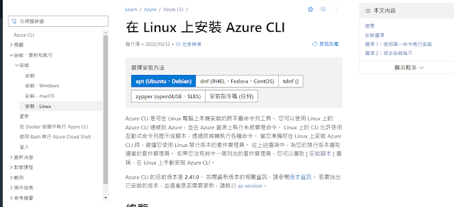
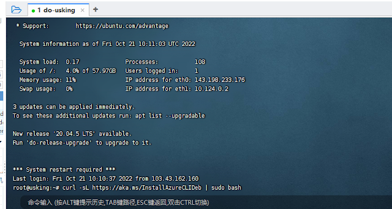
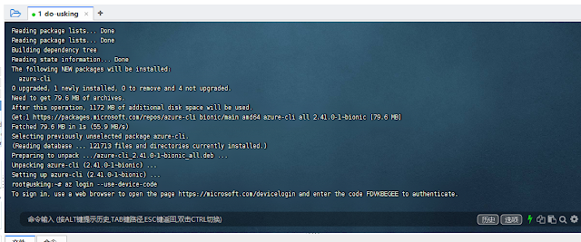
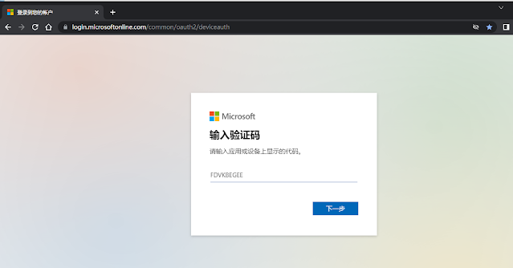
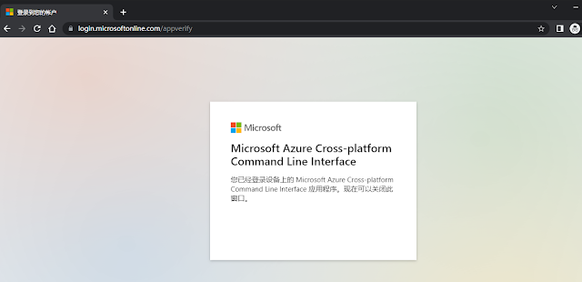
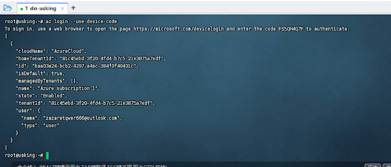
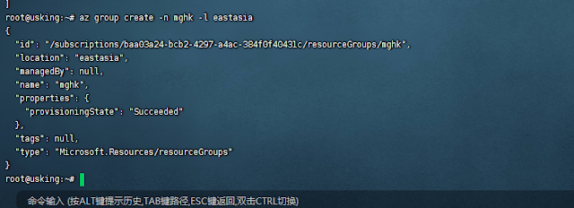
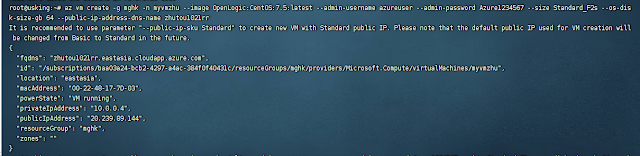
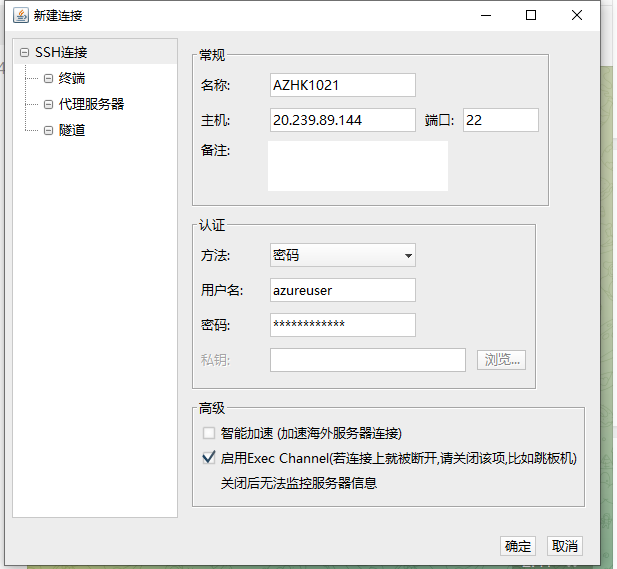
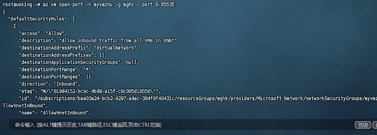

# AZURE-CLI 开机教程

## 一、下载一个az-cli

**首先，我们去azure官方下载一个az-cli**，各个操作系统的都有，官方文档讲得已经很详细了，这里就不做赘述。 [azure cli 官方安装网址](https://learn.microsoft.com/zh-tw/cli/azure/install-azure-cli-linux?pivots=apt)



这里以安装-linux为例，vps机器是ubuntu 

找到ubuntu的安装命令：

```
curl -sL https://aka.ms/InstallAzureCLIDeb | sudo bash
```

登录机器进入root模式，输入安装命令，完成安装。



## 二 ，登录AZ账户

机器VPS输入命令 

az account clear # 清除以前账户

az login --use-device-code 


[]()

输入命令后机器给出了一个网址和代码，**网址不变，代码每次不同**

谷歌无痕浏览器打开网址  **https://microsoft.com/devicelogin**

输入代码  FDVKBEGEE，再按提示输入AZ账号和密码


[]()


[]()

出现上图这样表明AZ账户登录成功了，可以关掉网页了，

这时的机器VPS也会变成下图这样，表明机器接管了AZ账户

[]()


## 三 ，创建虚拟机机器vps

**1，接下来我们先创建资源组** 

```
输入命令 az group create -n 资源组名 -l 地区

示例: az group create -n mghk -l eastasia #香港
```

注意此处的地区请填写az的代码 如香港是eastasia等，多个机器可以共用同一个资源组 

AZ常用地区代码 查询命令 ：

```
az account list-locations -o table
```

koreacentral 韩国

eastasia  香港

southeastasia 新加坡

japaneast 日本 

eastus 美国西部


[]()


**2， 创建[机器](https://www.yakn.cc/tag/机器/)：输入命令 （自行替换中文部分）**

```
az vm create -g 资源组名（名字要对应上一步）-n 机器名 --image 系统 --admin-username 用户名(SSH登录用户名) --admin-password 密码(SSH登录密码，需要12位以上 大小写字母和数字) --size Standard_B1s(机器规格型号） --os-disk-size-gb 64(内存大小) -public-ip-address-dns-name 自定义dns标签名称(每次更换名称，不能重复)
```

注意：在同一个资源组名下创建多个机器时，机器名称不能相同

示例1--CentOS:7.5系统，7.5可换成其他版本

```
az vm create -g mghk -n myvmzhu --image OpenLogic:CentOS:7.5:latest --admin-username azureuser --admin-password Azure1234567 --size Standard_F2s --os-disk-size-gb 64 --public-ip-address-dns-name zhutou1021rr
```


示例2--默认ubuntu18.04,尝试换20.04或更高级没有成功

```
az vm create -g mghk-n myvmzhu002 --image ubuntults --admin-username azureuser --admin-password Azure1234567 --size Standard_B1s --os-disk-size-gb 64 --public-ip-address-dns-name zhutou1021hao
```


示例3--Debian:debian-10:10:latest，可更换数字

```
az vm create -g mghk -n myvmzhu003 --image Debian:debian-10:10:latest --admin-username azureuser --admin-password Azure1234567 --size Standard_B1s --os-disk-size-gb 64 --public-ip-address-dns-name zhutou1022gg
```

[]()

## 四 ，登录SSH

创建机器成功后看上图，机器显示的"publicIpAddress"就是公网IP，填入主机那里

用户名和密码（根据前面自己创建机器时填写的数据）

用户名 admin-username  **azureuser**

密码 dmin-password   **Azure1234567**

使用上面三个数据就可以登录SSH了

[]()


## 五，最后一步开放AZ端口


开放端口命令如下：az vm open-port -n 机器名 -g 资源组名 --port 端口或端口范围 如0-65535全开


```
示例： az vm open-port -n myvmzhu -g mghk --port 0-65535
```


[]()


## 六更换ip命令


如下：**az vm deallocate -n 机器名 -g 资源组名**

示例：

```
az vm deallocate -n myvmzhu -g mghk
```

等待1分钟过后输入下一个命令 

**`az vm start -n 机器名 -g 资源组名`**

示例：

```
az vm start -n myvmzhu -g mghk
```

接下来我们输入`

```
az vm list-ip-addresses -o table
```

查看更换后的ip地址