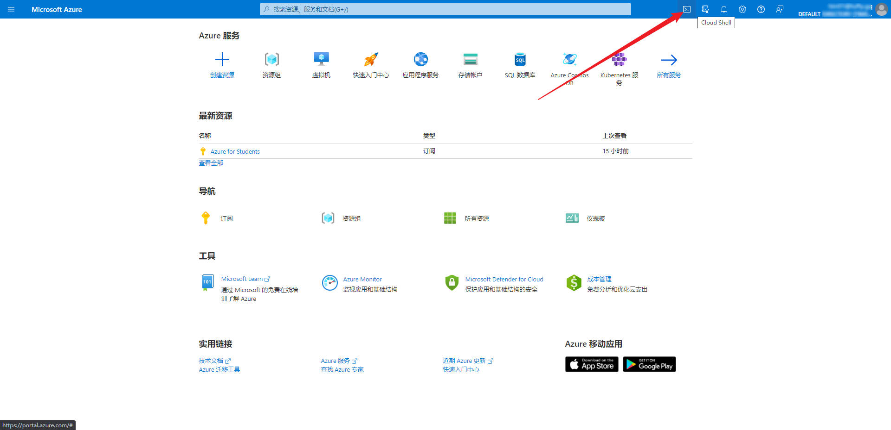
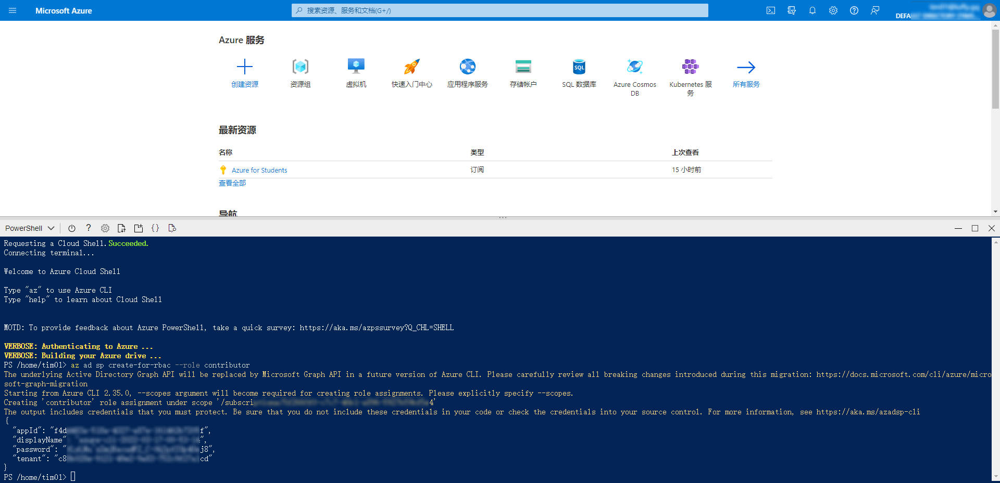
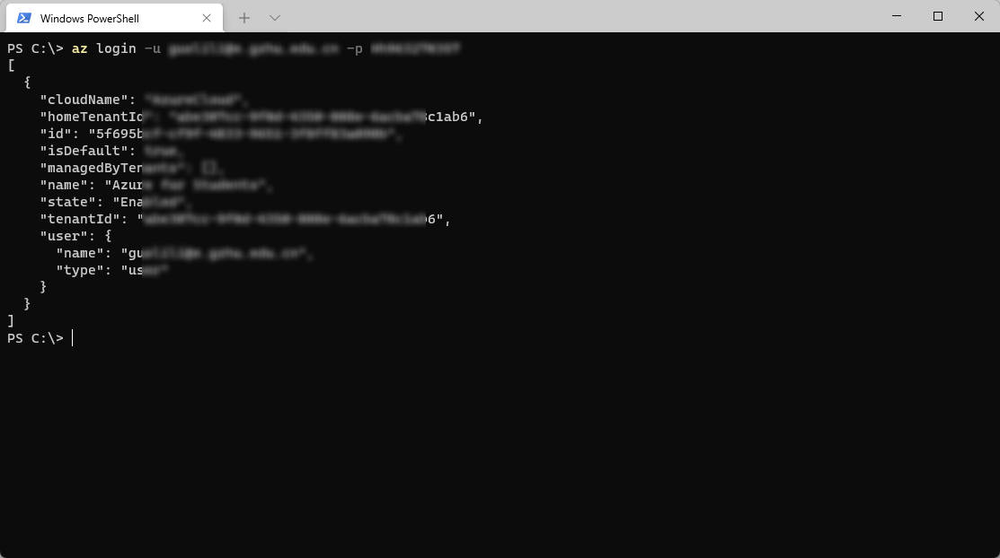
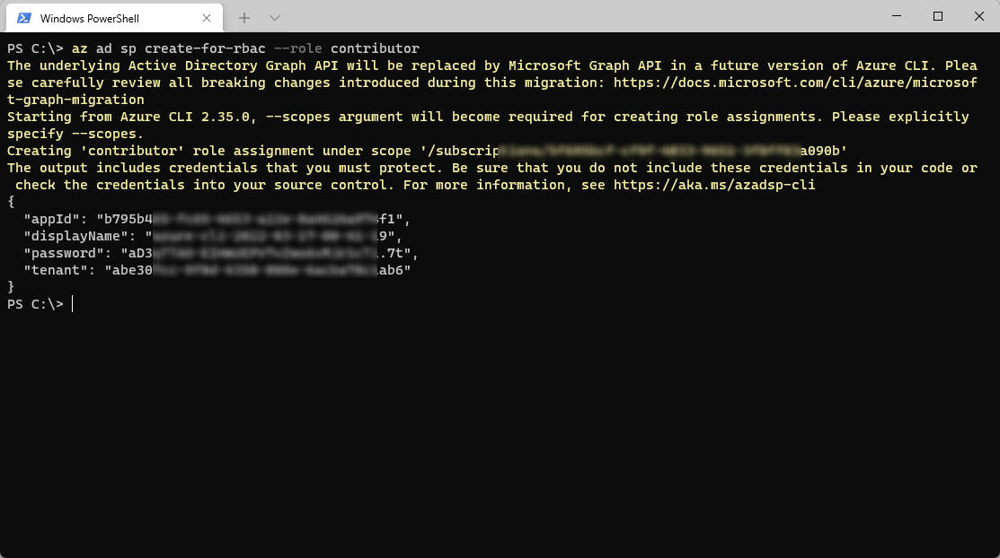

# Azure 获取开机API

以下两种方式任选其一即可。方式二不建议使用代理，可能会获取API失败。

## 一、网页方式

### 1. 登录[Azure后台](https://portal.azure.com/)，选择右上角的Cloud Shell



[
```

[]()


## 二、安装Azure CLI，用命令行方式

### 1. 下载安装Azure CLI

下载地址：https://docs.microsoft.com/zh-cn/cli/azure/install-azure-cli


### 2. 登录az子号

```css
az login -u 你的賬戶 -p 你的密碼
```

[]()


### 3. 执行如下命令，获取API相关参数

```lua
az ad sp create-for-rbac --role contributor
```

[]()

## 三、其他

1. 解决资源提供程序注册的错误

```cpp
az provider register --namespace Microsoft.Cdn
```
