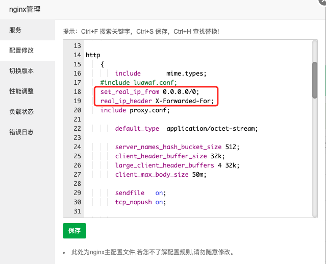

# 套用Cloudflare CDN后如何显示 真实访客ip|宝塔

使用Cloudflare CDN后，源站收到的请求均为Cloudflare CDN的地址，为了能够显示 真实访客ip ，需要做几步简单的设置。

**宝塔设置nginx**

1. 点击宝塔**应用商店**，找到nginx，点击右边的**设置**

2. 在**配置修改**中，找到`http`模块中的`include luawaf.conf;`，在下面添加如下两段代码，重载nginx即可。

   ```
   set_real_ip_from 0.0.0.0/0;
   real_ip_header X-Forwarded-For;
   ```

1. 此时在**站点设置**的**响应日志**里可以看到，访问的ip已经为真实ip了。

2. 如果想要包括ipv6地址的话可以做如下设置：

   ```
   set_real_ip_from 0.0.0.0/0;
   set_real_ip_from ::/0;
   real_ip_header X-Forwarded-For;
   ```

3.我自己用的代码。

```
    set_real_ip_from 0.0.0.0/0;
    real_ip_header  X-Forwarded-For;
    real_ip_recursive on;
```

