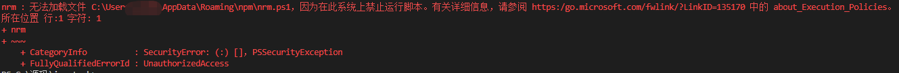
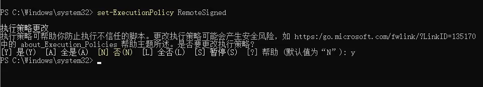

## 提示

**1.Typora**

打开设置  打开自动保存   

再点击 图片  在这插入图片时 选择复制到指定路径  填入

./tp/${filename}.tp

**2.PowerShell**

在文件夹的空白区域中按住 “Shift” 键，并同时右键单击文件夹的空白区域。

在右键菜单中选择 “在此处打开 PowerShell 窗口” 或 “在此处打开命令窗口”，这将在当前路径下打开一个新的 PowerShell 窗口。

推荐 22 款好用的 CLI 工具 [https://zhuanlan.zhihu.com/p/266032071](https://zhuanlan.zhihu.com/p/266032071)


**3.power shell“因为在此系统上禁止运行脚本”解决办法**

遇到了如下的问题。

> nrm : 无法加载文件 C:\Users\11190\AppData\Roaming\npm\nrm.ps1，因为在此系统上禁止运行脚本。



处理方案在提示中有，可以通过访问链接查看：https:\[go.microsoft.com](https://link.zhihu.com/?target=http%3A//go.microsoft.com)\fwlink\?LinkID=135170

核心是power shell的安全策略，将 nrm 命令视为了不安全脚本，不允许执行。只需要放开权限就行。

我们通过管理员权限运行power shell，然后输入命令

```text
 set-ExecutionPolicy RemoteSigned
```



选择“是”，就OK了。

## 开始

## 安装docsify

`docsify`是一个`Node.js`插件，所以需要提前安装[Node.js](https://nodejs.org/)。安装完毕后，打开管理员权限运行power shell 推荐全局安装`docsify-cli` 工具，可以方便地创建及在本地预览生成的文档。。

```bash
npm i docsify-cli -g
```

## 初始化项目

假设磁盘中有一个`/docs`目录，如果想在该目录里写文档可以直接通过`docsify init ./docs`命令初始化项目。

```bash
docsify init ./docs
```

建议在该目录下直接通过`docsify init`命令初始化项目。

```bash
docsify init
```

## 开始写文档

命令执行成功后，会在项目的目录生成三个新的文件如下：

- `index.html`为入口文件，`css`、`js`以及配置项都在此文件中修改。
- `README.md`会作为默认主页内容渲染。
- `.nojekyll`用于阻止`GitHub Pages`忽略掉下划线开头的文件

直接编辑 docs/README.md 就能更新文档内容，当然也可以添加更多页面

## 本地预览

通过运行 `docsify serve` 启动一个本地服务器，可以方便地实时预览效果。默认访问地址 [http://localhost:3000](http://localhost:3000/) 。

```bash
docsify serve docs
```

?> 更多命令行工具用法，参考 [docsify-cli 文档](https://github.com/docsifyjs/docsify-cli)。

## 手动初始化

如果不喜欢 npm 或者觉得安装工具太麻烦，我们可以直接手动创建一个 `index.html` 文件。

*index.html*

一份我自己用的配置项如下：

```html
<!DOCTYPE html>
<html lang="en">
<head>
  <meta charset="UTF-8">
  <title>Document</title>
  <meta http-equiv="X-UA-Compatible" content="IE=edge,chrome=1" />
  <meta name="description" content="Description">
  <meta name="viewport" content="width=device-width, initial-scale=1.0, minimum-scale=1.0">
  <link rel="stylesheet" href="//cdn.jsdelivr.net/npm/docsify@4/lib/themes/vue.css">
</head>
<body>
  <div id="app"></div>
  <script>
  window.$docsify = {
    loadSidebar: true,
    subMaxLevel: 5
  }
</script>
  
    <!-- 复制到剪贴板 -->
    <script src="//cdn.jsdelivr.net/npm/docsify-copy-code/dist/docsify-copy-code.min.js"></script>
    <!-- 外链脚本 -->
    <script src="//cdn.jsdelivr.net/npm/docsify/lib/plugins/external-script.min.js"></script>
    <!-- emoji表情支持 -->
    <script src="//cdn.jsdelivr.net/npm/docsify/lib/plugins/emoji.min.js"></script>
    <!-- 图片放大缩小支持 -->
    <script src="//cdn.jsdelivr.net/npm/docsify/lib/plugins/zoom-image.min.js"></script>
    <!-- 搜索功能支持 -->
    <script src="//cdn.jsdelivr.net/npm/docsify/lib/plugins/search.min.js"></script>

  <!-- Docsify v4 -->
  <script src="//cdn.jsdelivr.net/npm/docsify@4"></script>
</body>
</html>

```

还有更多配置项可以参考`docsify`文档中的`定制化 - 配置项`一小节，定制的东西越多，维护的难度就越大。侧边栏、导航栏和封面都建议采用默认的文件渲染：

|  组件  |       文件       |
| :----: | :--------------: |
| 侧边栏 |  `/_sidebar.md`  |
| 导航栏 |  `/_navbar.md`   |
| 侧边栏 | `/_coverpage.md` |
