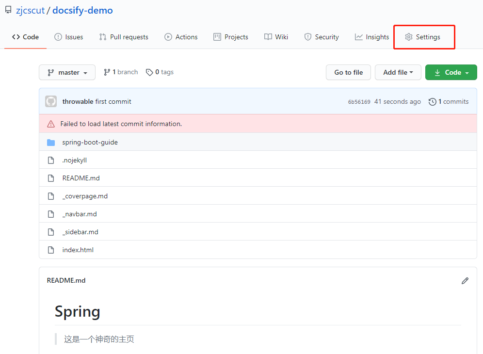
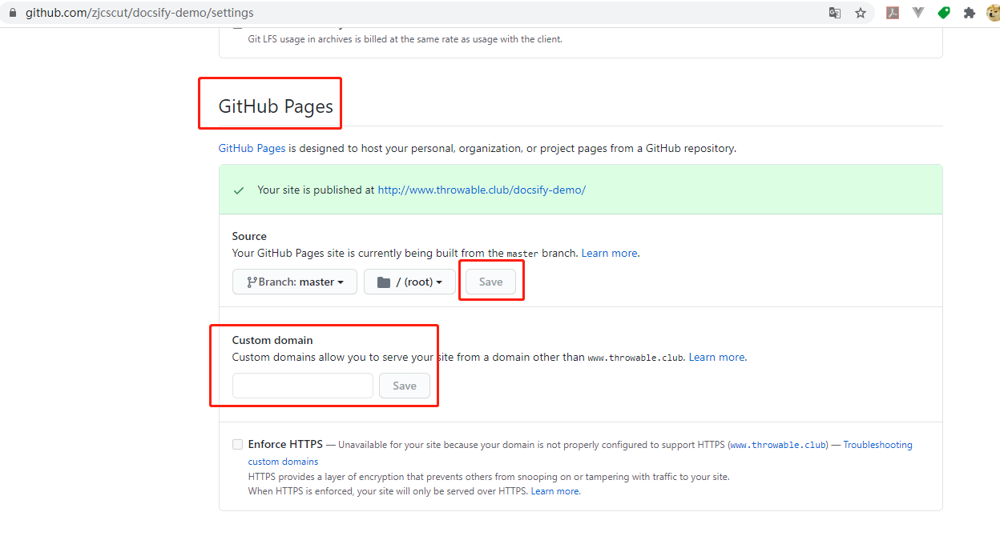
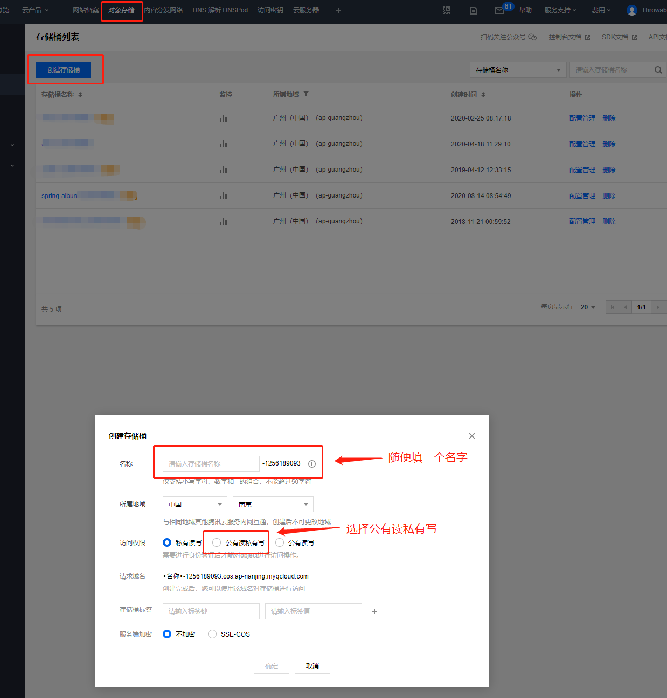
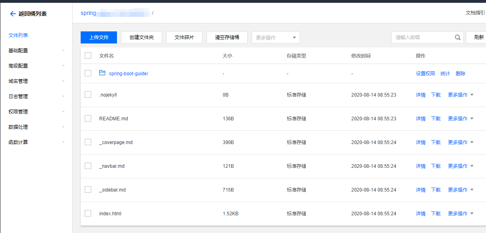
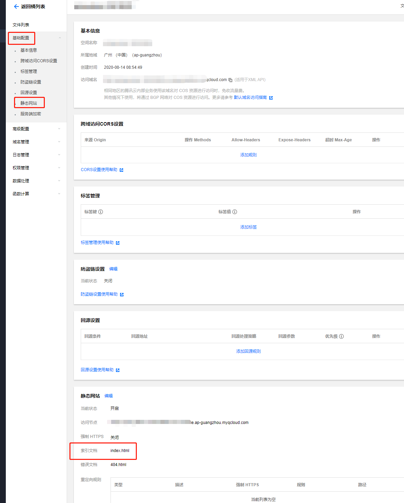
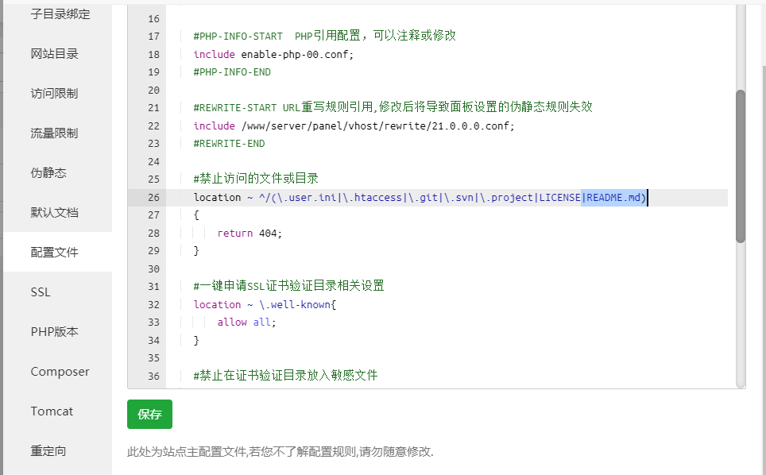

主要介绍`GitHub Pages`和腾讯云`COS`的部署，其他类似于`Coding Pages`或者阿里云`OSS`的部署方式等等可以参照下面介绍的两种方式进行部署。

## 部署在GitHub

先建一个`Github`仓库，把项目文件推送上去：



点右上角红圈中的`Settings`按钮，配置`Github Pages`：



保存完毕之后，配置一下自定义的域名解析，也就是把域名解析到项目的`Github Pages`中，然后就可以通过自定义域名访问此项目。

> 当然，Github也为每个账户提供一个免费的子域名：账号.github.io，需要建一个命名为"账号.github.io"仓库，把项目文件推上到此仓库，再配置一下Github Pages的属性即可通过"账号.github.io"访问此项目。

## 部署在腾讯云COS

笔者已经把一个子域名`spring.throwx.cn`解析到腾讯云`COS`的`docsify`项目中，过程很简单。先创建一个对象存储的桶设置为**公有读私有写**：



接着把整个`docsify`项目中的文件拷贝到桶中，**`index.html`文件必须在桶的根目录**：



然后配置桶的`基本配置 - 静态网站`中的索引文档（主页）如下：



做完这一步之后，就可以通过`COS`的公网域名访问`docsify`项目。最后再把子域名解析到`COS`的内网域名即可通过自定义的子域名访问该项目

## 宝塔部署

正常创建一个网站，将写好的项目中所有文件全部上传到网站目录里

HPH版本选择纯静态（其实不选也可以）

去配置文件找到



```
\#禁止访问的文件或目录
location ~ ^/(\.user.ini|\.htaccess|\.git|\.svn|\.project|LICENSE|README.md)
```

删除其中的README.md
