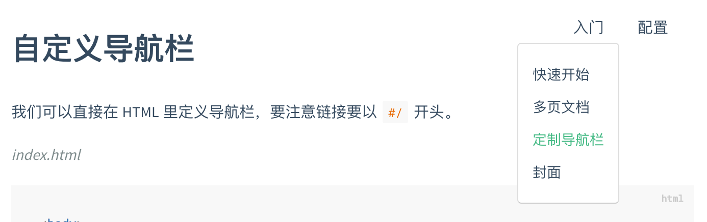

# 自定义导航栏

## HTML

如果你需要定制导航栏，可以用 HTML 创建一个导航栏。

!> 注意：文档的链接都要以 `#/` 开头。

```html
<!-- index.html -->

<body>
  <nav>
    <a href="#/">EN</a>
    <a href="#/zh-cn/">中文</a>
  </nav>
  <div id="app"></div>
</body>
```

我用的代码

```html
<!-- index.html -->

<body>
  <nav>
    <a href="https://throwx.cn">🐮🐮 Throwable's Blog</a>
    <a href="https://spring.throwx.cn">❤️❤️ Spring专栏</a>
  </nav>
  <div id="app">加载中......</div>
</body>
```


## 配置文件

那我们可以通过 Markdown 文件来配置导航。首先配置 `loadNavbar`，默认加载的文件为 `_navbar.md`。具体配置规则见[配置项#loadNavbar](https://docsify.js.org/#/configuration?id=loadnavbar)。

```html
<!-- index.html -->

<script>
  window.$docsify = {
    loadNavbar: true
  }
</script>
<script src="//cdn.jsdelivr.net/npm/docsify/lib/docsify.min.js"></script>
<!-- _navbar.md -->
```

```markd0wn
<!-- _navbar.md -->

* [En](/)
* [简体中文](/zh-cn/)
```

!>你需要在 `./docs` 目录下创建一个 `.nojekyll` 文件，以防止 GitHub Pages 忽略下划线开头的文件。

`_navbar.md` 加载逻辑和 `sidebar` 文件一致，从每层目录下获取。例如当前路由为 `/zh-cn/custom-navbar` 那么是从 `/zh-cn/_navbar.md` 获取导航栏。

## 嵌套

如果导航内容过多，可以写成嵌套的列表，会被渲染成下拉列表的形式。

```markdown
<!-- _navbar.md -->

* 入门

  * [快速开始](zh-cn/quickstart.md)
  * [多页文档](zh-cn/more-pages.md)
  * [定制导航栏](zh-cn/custom-navbar.md)
  * [封面](zh-cn/cover.md)


* 配置
  * [配置项](zh-cn/configuration.md)
  * [主题](zh-cn/themes.md)
  * [使用插件](zh-cn/plugins.md)
  * [Markdown 配置](zh-cn/markdown.md)
  * [代码高亮](zh-cn/language-highlight.md)
```

效果图



## 整合自定义导航栏与 emoji 插件

如果你使用 [emoji 插件](https://docsify.js.org/#/plugins?id=emoji):

```html
<!-- index.html -->

<script>
  window.$docsify = {
    // ...
  }
</script>
<script src="//cdn.jsdelivr.net/npm/docsify/lib/docsify.min.js"></script>
<script src="//cdn.jsdelivr.net/npm/docsify/lib/plugins/emoji.min.js"></script>
```

例如，你可以在自定义导航栏 Markdown 文件中使用旗帜表情：

```markdown
<!-- _navbar.md -->

* [:us:, :uk:](/)
* [:cn:](/zh-cn/)
```