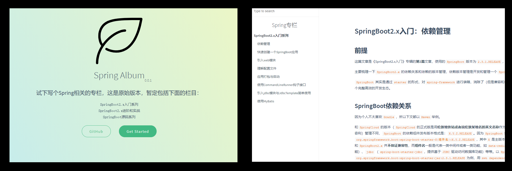
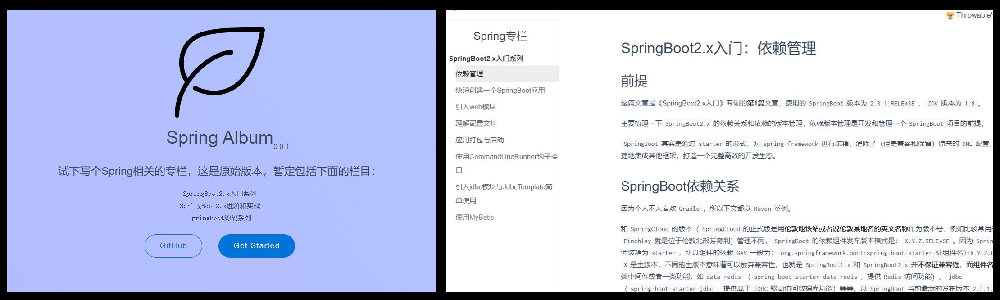
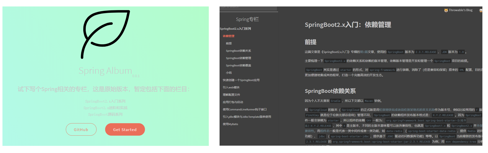
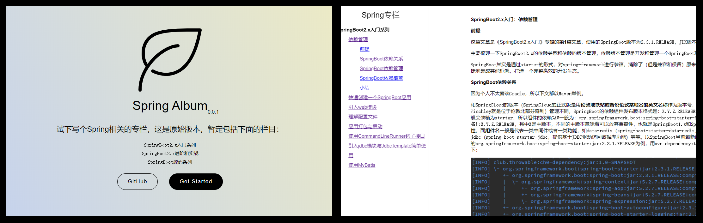
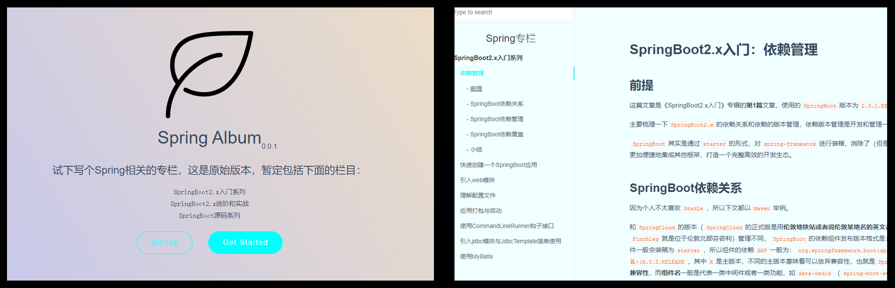
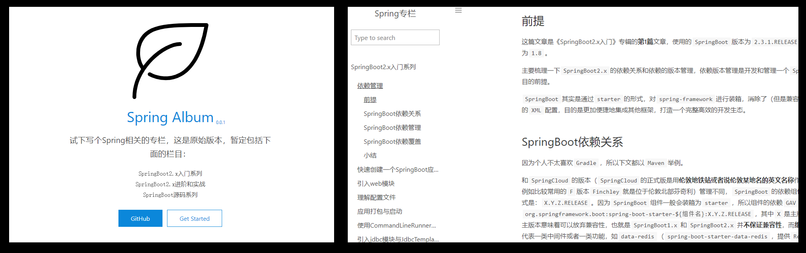
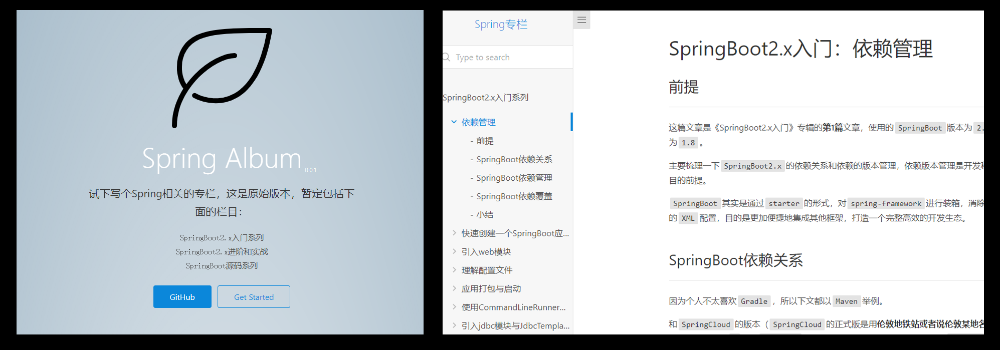
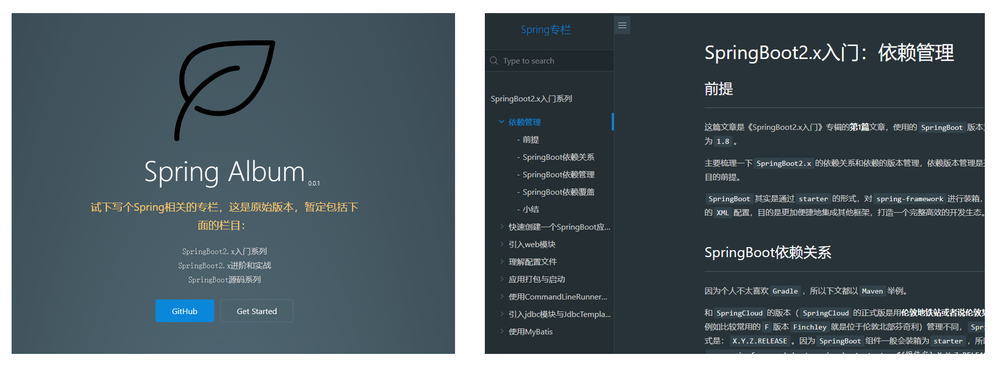

## 主题切换

> 切换主题只需要在根目录的index.html切换对应的主题css文件即可

目前`docsify`官方中列出来的所有支持主题和预览效果如下：

- `Vue`（默认主题）：`<link rel="stylesheet" href="//cdn.jsdelivr.net/npm/docsify/themes/vue.css">`

- `Buble`：`<link rel="stylesheet" href="//cdn.jsdelivr.net/npm/docsify/themes/buble.css">`

- `Dark`：`<link rel="stylesheet" href="//cdn.jsdelivr.net/npm/docsify/themes/dark.css">`

- `Pure`：`<link rel="stylesheet" href="//cdn.jsdelivr.net/npm/docsify/themes/pure.css">`

- `Dolphin`：`<link rel="stylesheet" href="//cdn.jsdelivr.net/npm/docsify/themes/dolphin.css">`

- `Docsify-Themeable-Default`：`<link rel="stylesheet" href="https://cdn.jsdelivr.net/npm/docsify-themeable@0/dist/css/theme-defaults.css">`

- `Docsify-Themeable-Sample`：`<link rel="stylesheet" href="https://cdn.jsdelivr.net/npm/docsify-themeable@0/dist/css/theme-simple.css">`

- `Docsify-Themeable-Sample-Dark`：`<link rel="stylesheet" href="https://cdn.jsdelivr.net/npm/docsify-themeable@0/dist/css/theme-simple-dark.css">`

最有一款合你心水。

