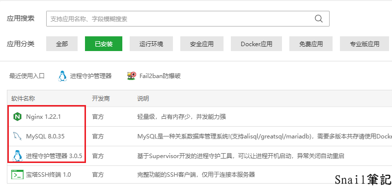
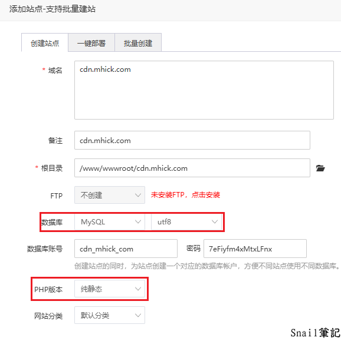
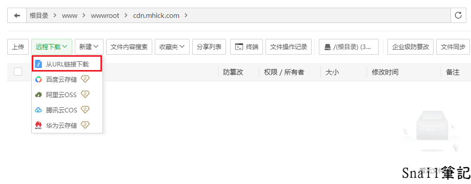
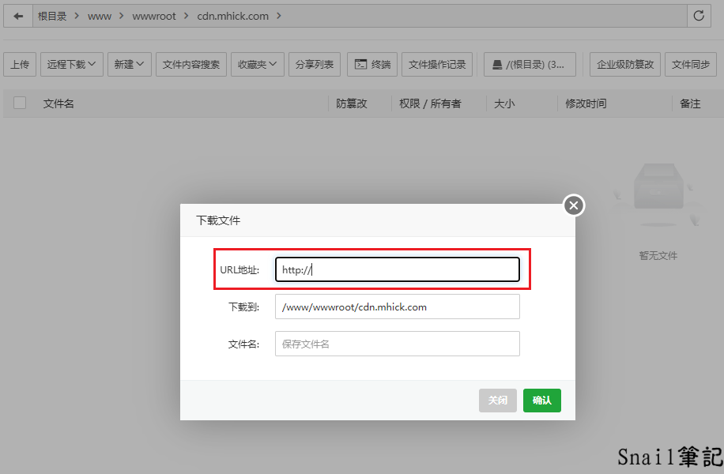
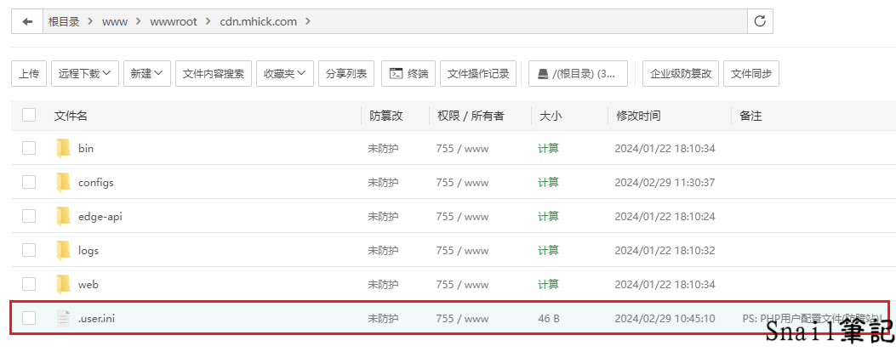
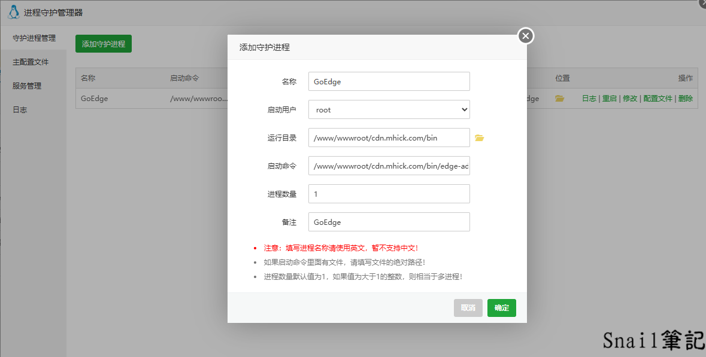
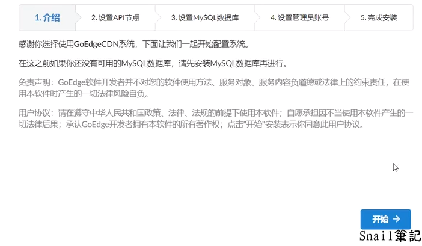
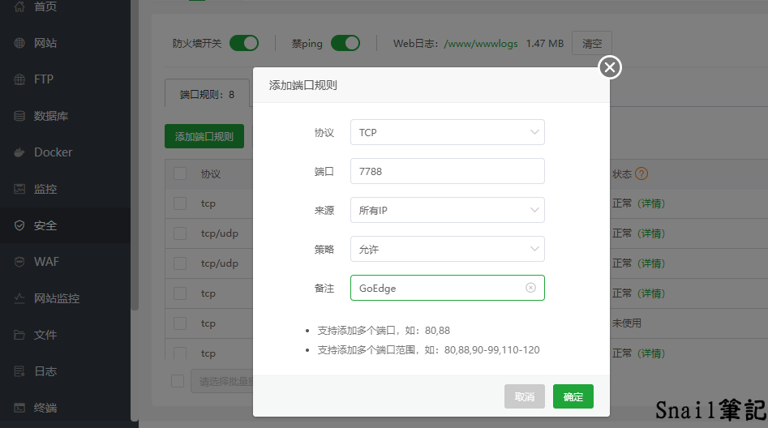
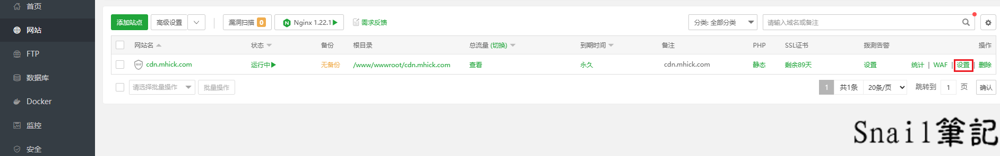
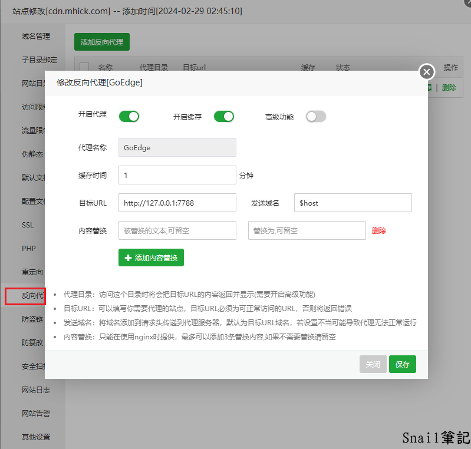

# 宝塔安装GoEdge

## 关于GoEdge

GoEdge是一款管理分布式CDN边缘节点的开源工具软件，目的是让用户轻松地、低成本地创建CDN/WAF等应用。

## 1.服务器配置 (4核8G低至35元/月起)

[WAP](https://wap.ac/aff.php?aff=51) Game VPS Palworld

> 地域：香港
> 实例规格：CPU: 4核 内存: 8GB
> 磁盘：系统盘：40GB
> 流量包套餐：带宽 1000Mbps，流量包 1000GB/月
> 操作系统：Debian11

## 2.环境配置

> Nginx 1.20.0
> MySQL 8.0.23
> 进程守护管理器 3.0.5

[](https://picture.mhick.com/2024/02/29/ab0ad6d30623261f3cac35648c44460e.png)

[image-20240229130544038](https://picture.mhick.com/2024/02/29/ab0ad6d30623261f3cac35648c44460e.png)


## 3.添加站点

宝塔面板 > 网站 > 添加站点。

> 在 域名 填入你指向服务器的域名
> 在 数据库 选择MySQL
> 在 PHP版本 选择纯静态

[](https://picture.mhick.com/2024/02/29/cdbdfef37345e7e815491e602e48cc80.png)

[image-20240229130756530](https://picture.mhick.com/2024/02/29/cdbdfef37345e7e815491e602e48cc80.png)


## 4.GoEdge CDN下载源码

创建完成后把网站根目录（/www/wwwroot/cdn.mhick.com）中的文件统统删除（.user.ini防跨站攻击文件，可以删除或保留），随后我们[下载源码](https://goedge.cn/downloads)（根据CPU架构选择对应的版本）

[](https://picture.mhick.com/2024/02/29/8090b30ee1e0f585ba2a358bbba1834c.png)

[image-20240229131204557](https://picture.mhick.com/2024/02/29/8090b30ee1e0f585ba2a358bbba1834c.png)


[](https://picture.mhick.com/2024/02/29/a4f586513a8eb57ad6d558f5e1a31111.png)

[image-20240229131245365](https://picture.mhick.com/2024/02/29/a4f586513a8eb57ad6d558f5e1a31111.png)


下载完成后解压到根目录下

[](https://picture.mhick.com/2024/02/29/89a29e9be59f9ed44e6e3a8c5a3fcc98.png)

[image-20240229131643830](https://picture.mhick.com/2024/02/29/89a29e9be59f9ed44e6e3a8c5a3fcc98.png)


## 5.启动队列服务

下面以宝塔面板中进程守护管理器来守护队列服务作为演示

> 在 名称 填写 GoEdge
> 在 启动用户 选择 root
> 在 运行目录 选择 /www/wwwroot/cdn.mhick.com/bin
> 在 启动命令 填写 /www/wwwroot/cdn.mhick.com/bin/edge-admin
> 在 进程数量 填写 1

[](https://picture.mhick.com/2024/02/29/b51d6cdf270a47d7b4f1b6405b8270b0.png)

[image-20240229132405560](https://picture.mhick.com/2024/02/29/b51d6cdf270a47d7b4f1b6405b8270b0.png)


配置完成后，在浏览器上访问：

```
http://IP地址:7788/
```

即可进入安装界面，其中`IP地址`是你服务器的IP地址；如果服务器有安全策略或者防火墙，需要放行`7788`及`8001`端口

[](https://picture.mhick.com/2024/02/29/863d407cdb551d27c2bac282382b8417.png)

[image-20240229142233664](https://picture.mhick.com/2024/02/29/863d407cdb551d27c2bac282382b8417.png)


## 6.宝塔面板开启7788端口

宝塔面板 > 安全 > 添加端口规则

> 协议 选择 TCP
> 端口 填写 7788

[](https://picture.mhick.com/2024/02/29/6429a8f3b5f4257350bda9adc96c5de5.png)

[image-20240229134545169](https://picture.mhick.com/2024/02/29/6429a8f3b5f4257350bda9adc96c5de5.png)


## 7.添加反向代理

宝塔面板 > 网站 > 设置 > 反向代理

> 在 代理名称 填写 GoEdge
>
> 在 目标URL 填写 [http://127.0.0.1:7788](http://127.0.0.1:7788/)

[](https://picture.mhick.com/2024/02/29/bbdbe02e40f008a25407196f1639e0f1.png)

[image-20240229133513387](https://picture.mhick.com/2024/02/29/bbdbe02e40f008a25407196f1639e0f1.png)


[](https://picture.mhick.com/2024/02/29/ab6631863c3c46e196b9d62824ac688c.png)

[image-20240229133545418](https://picture.mhick.com/2024/02/29/ab6631863c3c46e196b9d62824ac688c.png)


 最后修改：2024 年 02 月 29 日
