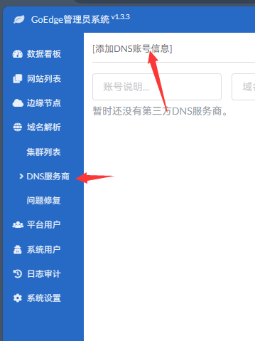
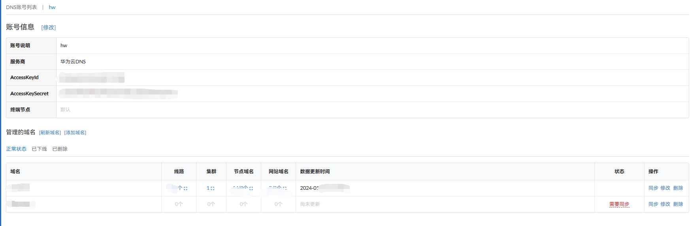
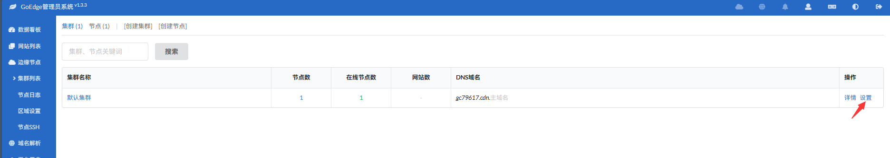
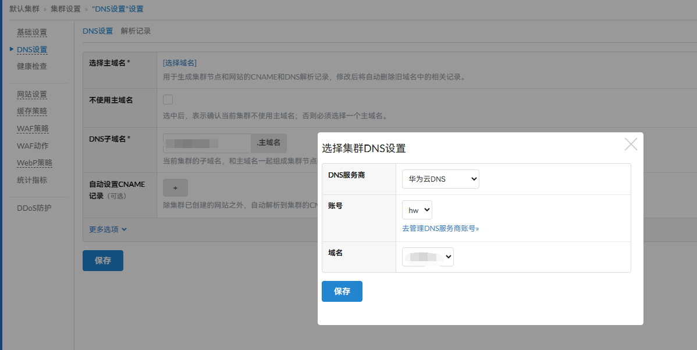
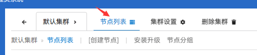
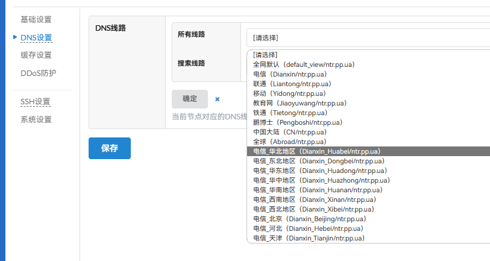

# 添加 DNS 服务商

首先添加域名解析服务商，进入 `域名解析` -> `DNS服务商`

推荐使用华为云 DNS，支持到省级的地域解析，如果有优化节点或地域划分要求比较容易操作；CloudFlare 不支持地域解析功能。

添加 DNS 服务商后点击回到页面点击详细进入你绑定的 DNS 服务商，等待同步域名

**务必要点击立即同步，后面才能正常使用 DNS 的分地域解析功能**

随后点击边缘节点中的集群列表，点击设置绑定域名

选择你刚刚绑定的 DNS 服务商，选择你要的域名，最好是三网访问都没什么问题的域名

保存后点击上方的节点列表，管理节点，同时配置地域解析

选择你要配置的节点，点击 DNS 设置就可以选择分区解析了，不同 DNS 服务商提供的解析不同，这里仅供参考

选择好后点击保存，可以 ping 一下生成的 CDN 域名，查看解析是否生效，也可以点击侧边栏中的 DNS 服务商查看同步情况