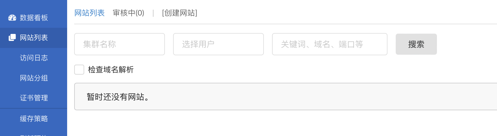
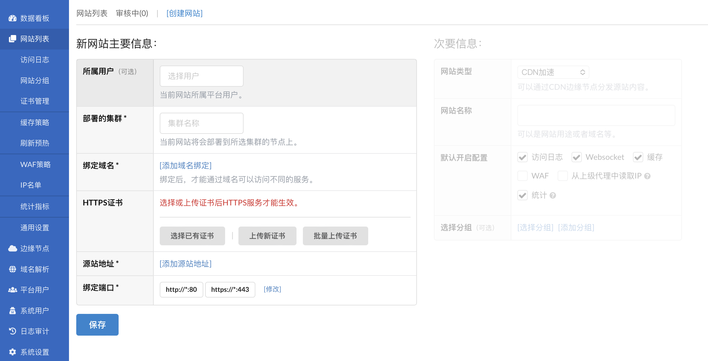
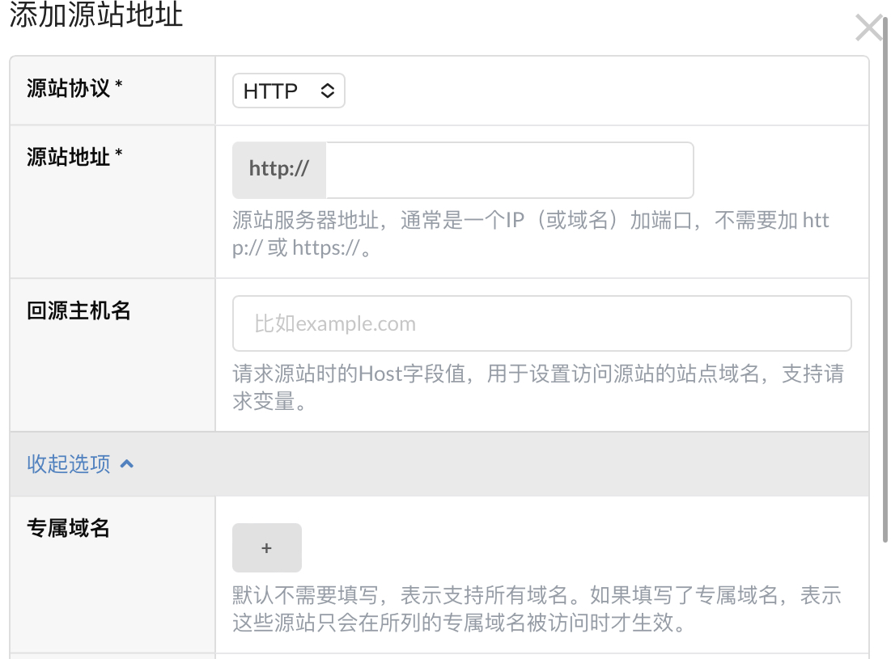
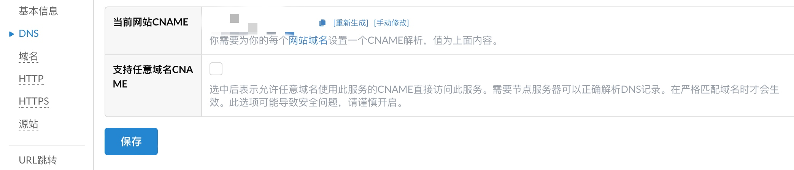
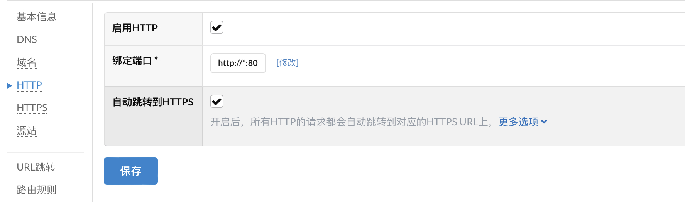
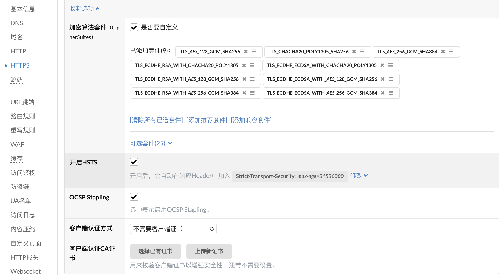

## 添加网站

接下来就是最后一步了：添加目标网站，进入 `网站列表`



添加网站

点击左上角的 `创建网站`



添加网站

选择 `部署的集群`，添加 `绑定的域名`，选择 `HTTPS证书`，填写 `源站地址`



添加源站

选择 `源站协议`，填写 `源站地址` 即可

添加网站后，也有一些建议开启的自定义选项

进入 `网站列表` -> `设置 DNS`



关闭任意域名 CNAME

关闭 `支持任意域名CNAME`

进入 `网站列表` -> `设置` -> `HTTP`



开启强制 https

勾选上 `自动跳转到HTTPS`

进入 `网站列表` -> `设置` -> `HTTPS`



开启 hsts

勾选 `开启HSTS` 和 `OCSP Stapling`

剩余的选项就可以自行研究了，按照需求调整

至此，专属于你的 CDN 就完成啦，将目标网站解析到这里，试试吧！

## 六、后续维护

这个系统总体来说比较完善，大多数功能在面板里操作就够了，需要手动维护的主要是程序更新。

下载 edgeboot 用于管理

```
wget https://dl.goedge.cn/edge-boot/linux/amd64/edge-boot
```

若要更新，执行

```
chmod u+x ./edge-boot  #第一次运行时，需要修改此文件为可执行
./edge-boot upgrade admin
```

