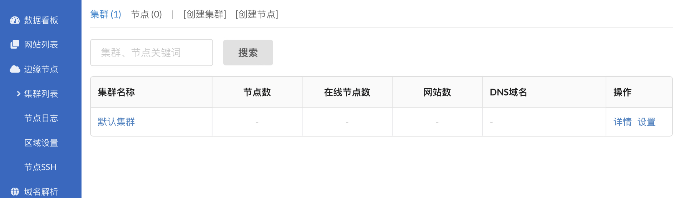
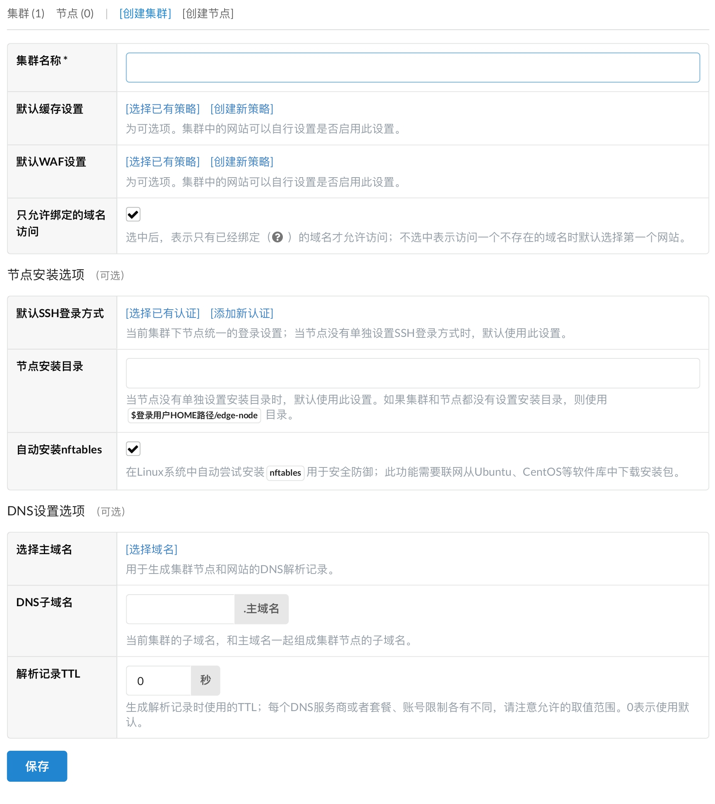
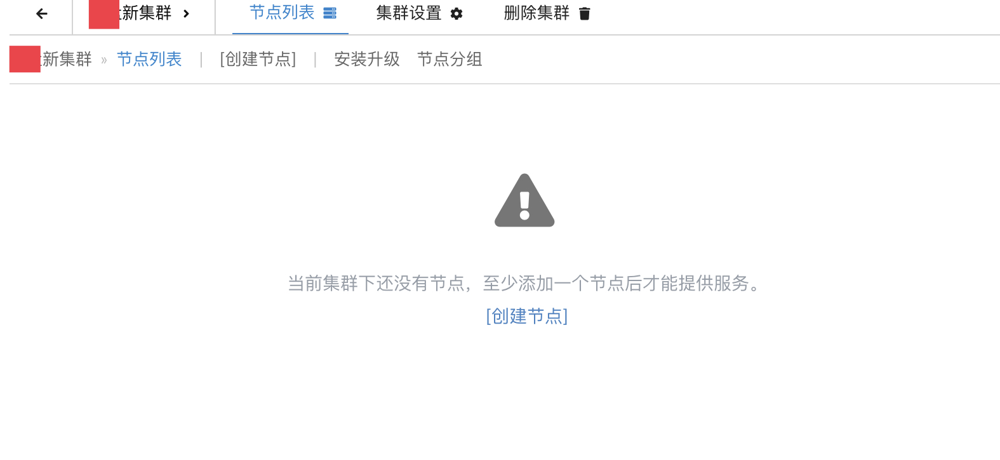
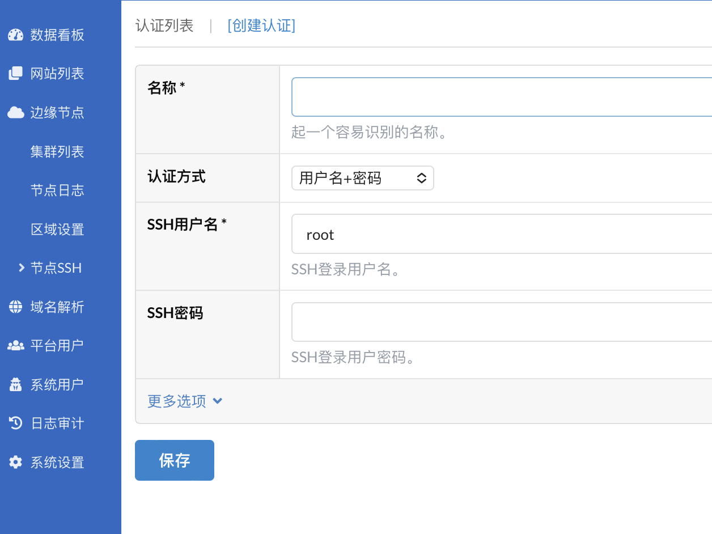
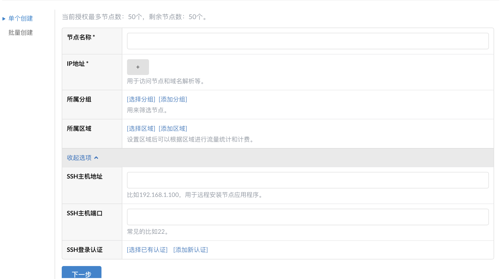
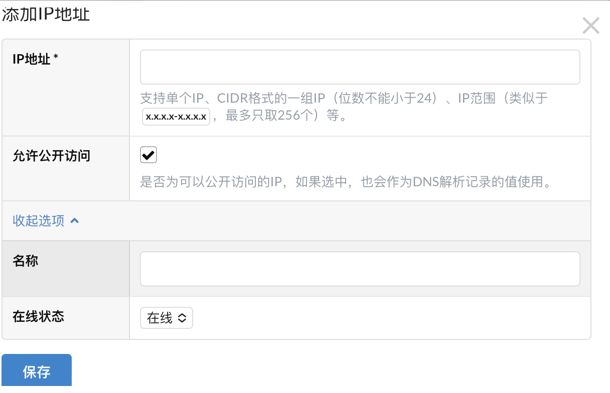
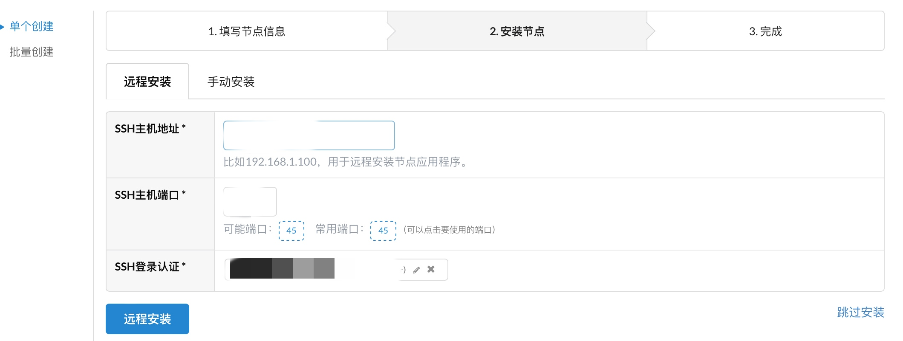
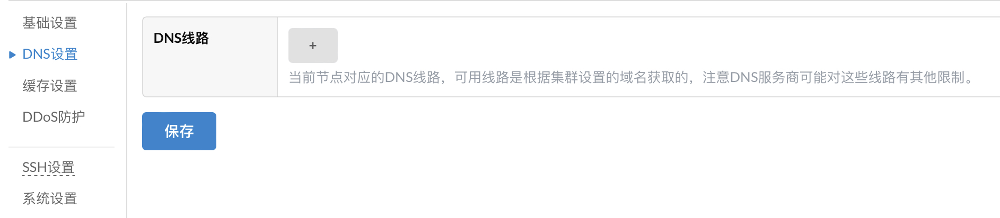
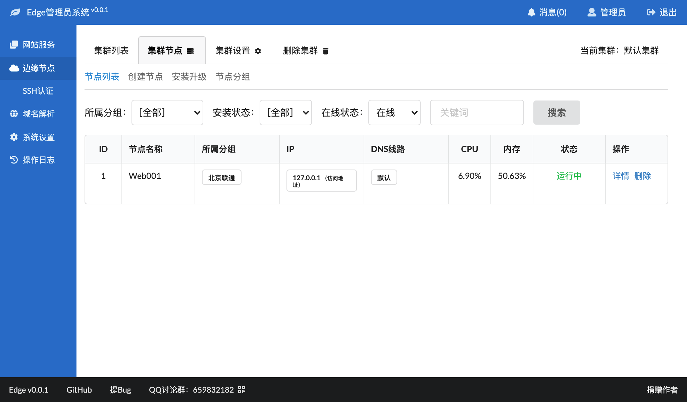

# 添加集群及节点

###  创建集群

程序默认包含一个默认集群



默认集群

我们也可以自己创建集群，进入 `边缘节点` -> `集群`

点击左上角的`创建集群`



添加集群

集群创建完成后会看到



新创建的集群

正如图中所说，现在应该添加节点了

###  添加节点

现在连接到你想要添加的节点的 SSH，进行一些准备工作

安装一些必要的依赖，**不懂可以不用安装，更改一下时区就行**

```
apt install -y iptables ipset firewalld nftables

```

防火墙放行端口，其中 `YOUR_SSH_PORT` 是你的 SSH 端口

```
firewall-cmd --permanent --zone=public --add-port=YOUR_SSH_PORT/tcp
firewall-cmd --permanent --zone=public --add-port=80/tcp
firewall-cmd --permanent --zone=public --add-port=443/tcp
firewall-cmd --reload
```

创建一个 cdn 专用的账户，以 `cdnuser` 为例

```
sudo useradd -d /home/cdnuser -m cdnuser
```

设置该用户的密码

```
sudo passwd cdnuser
```

赋予该用户 sudo 权限

```
usermod -a -G sudo cdnuser
```

更改时区

```
sudo timedatectl set-timezone Asia/Shanghai
```

这里的时区必须与主控相同，否则安装时会报错

```
安装过程中发生错误：test failed: Process exited with status 127
```

更改系统名，其中 `your.domain.name` 是你目标更改的系统名，必须是域名格式

```
sudo hostnamectl set-hostname your.domain.name
```

更改 hosts，其中 `your.domain.name` 是你目标更改的系统名

```
sudo nano /etc/hosts
127.0.0.1 your.domain.name
```

这点同样非常重要，不设置好安装就报错

设置好后，现在去添加连接节点的 ssh 信息，进入 `边缘节点` -> `节点SSH` -> `创建认证`



添加 SSH 认证

填写完成后，开始添加节点，进入 `边缘节点` -> `创建节点`



填加节点

在 IP 地址栏，填写节点的 IP



添加节点 IP

如果填写的 IP 就是用户访问你的节点的 IP，那就要勾选上 `允许公开访问`

其余信息按照实际填写即可，选择保存好的 ssh 认证



远程安装准备

点击远程安装

如果安装失败，报什么没权限之类的错误之类的，再多装几次就好了

安装完成后，还可以进行一些自定义设置

比如设置 DNS 线路，让特定区域的用户访问到这个节点



其余的设置可以自行研究，一般不需要更改


### 手动安装边缘节点

1. 先在管理平台”创建节点”，填写节点的相关信息；

2. 可以在”集群节点” – “安装升级” – “手动安装” 界面中查看等待安装的边缘节点；

3. 在”手动安装”界面，可以查看配置文件内容，先不着急使用这个配置文件；

4. 在GoEdge官网上下载对应版本的边缘节点；

5. 上传到目标服务器，建议放在 **/usr/local/goedge** 目录下（如果目录不存在，就创建），然后使用 **unzip** 命令解压，比如：

   ```bash
   unzip -o ./edge-node-linux-arm64-v1.3.4.zip
   ```

   如果系统没有 unzip 命令，请先安装；

6. 解压后转到安装目录下：

   ```bash
   cd edge-node/
   ```

   - 在 GoEdge v1.3.3之前，创建或修改配置文件：

     ```bash
     vi configs/api_node.yaml
     ```

     然后把 **api_node.yaml** 里面的内容换成在当前流程**第3步**看到的配置内容，然后使用 :x 回车保存并退出 vi ；

   - 在 GoEdge v1.3.3及以后，执行：

     ```bash
     edge-node config '
          当前流程 第3步 看到的配置内容
     '
     ```

     注意两边的单引号不能少，如果看到提示 success 表示成功。

7. 可以使用以下命令启动节点：

   ```bash
   bin/edge-node start
   ```

   如果使用的非 root 用户，需要使用：

   ```bash
   sudo bin/edge-node start
   ```

8. 可以使用ps命令确认进程是否正常启动：

   ```
   ps ax|grep edge-node
   ```

   应该输入类似于以下的内容：

   ```
   52160 ?        Sl     1:42 /usr/local/goedge/edge-node/bin/edge-node
   ```

9. 如果没有启动成功或者有其他异常，可以通过查看 `logs/run.log` 中的内容来诊断问题所在。


**确认启动状态**

可以在单个集群的”集群节点”中查看节点的状态：

[](https://dl.goedge.cn/edge/docs/Node/InstallManual1.png)


正常情况下，状态应该为”运行中”。


**重装**

如果在管理界面上删除了某个节点，并重新创建了一个新节点，那么节点的配置将会发生变化，你需要重新修改 `api_node.yaml` 为 “安装升级” 界面中的配置，并重启节点进程。

如果没有重新创建节点，只需要下载安装文件解压覆盖后重启节点进程即可。


**卸载**

从GoEdge v1.2.7以后，你可以使用以下命令卸载节点：

```bash
edge-node uninstall
```

卸载后，缓存目录需要手动删除。


**查看运行日志**

从GoEdge v1.2.7以后，在节点服务器上，可以使用以下命令查看节点运行日志：

```bash
tail -f /var/log/edge-node.log
```

如果提示这个文件不存在，说明你的节点版本太低或者没有启动（`edge-node start`）。


**注意事项**

1. 单个服务器同时只能启动一个边缘节点；
2. 建议安装目录仍然保持为 `edge-node`，避免升级时带来麻烦。


### 同样可以用宝塔进程守护管理器运行边缘节点

修改好 api_node.yaml 后进程守护管理器运行或者系统启动项 

下面以宝塔面板中进程守护管理器来守护队列服务作为演示

> 在 名称 填写 GoEdge
> 在 启动用户 选择 root
> 在 运行目录 选择 /www/wwwroot/cdn.mhick.com/edge-node/bin
> 在 启动命令 填写 /www/wwwroot/cdn.mhick.com/edge-node/bin/edge-node
> 在 进程数量 填写 1