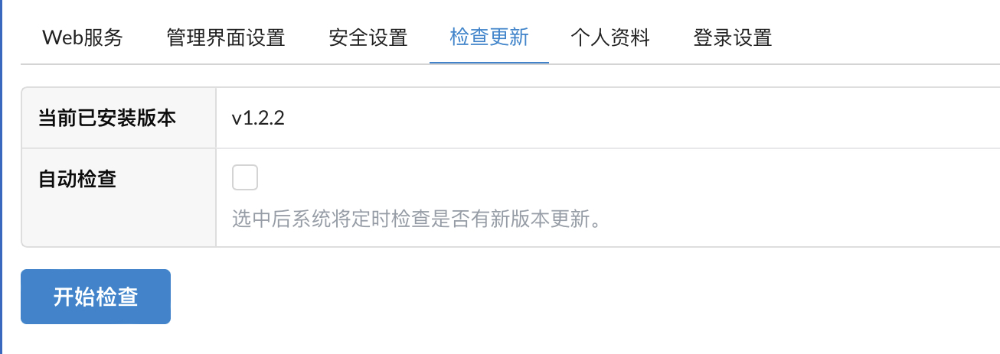
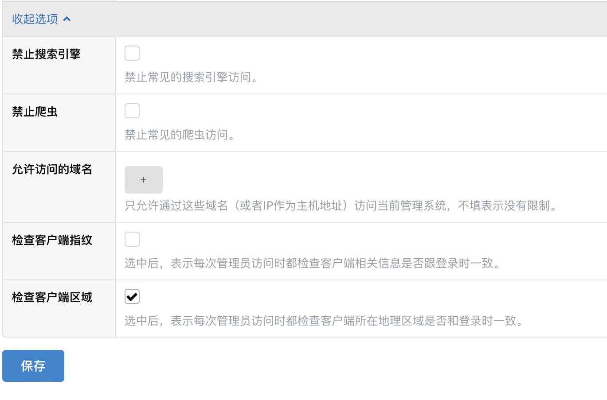

# 面板基本设置

现在先不要着急添加节点，我们先去做一些基本的设置

首先去开启更新检查

开启更新检查

你只需要：

- 勾选上 `自动检查`

即可

非常建议开启自动检查，这样在有更新时就可以及时看到更新提示

然后去禁止搜索引擎，爬虫等访问

禁止爬虫访问

现在需要：

- 勾选上 `禁止搜索引擎`
- 勾选上 `禁止爬虫`
- 勾选上 `检查客户端指纹`
- 添加 `允许访问的域名`（可选，但十分建议）

十份建议添加允许访问的域名，这样可以使用域名访问并开启 https，既安全又方便

假设你使用 `your.domain` 作为允许访问的域名，那么现在需要通过 http://your.domain:7788 访问面板

为了让 CDN 能够自动为我们申请证书并续签，我们还需要一些配置，稍后再回来开启面板 https