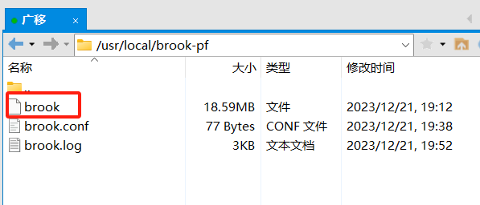
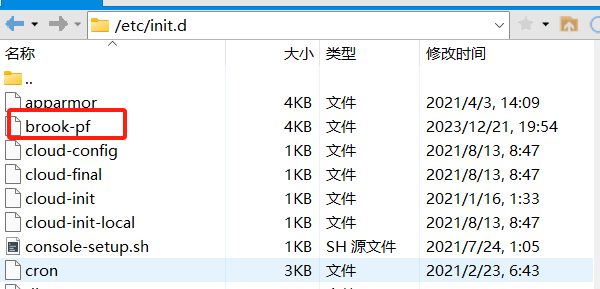
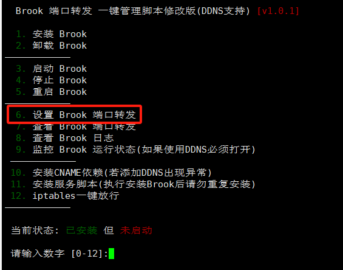
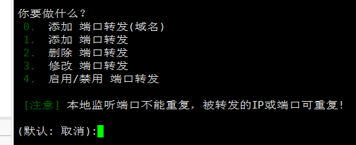
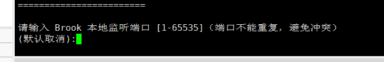

# IPv6转发教程

使用得是debian 11,bbr自行安装，使用brook转发

[工具直接下载](https://github.com/chenxi-a11y/wiki/archive/refs/tags/v0.1.zip)

或者 https://github.com/chenxi-a11y/wiki/releases/ 下载brook

```
1、执行命令：mkdir /usr/local/brook-pf;cd /usr/local/brook-pf;rm -rf /usr/local/brook-pf/*

2、将【brook】文件放至/usr/local/brook-pf/目录下
3、chmod +x brook
4、echo >  /usr/local/brook-pf/brook.conf
5、echo >  /usr/local/brook-pf/brook.log
```




```
1、将【brook-pf】文件放至/etc/init.d/目录下
2、chmod +x /etc/init.d/brook-pf;update-rc.d -f brook-pf defaults
```



```
1、将【brook-pf-mod.sh】文件放至/root/目录下
2、cd ~;chmod +x brook-pf-mod.sh;./brook-pf-mod.sh
```

创建转发



输入6



输入1



输入端口、输入v6IP`v6必须带[]` 列：[xxx:xxx:1:38:354e::1]

最后输入 `ps -ef |grep brook`看有没有转发得线程，有就成功了

**注意**

提示 Brook-pf 启动失败 !  

这个没关系，看看线程在不在，在就成功了