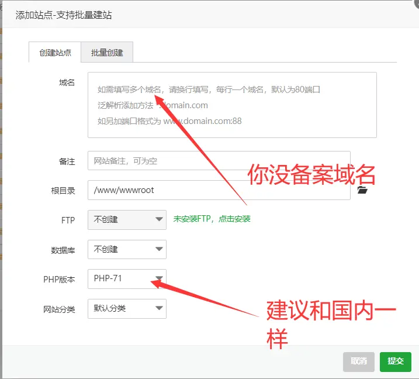
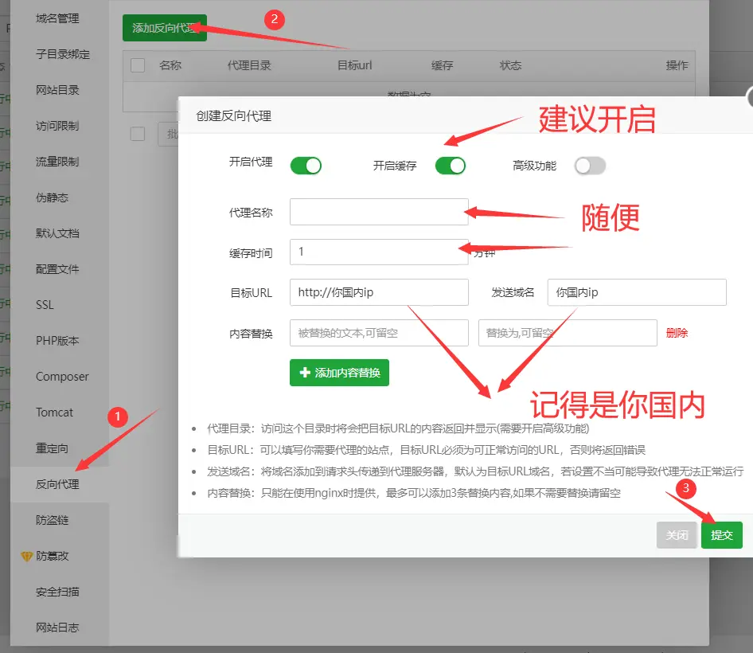
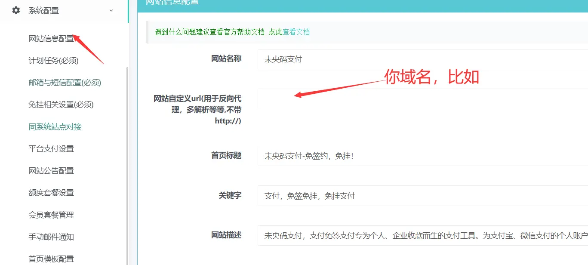

## 一.反向代理简单介绍

什么是反向代理，简单来说就是，当用户请求我的网站时，把用户的请求转到其他站点，让用户访问的内容是其他站点的内容，但是显示访问的网站是我的网站

## 二.怎么实现反向代理绕备案

国内ip是直接访问的，不需要备案，但是让用户访问ip不太现实，所以我们在一个国外服务器上，绑定我们的域名，让这个域名反向代理到我们国内ip的那个网站，这样用户访问我们域名返回的就是我们国内ip的网站内容，也就实现了绕备案！

## 三.搭建前的准备

1.一台国内服务器，建议2核心+2内存+5M以上的配置(腾讯云轻量就可以)
2.一台国外服务器，宽带大一点就可以，地区无限制
3.一个没备案域名，解析到国外服务器的ip
4.一个灵活的小手

## 四.国内服务器IP搭建站点

**记得把授权站的授权域名改为你的国内ip再搭建！**
**搭建教程参考上一篇的安装教程，这里就不多说了，注意填域名的地方填ip**
好了就可以不用操作国内服务器了

## 五.国外服务器设置反向代理

先把国外服务器正常搭建好宝塔
环境**nginx/Apache都可以，MySQL5.6，PHP5.6-7.2**
然后我们新建一个站点，填上我们的域名

新建站点好了，我们点开设置

比如我国内ip是121.121.121.121
那我就填 [http://121.121.121.121](http://121.121.121.121/) 121.121.121.121
最后提交，再访问我们域名就可以看到和国内IP一模一样了

## 六.网站后台配置域名（这里以易支付为例子）

## 注意：温馨提示

1,域名开启了https，国内IP也要https    
2.建议访问网站后台使用 国内IP/Admin
