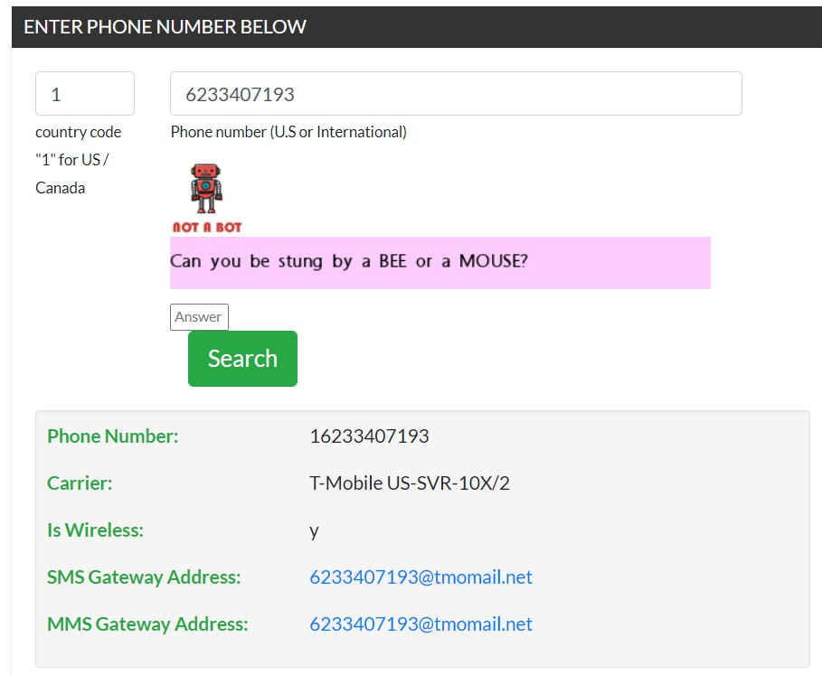
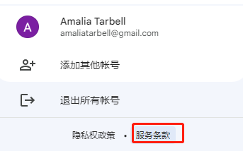
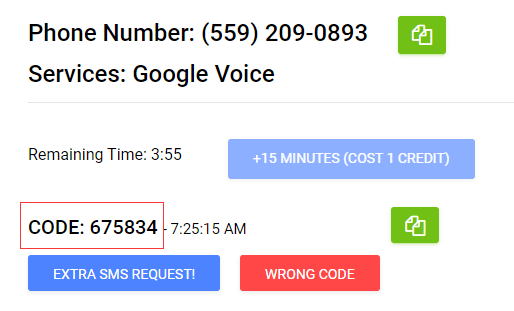
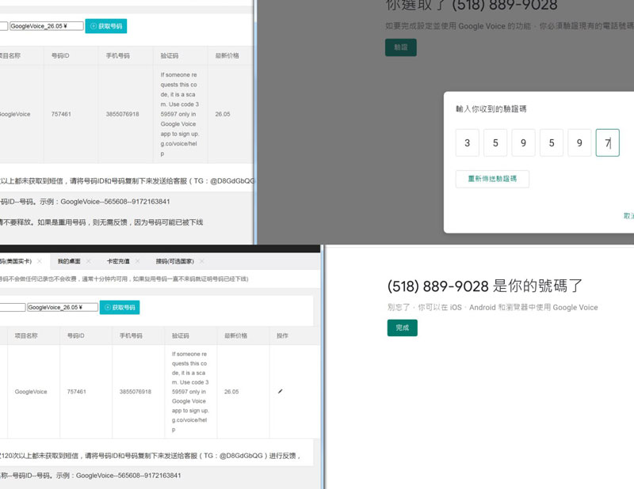

# Google Voice注册,无美国电话卡验证GV号码教程

在开展外贸时，注册Google Voice (GV) 号码是一个普遍的选择。GV号码可以提供一个稳定且好记的美国号码，这将极大地增强客户的信任感。您无需月租费用，只需花费几十块人民币就可以获得一个完整的GV号码，用于注册Google、Facebook、Amazon、Telegram等需要美国电话号码的服务。

此外，开展海外营销业务，在TK上使用个人简介链接进行引流的效果可能不太好，转化率较低。最近引流私域的效果较好的方法是使用WhatsApp或Line（类似于国内的微信）。

考虑到要引流私域，使用接码平台可能行不通，因为无法进行二次接码。如果账号出现问题，很难申诉回来。因此，我考虑使用一个免费的Google Voice账号，用于接码和注册各种海外账号。主要的优势在于它可以重复接码。

什么是Google Voice？

Google Voice是Google提供的一项虚拟电话号码服务。它的特点是永久免费，并且可以循环使用，允许用户进行二次接码。这意味着您可以在不紧急需要的情况下保留该号码，或者将其用于个人使用。特别是在注册像OpenAI这样的服务时，拥有一个美国号码可以省去寻找接码平台的麻烦。

**2023年最新成功注册GoogleVoice(不需要美国实体手机卡)**

在本教程中，我们将向您展示如何注册和验证GV号码。

## 使用Google Voice美国号码的好处

1. 免费拨打美国、加拿大的电话
2. 获得一个免费美国电话号码
3. 无月租
4. 接收短信验证非常方便
5. 成本低
6. 可以注册Google、Facebook、Amazon等需要美国电话号码的服务
7. 拨打美国至中国的电话只需要0.01美元/分钟
8. 避免主号码接收骚扰电话和垃圾短信
9. 对于外贸，代购行业来说是最佳选择，有助于提升业务信任度
10. 免费提供语音信箱功能

还有许多其他实用功能可供利用。举例来说，尽管Google Voice号码无法直接用于微信注册，但你可以先使用国内手机号注册微信，然后将其改绑为Google Voice号码，这一操作是被允许的。

这样，在申请多个微信账号时，你就无需购买多个国内手机号码，同时，当与国外客户沟通时，你可以提供一个美国的号码，以增加亲和力，使客户更愿意添加你的微信。

## 成功注册Google Voice的条件

1. 美国IP注册的Gmail邮箱，且未被封禁过，注册时间7天以上最佳
2. 美国住宅IP地址
3. 美国实卡电话号码

分享三个网站，可以查询是否是美国实卡！

- https://www.numlookup.com/
- https://freecarrierlookup.com/
- https://www.revealname.com/
- https://www.ipqualityscore.com/free-carrier-lookup

如上图，输入电话号码查询，如果is Wireless显示的是y，说明是实卡号码，可以用来注册GV。

- IP地址类型查询 https://iphub.info/ 或者 https://ipinfo.io/
- 检测IP地址是否泄露 https://ip.voidsec.com/
- 关闭web RTC webrtc leak prevent
- IP地址伪装查询 https://whoer.net/
- 指纹浏览器 https://www.adspower.net/
- 住宅代理 http://sem.ipidea.net/ 或者 动态住宅IP代理https ://www.smartproxy.cn/

怎样查看你的Gamil是否是美国IP注册的？

登录你的google账号，在隐私条款这里，你可以看到自己所属地区，如果显示是中国，那就重新注册一个美国地区的google账号。

## 注册GV准备工作

最新注册Google Voice 教程： 使用的工具为：指纹浏览器+美国住宅IP(静态/动态 都可以)

如果注册GV不下号，是因为你的IP不干净或者是因为邮箱有问题（不是用美国IP注册的Gmail），可自行排查，千万不要使用whoer来作为环境是否干净的标准

1. 指纹代理浏览器 adspower.net
2. Kookeey全球住宅代理IP, 或者www.miyaip.com （6折优惠码 allen123）
3. 接码网站：ussms.cyou ，app.pvadeals.com， daisysms.com , verifywithsms.com

（1）首先，您需要注册一个美国的Windows 10虚拟机，您可以选择使用甲骨文、AWS、Azure等提供的免费或付费机器，甚至可以考虑Vultr服务器。

（2）在该虚拟机上安装adspower指纹代理浏览器，并下载其客户端。

（3）在虚拟机上注册一个美国地区的Gmail邮箱账号。请注意，确保您使用美国的地址和最好是美国手机号进行注册。如果没有美国手机号，建议不要使用虚拟号码。您可以考虑使用像giffgaff这样的英国手机号，或者中国大陆手机号。在注册时修改地址是非常重要的步骤。同时，务必使用您自己的手机号，而不是虚拟号码，以避免账号被封禁。

为了更好地帮助您完成谷歌账号注册地址的更改，以下是具体步骤：

1. 登录您的谷歌账号。
2. 点击右上角的头像图标，选择 “设置”。
3. 在 “个人信息” 标签中，点击 “地址”。
4. 修改您的注册地址并保存更改。

务必确保输入的地址信息准确无误，以便您能更好地使用谷歌的服务。

（4）建议将新注册的Gmail账号在指纹浏览器中使用一段时间，以防止触发风控机制。您可以使用Whoer网站来检查IP的隐私程度和彻底性。这样可以确保您的账号和浏览行为不会引发不必要的警示。

## 申请Google Voice号码

1. 打开Google Voice网址：[voice.google.com](https://voice.google.com/) 并登录Google账号。
2. 点击 “Continue”。
3. 系统会随机显示不同的洲和号码，选择自己喜欢的号码即可。
4. 选择好后选择验证。

只要是实体手机卡首次接码，一定没问题。可以肯定添加。如果接收到了验证码，然后返回到选择账号页面。肯定是虚拟号或者环境有问题。

虚拟号一定不行。一个号码验证次数有限。点击右上角设置。只要有这两个就肯定没问题。

此时，您需要有一个美国的号码才能接收验证码。这个号码不能是虚拟号，之前网络上用免费网络临时电话号码（像twilio等）接收短信的方法现在已经全面失效了。

解决的方法是购买一个NON-VOIP号码，比如在美国实卡接码平台上购买。NON-VOIP号码成功率很高，但是现在平台出售的号码很少，经常缺货。

购买NON-VOIP号码成功后，将得到的号码填入Google Voice验证，很快就能收到了验证码。

一旦您收到验证码并输入，Google Voice号码就申请成功了。

## 注意事项：

（1）在获得Google Voice号码后，务必先使用smartproxy平台等工具养号一段时间，至少两天，然后再将该号码登录到其他设备上。这样可以降低账号被封的风险。

（2）对于注册的Gmail邮箱，最好使用美国的地址。尽量选择已存在的旧Gmail邮箱。如果有可能，绑定美国手机号，尽管这可能并非必需（我的情况是例外）。

（3）务必使用某些工具查询IP地址，以确保您的IP隐私得到保护。

（4）在更换登录设备时，尽量避免修改密码，以减少账号被封的可能性。

（5）登录Google Voice号码时，建议使用质量较好的节点，以确保稳定性和安全性。

**3. 使用Google Voice号码**

在Google Voice设置里面，我们可以看到购买注册成功的Google Voice号码。下载环聊或Google Voice软件在手机上，就可以使用该号码打电话了。

现在注册GV号非常麻烦，前段时间我试过，无论注册还是转移号码，对IP门槛要求特别高，建议如果一定需要一个GV号码的话，还是用实体号码转进去比较方便，对IP要求不高，20美元费用，永久使用！

**Google Voice注册失败的原因？**

在申请 Google Voice 电话号码时，可能会因以下原因之一导致您的 Google 帐户不符合资格：

1. 您提交的个人电话号码来自不符合 Google Voice 号码申请资格的电话运营商。您可以尝试使用来自“三大”移动运营商之一（AT&T Wireless、T-Mobile 或 Verizon Wireless）或其子公司、转售商 (MVNO) 品牌之一的号码，或者来自传统固定电话运营商（如AT&T、CenturyLink、Charter、Comcast、Frontier、Spectrum 或 Verizon）的号码。请提交符合资格的转接电话号码。
2. 所提交的号码可能之前曾被您、该号码的前任用户或诈骗者用于申请 Google Voice 号码，因此导致申请失败。您可以尝试提交不同的号码。
3. 您提交的号码位于美国 48 个相邻州之外，而 Google Voice 号码的申请仅限于美国 48 个相邻州内。请提交位于美国 48 个相邻州内的号码。请注意，您无法在美国境外注册 Google Voice 号码。
4. 如果您在短时间内多次尝试提交和链接号码，可能会导致申请失败。建议您至少等待 24 小时后再进行尝试。
5. 如果您的 Google 帐户已被标记为违反 Google 的服务条款或可接受的使用政策，您将不符合获得 Google Voice 号码的资格。

请在申请 Google Voice 号码时留意以上原因，并根据要求提交合适的号码以确保成功申请。