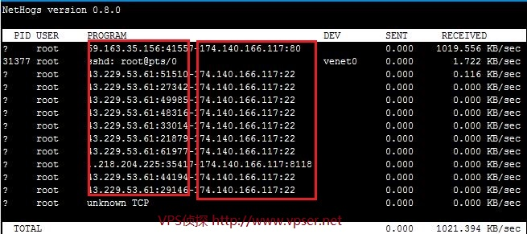

# Linux下进程/程序网络带宽占用情况查看工具 -- NetHogs

之前介绍过流量带宽相关的工具如：[iftop](https://www.vpser.net/manage/iftop.html)、[vnstat](https://www.vpser.net/manage/vnstat.html)，这几个都是统计和监控网卡流量的。但是当我们的服务器或 VPS的带宽被大量占用或占满，却没找不到称心的工具或程序来查看到底是哪个程序或进程占有率多少带宽。虽然在Windows上查看进程占用带宽情况的软件很多，像某3**、某Q家的电脑管家、IP雷达等。但是Linux下这一类软件很少，今天我们介绍的就是Linux的一款查看进程带宽网络占用的软件：NetHogs。

**安装**
Debian/Ubuntu下安装很简单，执行：**apt-get install nethogs** 就可以安装。

CentOS/RHEL下建议先[安装上EPEL](https://www.vpser.net/manage/centos-rhel-linux-third-party-source-epel.html)，再执行：**yum install libpcap nethogs** 进行安装。

**具体使用参数说明：**

> [root@vpser ~]# nethogs -h
>
> usage: nethogs [-V] [-b] [-d seconds] [-t] [-p] [device [device [device ...]]]  //nethogs可以使用的参数
>
> -V : prints version.//打印版本信息
>
> -d : delay for update refresh rate in seconds. default is 1. //延迟刷新时间，单位秒，默认1秒
>
> -t : tracemode. //跟踪模式
>
> -b : bughunt mode - implies tracemode. //bughunt模式
>
> -p : sniff in promiscious mode (not recommended). //混合模式下嗅探，不推荐
>
> device : device(s) to monitor. default is eth0 //监听的设备，默认是eth0，也就是网卡设备名称，如果是openvz的vps一般都是venet0，具体可以ifconfig进行查看，lo为本地回环，用不到。多个网卡可以一块写上，空格隔开。
>
> 
>
> When nethogs is running, press: //nethogs运行是可以使用以下按键进行操作
> q: quit //运行时，按 q 键退出
> m: switch between total and kb/s mode //按 m 键，切换单位或显示进程占用速度或已统计使用的流量。切换顺序是KB/sec->KB->B->MB
> r : Sort by received. //按received进行排序
> s : Sort by sent. //按send进行排序

使用例子：**nethogs eth0**

如上图，PID一列就是进程的PID，PROGRAM就是显示进程或连接双方的端口号，前面红框是连接VPS人的IP:端口，后面红框是当前VPS上的IP:端口，如图根据端口可以判断，目前有80端口和22端口及8118端口，如果不知道端口对应的进程可以通过[lsof](https://www.vpser.net/manage/linux-windows-ports.html)来进行查看。

DEV列显示设备名，SEND列相当于VPS上往外流出占用的带宽(相当于VPS配置上标识的Outgoing)，RECEIVED相当于在VPS上使用wget下载时占用的带宽(相当于VPS配置上标识的Incoming)。