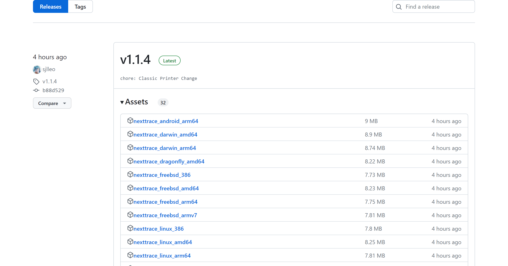
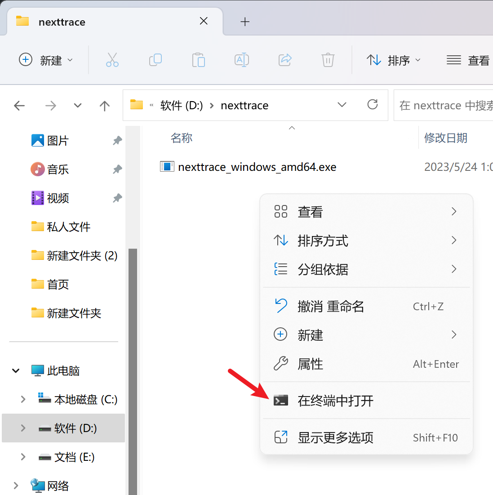
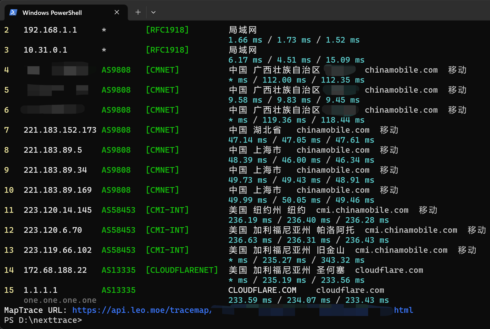
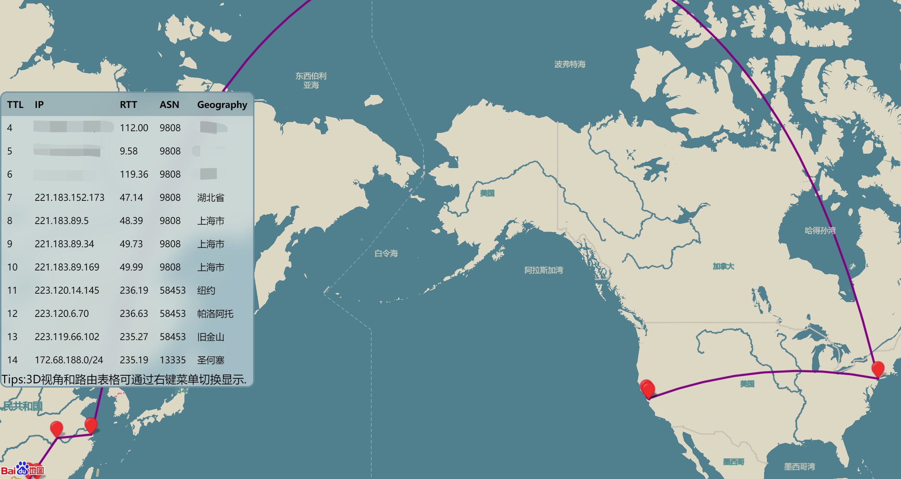

# NextTrace 路由跟踪工具使用教程

一般我们需要查询VPS的线路的时候，首先大家第一个反应就是Best Trace。但是这个软件是由国内公司开发，且不开源。有可能你使用这个软件追踪路由之后，你的VPS的IP就会那啥。博主也一直在寻找其的替代品。在这篇文章中，我来和大家一起来介绍并且了解NextTrace这款软件。这款路由跟踪工具是全开源的，大家可以放心的去使用。

**准备材料**

- 一台电脑（本文以Windows的演示）

**使用步骤**

1. 打开项目的Release页面： https://github.com/nxtrace/Ntrace-core/releases ，选择适合自己电脑的版本进行下载。我这里是Windows的电脑，所以说下载Windows的版本

[](https://v2cross.com/wp-content/uploads/2023/10/1698512243-cfbf6c573578b83.png)

1. 右键打开命令行，输入以下命令

[](https://v2cross.com/wp-content/uploads/2023/10/1698512248-b95147a73406293.png)

```
shell
.\nexttrace_windows_amd64.exe 1.1.1.1
```

> 请将 `1.1.1.1` 替换成需要追踪的 IP，支持 IPv4 / IPv6

> `nexttrace_windows_amd64.exe` 为示例程序名，请根据实际文件名修改成对应的

> 更多高级命令用法可以参考项目README：https://github.com/sjlleo/nexttrace/blob/main/README_zh_CN.md

1. 运行完命令之后，可以在下方查询到追踪结果

[](https://v2cross.com/wp-content/uploads/2023/10/1698512251-54476fd64364e70.png)

1. 可以使用提供的地图链接，实时显示路由情况

[](https://v2cross.com/wp-content/uploads/2023/10/1698512254-1f97333dcf1592d.png)

**项目地址**

https://github.com/sjlleo/nexttrace