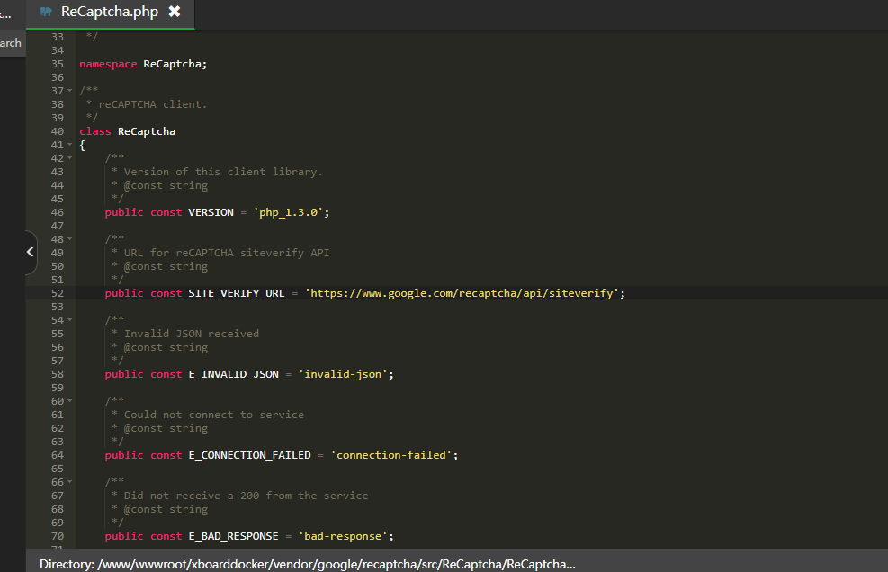

# V2board 修改Google Recaptcha为Cloudflare Turnstile

注意

注意：此方法仅适用于xiao佬版本v2board. 其他版本文件有所区别不通用。但是可以参考学习！

https://github.com/wyx2685/v2board

 

文件1：

vendor/google/recaptcha/src/ReCaptcha/ReCaptcha.php

第52行
public const SITE_VERIFY_URL = 'https://recaptcha.net/recaptcha/api/siteverify';
更改
public const SITE_VERIFY_URL = 'https://challenges.cloudflare.com/turnstile/v0/siteverify';

文件2:

public/theme/default/assets/umi.js

第18161行
return "https://www.google.com/recaptcha/api.js?onload=".concat(x, "&render=explicit")
更改
return "https://challenges.cloudflare.com/turnstile/v0/api.js?onload=".concat(x, "&render=explicit")

 