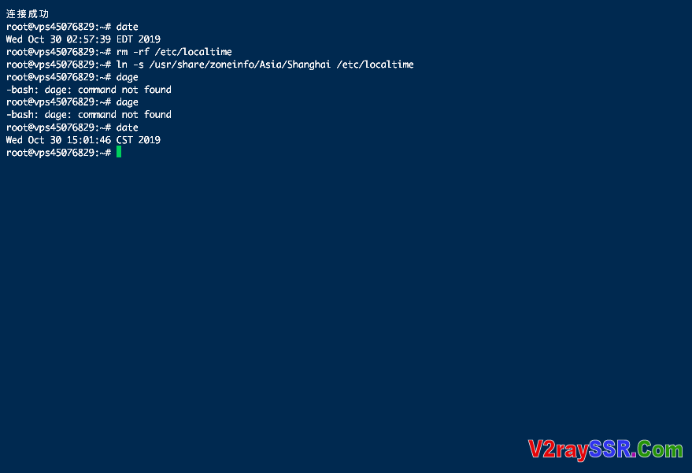

# VPS时间同步教程/解决VPS时间和本地客户端时间不同

[简介](https://v2rayssr.com/vpstime.html#简介)[设置时区为北京时间](https://v2rayssr.com/vpstime.html#设置时区为北京时间)[NTP同步时间 协议](https://v2rayssr.com/vpstime.html#NTP同步时间_协议)[Ubuntu/Debian系统](https://v2rayssr.com/vpstime.html#UbuntuDebian系统)[CentOS/RHEL系统](https://v2rayssr.com/vpstime.html#CentOSRHEL系统)

## 简介

之前在配置V2ray的时候，有群友和我反馈说VPS时间和本地客户端时间不同步，无法正常使用。于是今天就分享个同步VPS时间的教程。


## 设置时区为北京时间

一般国外的VPS的镜像都是默认的国外时区，使用起来不是很方便。可以把它修改成北京时间，就会方便很多。代码：

```
rm -rf /etc/localtime
ln -s /usr/share/zoneinfo/Asia/Shanghai /etc/localtime
```

## NTP同步时间 协议

众所周知，NTP协议是网络时间同步协议，有了它，我们可以很轻松的同步本地时间与互联网时间。VPS上也可以使用NTP来同步网络。首先安装必要的软件包：

### Ubuntu/Debian系统

```
apt-get update
apt-get install ntp ntpdate -y
```

### CentOS/RHEL系统

```
yum install ntp ntpdate -y
```

接下来我们需要先停止NTP服务器，再更新时间。

```
service ntpd stop                 #停止ntp服务
ntpdate us.pool.ntp.org           #同步ntp时间
service ntpd start                #启动ntp服务
```

执行完成后，VPS上就是相对精确的时间设置了。很多依赖于系统时间的应用程序也就能正常工作了。



