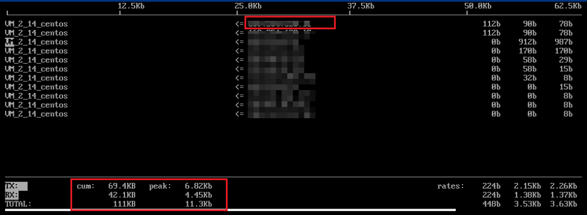

# VPS 流量监控工具 找到消耗流量最多的IP和端口

## 一、VPS实时流量

查看网络实时工具

### **1、安装软件**

\# CentOS 系统命令

```
yum install -y epel-release && yum install -y nload
```

\# Debian 系统命令

```
apt install -y epel-release && apt install -y nload
```

### **2、查看流量命令**

```
nload eth0     # 查看 eth0 网卡流量
```

## 二、端口监测

执行以下命令，安装 iftop 工具（iftop 工具为 Linux 服务器下的流量监控小工具）

### **1、安装iftop** 

CentOS 系统

```
yum install iftop -y
```

Ubuntu/Debian系统

```
apt-get install iftop -y
```

**2、执行以下命令，安装 lsof。**

```
yum install lsof -y
```

**3、运行iftop**

```
iftop
```

**建议您重点核查目的端 IP 归属地，可以通过 [IP138查询网站](http://www.ip138.com/) 进行 IP 归属地查询。如果发现目的端 IP 归属地为国外，安全隐患更大，请务必重点关注！**



- `<=`、`=>` 表示流量的方向
- TX 表示发送流量
- RX 表示接收流量
- TOTAL 表示总流量
- Cum 表示运行 iftop 到目前时间的总流量
- peak 表示流量峰值
- rates 分别表示过去2s、10s和40s的平均流量

根据 iftop 中消耗流量的 IP，执行以下命令，查看连接该 IP 的进程。

```
lsof -i | grep IP
```

例如，消耗流量的 IP 为201.205.141.123，则执行以下命令：

```
lsof -i | grep 201.205.141.123
```

根据返回的如下结果，得知此服务器带宽主要由 SSH 进程消耗。

```
sshd       12145    root    3u  IPV4  3294018       0t0   TCP 10.144.90.86:ssh->203.205.141.123:58614(ESTABLISHED) sshd       12179  ubuntu    3u  IPV4  3294018       0t0   TCP 10.144.90.86:ssh->203.205.141.123:58614(ESTABLISHE
```

看消耗带宽的进程，判断此进程是否正常。

- 如果消耗带宽较多的进程为业务进程，则需要分析是否由于访问量变化引起，是否需要优化空间或者 [升级服务器配置](https://cloud.tencent.com/document/product/213/2178)。
- 如果消耗带宽较多的进程为异常进程，可能是病毒或木马导致，您可以自行终止进程或者使用安全软件进行查杀，也可以对数据备份后，重装系统。