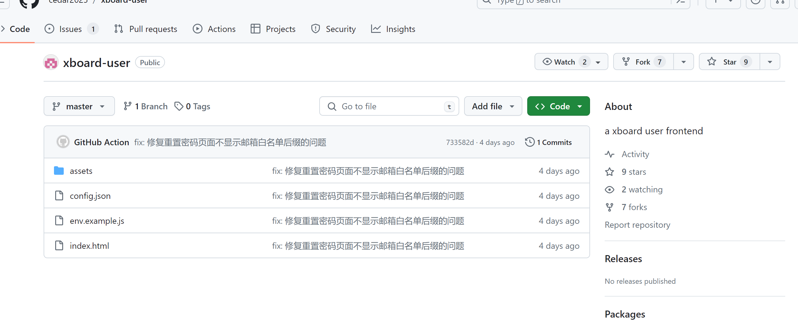
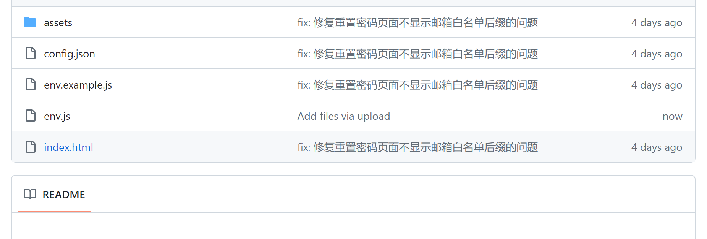
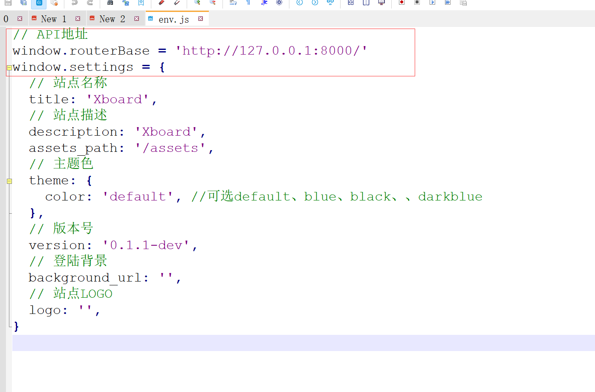
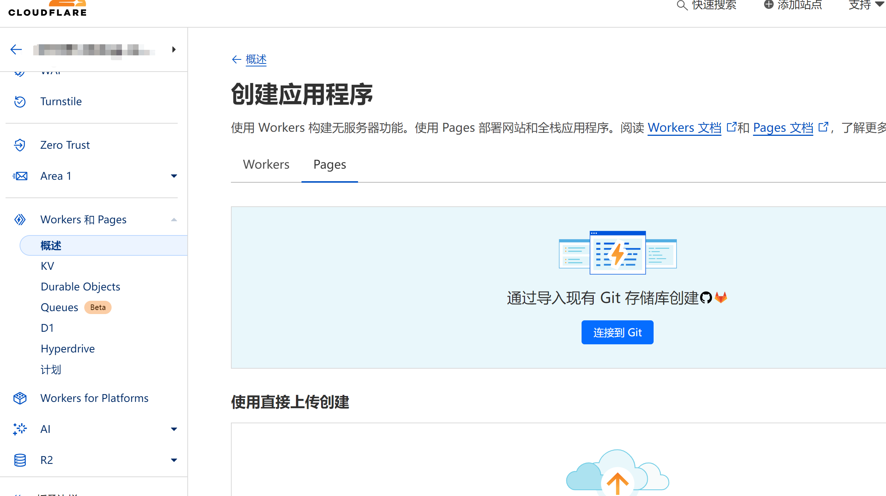
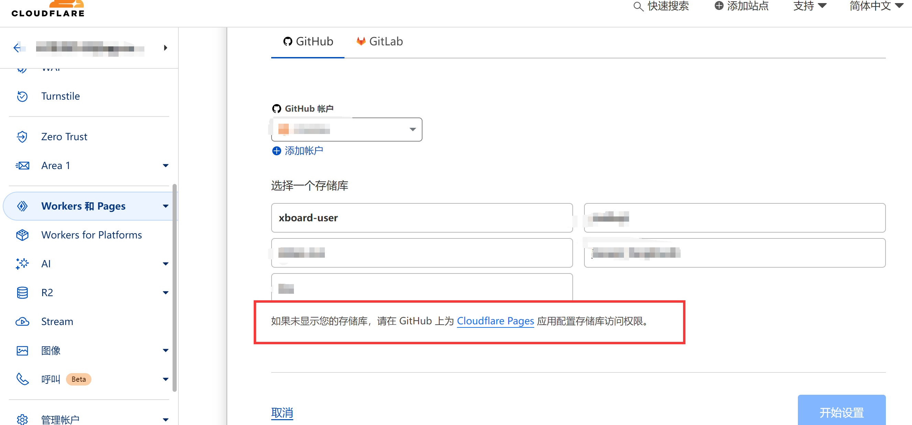
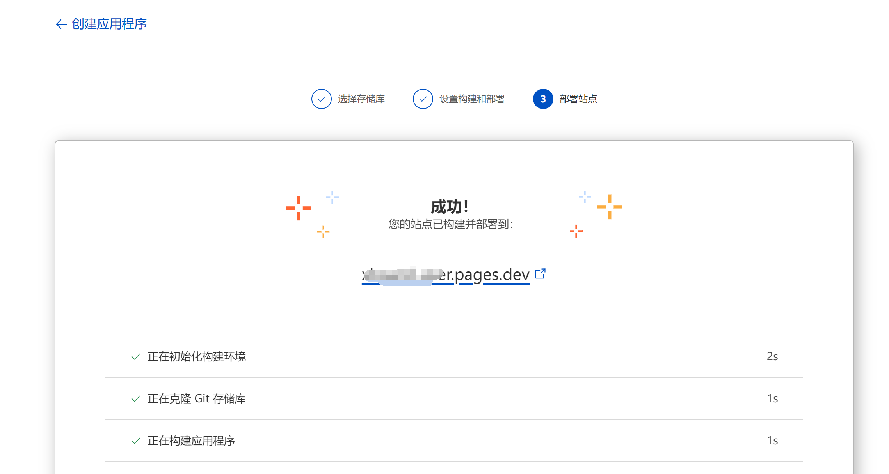
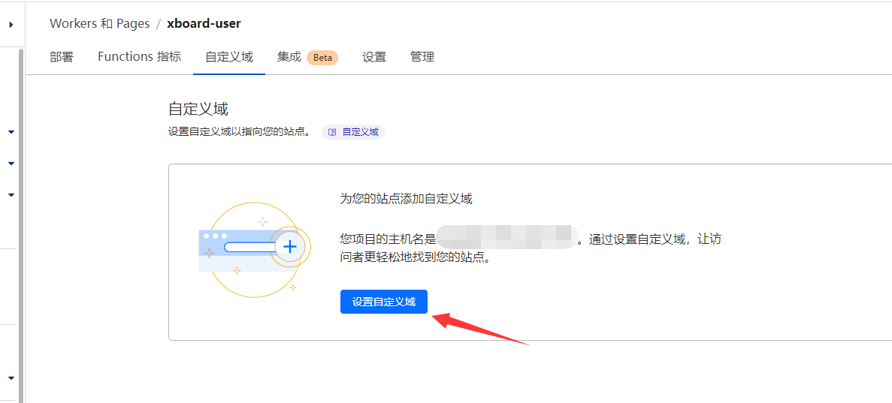

# Xboard/V2board 基于cloudflare Page 部署前后端分离

本教程适用于v2board原版和 xboard

第一步：我们先要复制 xboard的前端到自己的github账号下。

前端地址：https://github.com/cedar2025/xboard-user

我们直接fork 到自己账号下就可以了。

 

这里我们先设置下配置文件如何修改配置文件。看仔细了
1、下载 env.example.js 这个文件到本地
2、修改env.example.js文件名为 env.js
3、修改配置文件中的面板地址；这里直接输入你面板的地址就可以了。https的域名即可 不需要其他设置。
4、其他的网站名称那些你根据需要自己要设置就设置下。
5、上传文件到github自己的库下面
6、等待cloudflare 自动更新部署

 

直接修改这个 http的地址到你面板地址即可。

经过测试。域名后面必须要带斜杠"/" 不然部署成功之后会不能登录。登录会提示 未知错误

 

 

修改和新增配置文件完毕之后。我们需要在cloudflare下面去部署 page页面

 

 

这里特别注意下：如果你这里没有显示 刚刚复制的那个库 可能是github那边没有设置权限 。自己去设置下就可以了

 

然后下一步 其他不用设置 直接部署就可以了
最后显示部署成功。得到一个开发者域名。然后访问这个域名就可以了。

 

如果需要绑定自己的 域名 不管是一级域名 二级域名还是什么域名；直接在这里设置 自定义域 然后保存就可以了！

这时候前端就部署完毕了！就可以正常登录使用了！