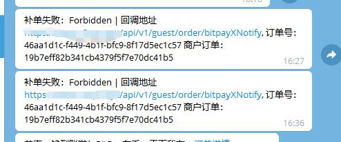
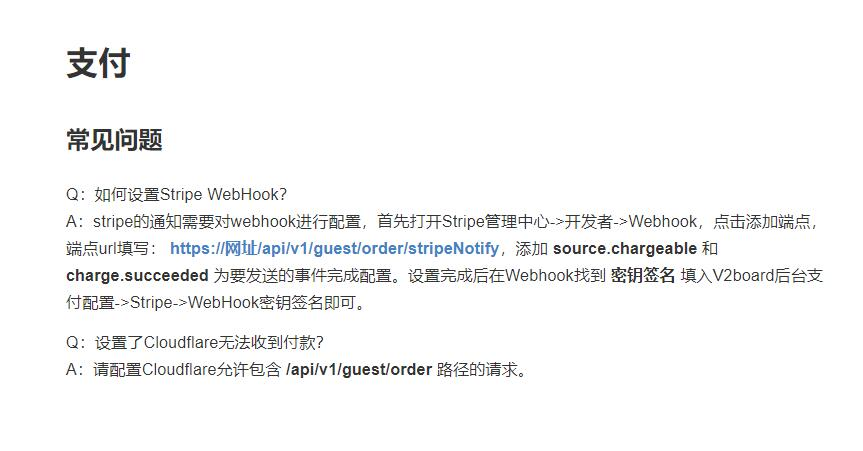
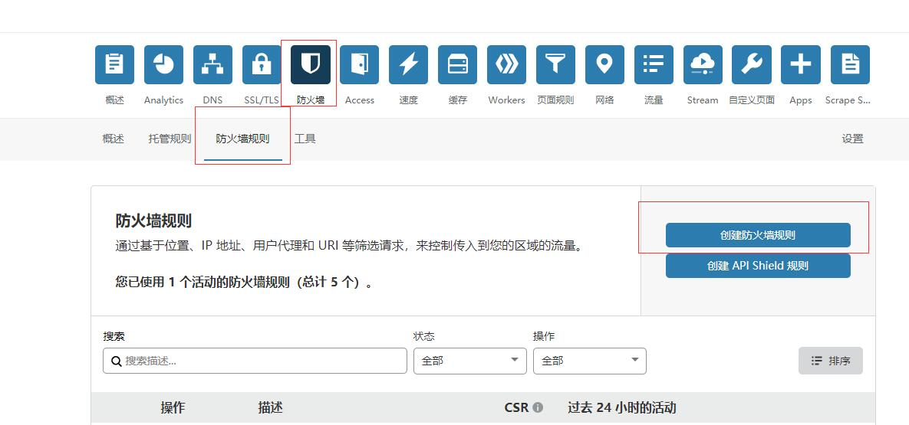
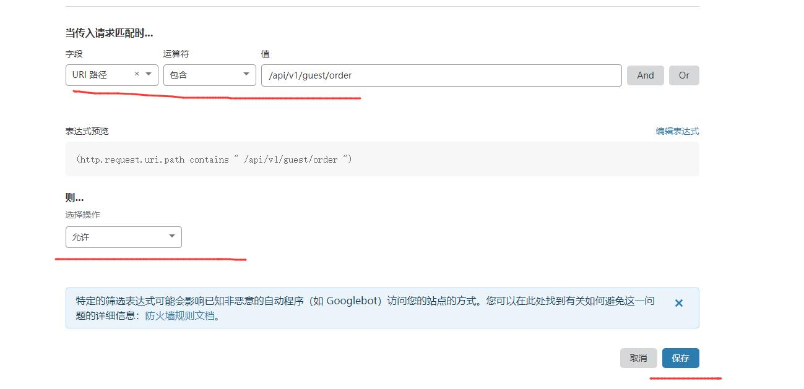

# Xboard/V2board 开启cloudflare 小黄伞之后支付无法回调

最近网站出现了这个问题回调失败。

但是很明显这个问题不是我一个人遇到的。别人也遇到了。所以官方给出了解决办法

那就是在 cloudflare 的防火墙里面 放行路径。

但是这个放行这个怎么设置 因为我一直没遇到 所以 以前我就没设置

今天我遇到了。所以我就设置了下。

首先当然是进入防火墙 设置防火墙规则

然后 就是规则内容了

Q：设置了Cloudflare无法收到付款？
A：请配置Cloudflare允许包含 /api/v1/guest/order 路径的请求。

