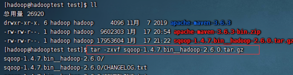
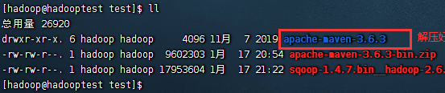

# finalshell解压文件命令介绍

小伙伴想知道finalshell解压文件命令有哪些，有需要的小伙伴可以观看下方，小编会整理出几种格式解压命令，详情如下。

finalshell解压文件命令介绍

1、根据需求输入以下命令，解压tar包：**tar -xvf file.tar**。

2、解压tar.gz：**tar -xzvf file.tar.gz**。

3、解压tar.bz2：**tar -xjvf file.tar.bz2**。

4、解压tar.Z：**tar -xZvf file.tar.Z**。

5、解压rar：**unrar e file.rar**。

6、解压zip：**unzip file.zip**。

以上就是finalshell解压文件命令介绍的全部内容，望能这篇finalshell解压文件命令介绍可以帮助您解决问题，能够解决大家的实际问题是软件自学网一直努力的方向和目标。