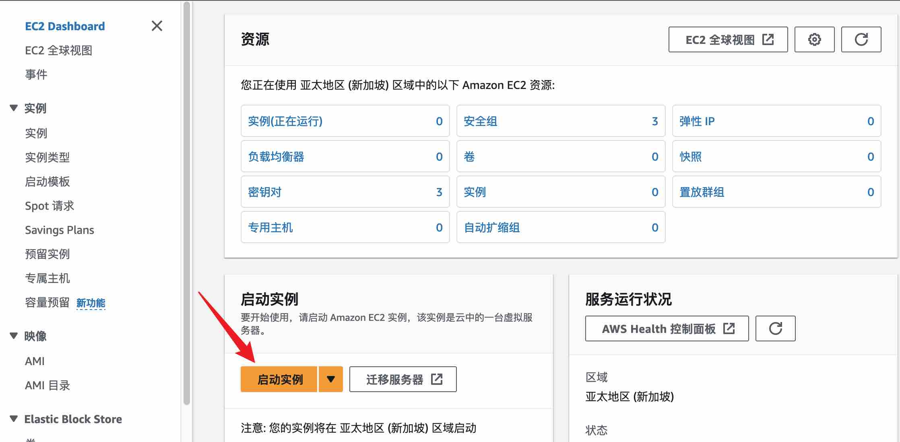
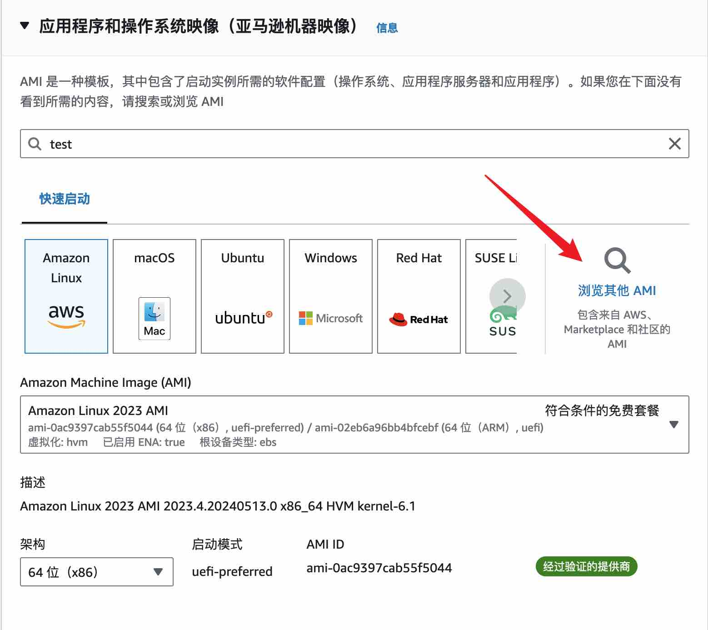
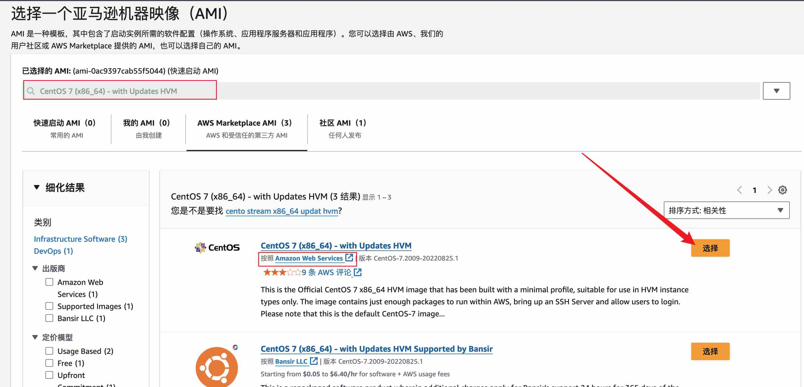
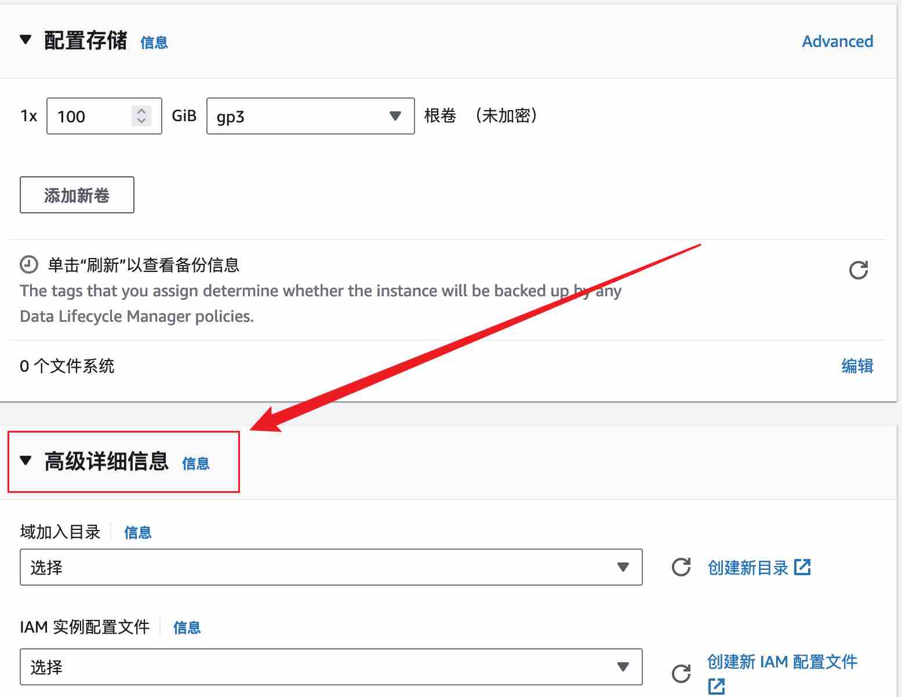
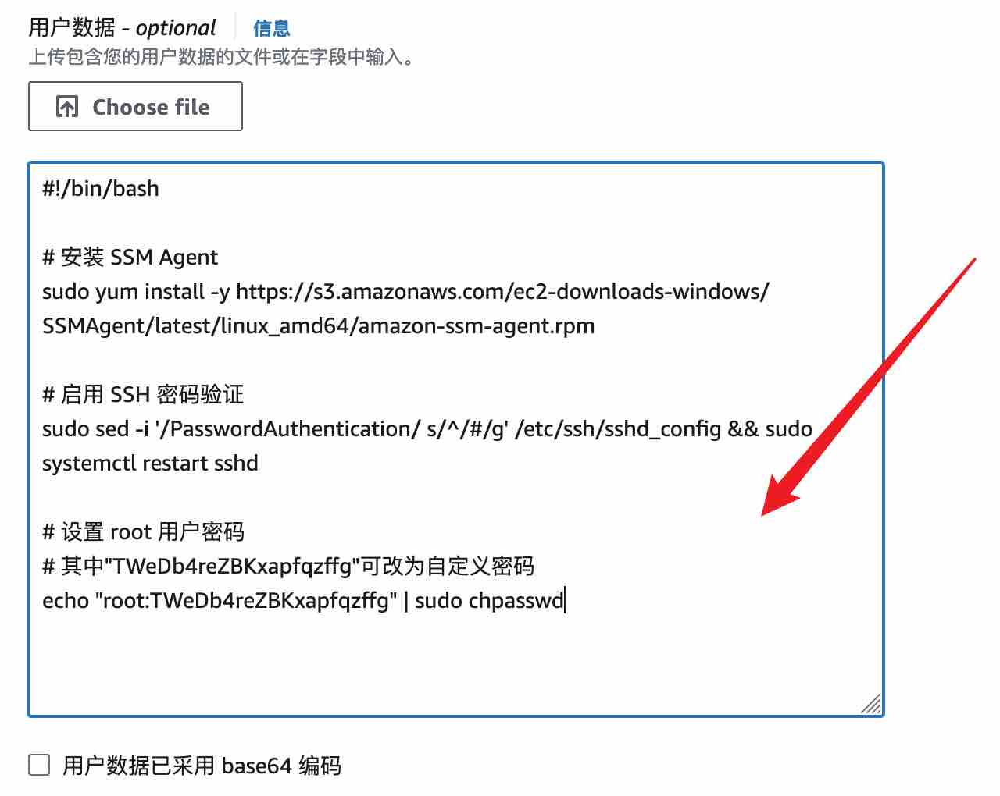

# 在AWS中如何选择CentOS 7官方免费版本并配置密码登录

在AWS平台上，选择CentOS 7官方免费版本及配置密码登录的简易指南。本教程将跳过对实例启动过程中存储、安全组、秘钥对、实例类型等的介绍。

## **操作步骤**

1. 打开AWS管理控制台：https://ap-southeast-1.console.aws.amazon.com/ec2/home?region=ap-southeast-1#Home 在选择服务器地区后，点击"启动实例"（Launch Instances）按钮。




2. 在"Amazon Machine Image (AMI)"步骤中，选择“浏览其他 AMI（包含来自 AWS、Marketplace 和社区的AMI）”




3. 使用搜索栏搜索" CentOS 7 (x86_64) - with Updates HVM"。从搜索结果中选择适合您的需求的CentOS 7 AMI。确保选择的镜像是由CentOS官方或受信任的提供商提供的，且免费！

```
CentOS 7 (x86_64) - with Updates HVM
```




4. 展开"高级详细信息" 拉到最下方"用户数据"的地方复制以下shell脚本




```
#!/bin/bash

# 安装 SSM Agent
sudo yum install -y https://s3.amazonaws.com/ec2-downloads-windows/SSMAgent/latest/linux_amd64/amazon-ssm-agent.rpm

# 启用 SSH 密码验证
sudo sed -i '/PasswordAuthentication/ s/^/#/g' /etc/ssh/sshd_config && sudo systemctl restart sshd

# 设置 root 用户密码
# 其中"TWeDb4reZBKxapfqzffg"可改为自定义密码
echo "root:TWeDb4reZBKxapfqzffg" | sudo chpasswd
```


5.实例启动完成后，即可使用密码进行远程服务器访问了。