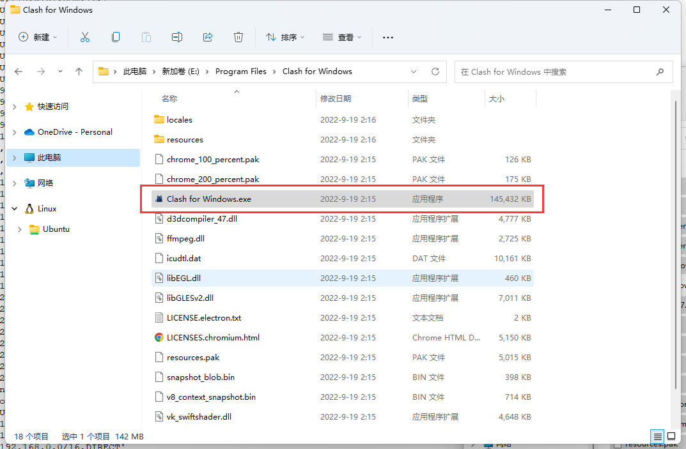
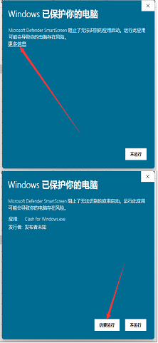
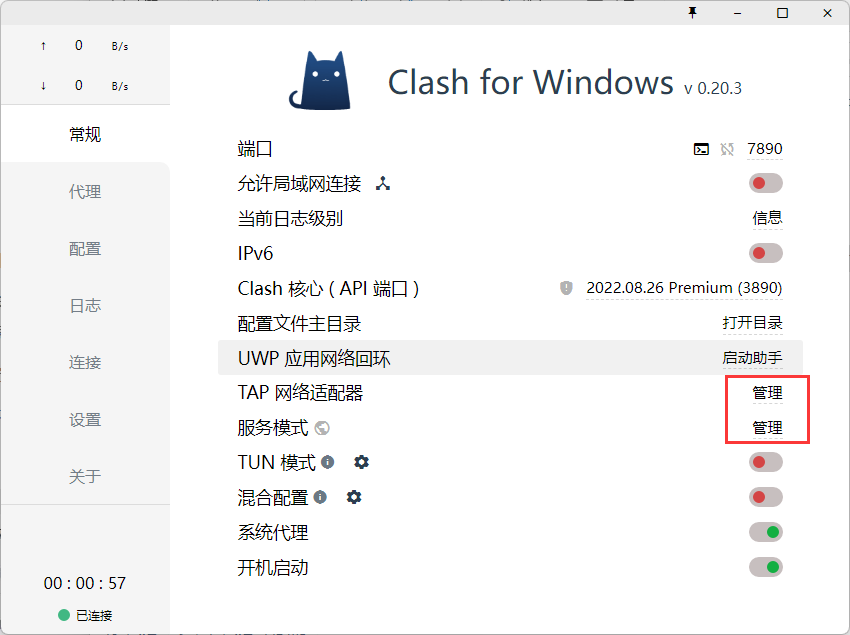
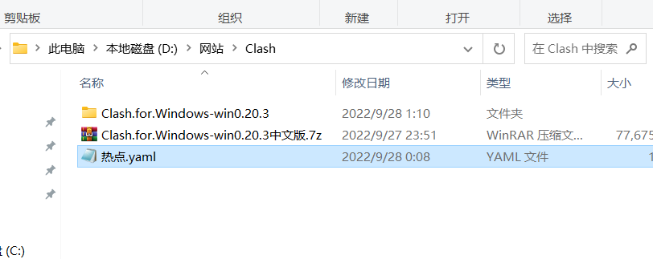
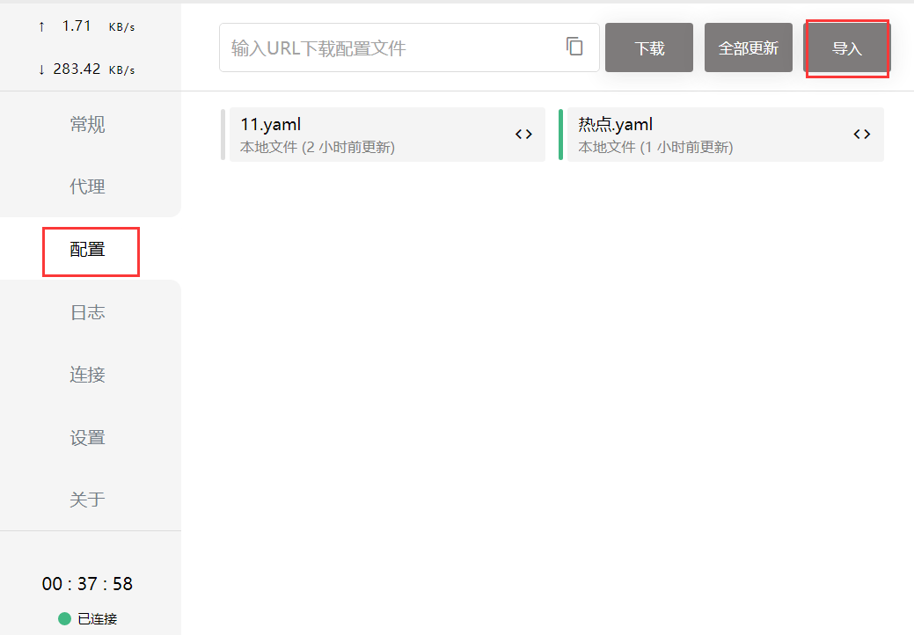
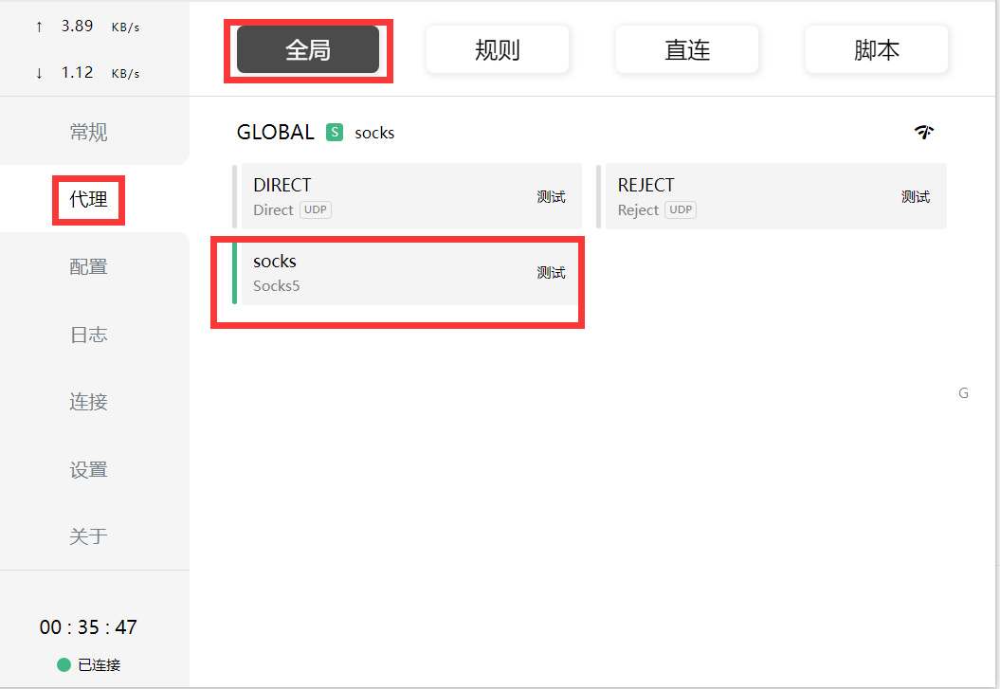
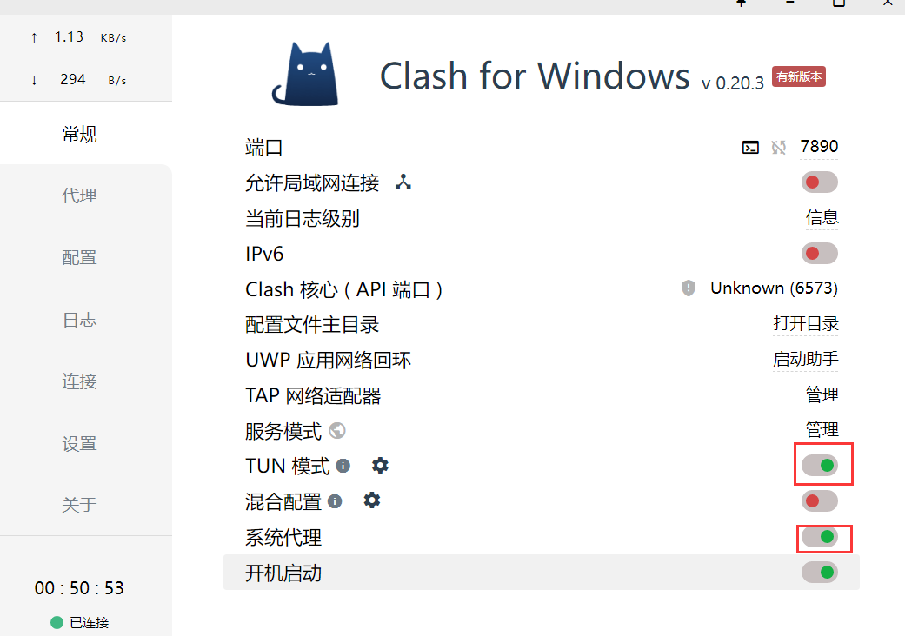
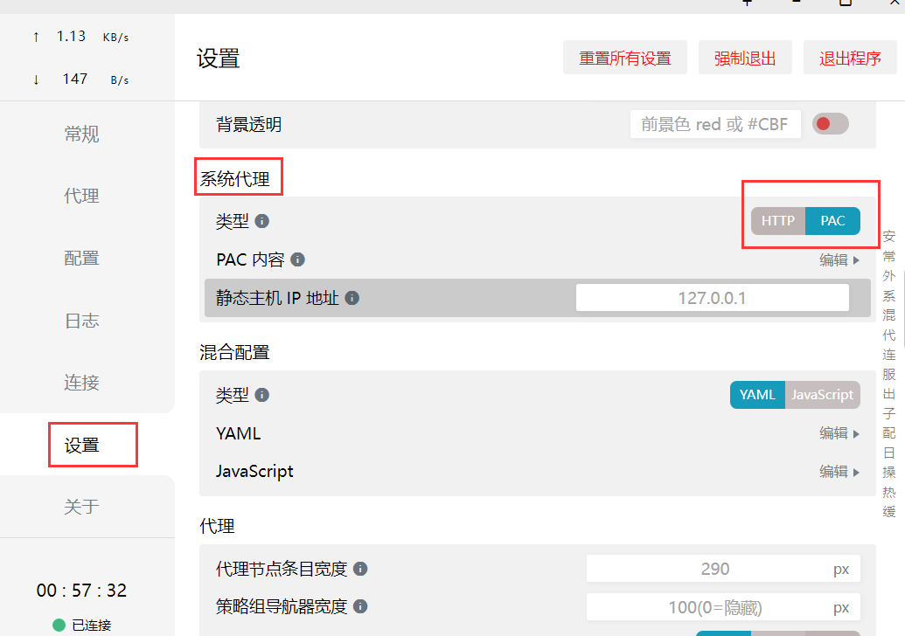

# **本篇使用Clash**

## 1.下载安装  

**安装原版 Clash**

要想汉化，需要先安装官方原版，推荐去[ 作者 Github 主页](https://github.com/Fndroid/clash_for_windows_pkg/releases) 下载（有安装版和解压版，自行选择）

**汉化 Clash**

打开汉化补丁作者的 [Github 主页](https://github.com/BoyceLig/Clash_Chinese_Patch/releases)，**下载解压后就能得到对应版本的** `app.asar`，将新的 `app.asar` 放到 `resources` 文件夹**覆盖**

**解压版打开**





### 安装 服务模式 和 TUN模式



## 2.配置

创建一个xx.yaml点配置文件，比如:**热点.yaml**



**内容：**

SOCKS5 协议的节点

```
proxies:
  # socks5
  - name: "socks"
    type: socks5
    server: ip地址
    port: 端口
    # username: username
    # password: password
    # tls: true
    # skip-cert-verify: true
    # udp: true
```

导入刚刚创建的配置 **并选择导入配置**



## 3.选择节点并设置全局代理

点击 代理 - 全局 - 选择刚刚的节点，也就是**SOCKS5**



## 4.启动

**点击 常规 - 开启TUN模式和系统代理**，至此已完成所有操作



## 5.部分软件不免解决

**找到 设置-系统代理-类型，将类型切换到PAC**



 <br>**如果还是不免就换SSTap吧**

这里说下我为啥不使用SSTap呢？

因为这个软件老是莫名其妙自动断开连接 导致不注意就会扣流量，这点我是深有体会的，所以弃用了
