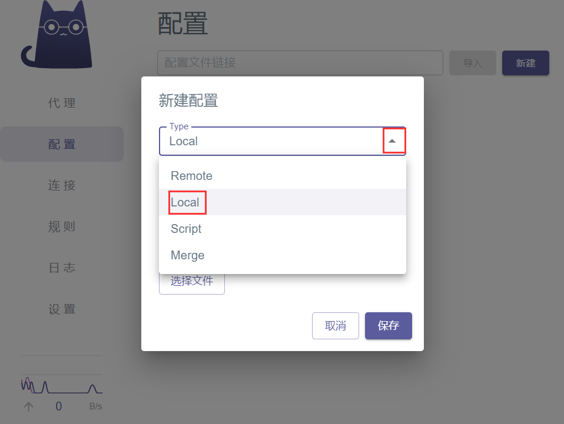

# **本篇使用Clash**

## 1.下载安装

[下载](https://github.com/zzzgydi/clash-verge)zh-CN.msi的安装文件<br>首次安装打开可能报错，需要下载运行库啥的，根据提示安装就行<br>**汉化：**打开软件 → Settings → Language→ 选择中文


## 2.配置

创建一个xx.yaml点配置文件，比如:**热点.yaml**


**内容：**

SOCKS5 协议的节点

```
proxies:
  # socks5
  - name: "socks"
    type: socks5
    server: ip地址
    port: 端口
    # username: username
    # password: password
    # tls: true
    # skip-cert-verify: true
    # udp: true

```

**导入刚刚创建的配置 并选择导入配置**





## 3.启动

**点击 代理 - 全局 - 选择刚刚的节点，也就是SOCKS5**


**切换内核**


**设置系统代理规则**


**最后启动**

