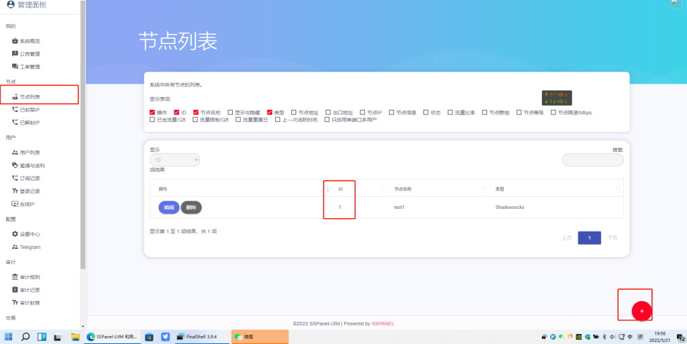

**SSPanel UIM后端对接一键安装脚本**

## 后端一键安装脚本

本文以 CentOS 7 和 CentOS 8 为例。

### 脚本功能

- 可选配置节点为WebAPI模式或MySQL模式
- 可选配置单端口多用户
- 可选注册为系统服务

### 安装

**CentOS 7（非主要支持版本，请有条件的优先使用CentOS 8）**

```
yum install wget -y && wget https://raw.githubusercontent.com/M1Screw/Airport-toolkit/master/ssr_node_c7.sh && chmod +x ssr_node_c7.sh && ./ssr_node_c7.sh
```

**CentOS 8**

```
dnf install wget -y && wget https://raw.githubusercontent.com/M1Screw/Airport-toolkit/master/ssr_node_c8.sh && chmod +x ssr_node_c8.sh && ./ssr_node_c8.sh
```

### 卸载

```
systemctl disable ssr_node && \rm /usr/lib/systemd/system/ssr_node.service && \rm -rf /soft/shadowsocks
```

### 服务启动

```
systemctl start ssr_node
```

### 服务停止

```
systemctl stop ssr_node
```

### 注意事项

- 由于后端最新版本不再支持Python2，在CentOS 7环境中安装时会额外安装Python3.6
- 所有跟节点安装本身无关的功能会通过单独的脚本提供（例如BBRv1配置在 Airport-toolkit 中有 bbr_c7/c8.sh 可用）

## 与SSPanel前端对接

### 添加节点

在前端添加一个节点



记住这个ID

### 执行安装命令

输入Y以确认安装，等待几分钟

环境部署完成后输入配置，下面列出中英文对照

```
Do you want to enable multi user in single port feature?(Y/N)
是否要启用单端口多用户功能？（是/否）        //按需选择
Please enter WebAPI url:
请输入WebAPI url：                        //输入前端地址
Please enter WebAPI token:
请输入WebAPI token：                      //在配置文件adminApiToken字段里
Server node ID:
前端节点ID：                              //节点ID
Do you want to register SSR Node as system service?(Y/N)
是否要将SSR程序注册为系统服务？（是/否）    //推荐是
```

配置完成后会提示输入Y来重启系统，输入Y

等待片刻，前端即可显示节点在线！