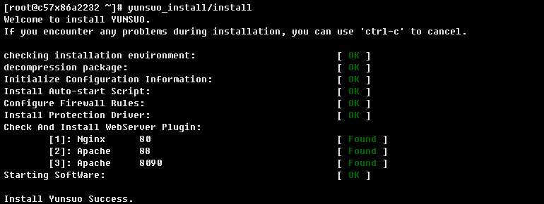

# 最新云锁安装方式

由于云锁更换域名，且官方文档并未更新安装方式，导致大量用户无法正常安装，本站现提供修正后的安装命令，供你参考。

## 安装云锁

!> 如曾经下载过云锁安装包，则将旧的云锁安装包及安装目录删除**（rm -rf yunsuo_\*）**后再安装。


##  快速安装

**官方网站命令：**

```
x86：wget https://download.yunsuo.com.cn/v3/yunsuo_agent_32bit.tar.gz && tar xvzf yunsuo_agent_32bit.tar.gz && chmod +x yunsuo_install/install && yunsuo_install/install

x64：wget https://download.yunsuo.com.cn/v3/yunsuo_agent_64bit.tar.gz && tar xvzf yunsuo_agent_64bit.tar.gz && chmod +x yunsuo_install/install && yunsuo_install/install
```

**修正后的安装命令，如果上面用不了就用这个**

```
CentOS/Redhat：

x86：wget http://download.yunsuo.qianxin.com/v3/yunsuo_agent_32bit.tar.gz && tar xvzf yunsuo_agent_32bit.tar.gz && chmod +x yunsuo_install/install && yunsuo_install/install

x64：wget http://download.yunsuo.qianxin.com/v3/yunsuo_agent_64bit.tar.gz && tar xvzf yunsuo_agent_64bit.tar.gz && chmod +x yunsuo_install/install && yunsuo_install/install

Ubuntu：

x86：wget http://download.yunsuo.qianxin.com/v3/yunsuo_agent_32bit.tar.gz && tar xvzf yunsuo_agent_32bit.tar.gz && chmod +x yunsuo_install/install && sudo yunsuo_install/install

x64：wget http://download.yunsuo.qianxin.com/v3/yunsuo_agent_64bit.tar.gz && tar xvzf yunsuo_agent_64bit.tar.gz && chmod +x yunsuo_install/install && sudo yunsuo_install/install
```


##  分步安装

**官方网站命令：**

```
下载云锁安装包。

x86：wget https://download.yunsuo.com.cn/v3/yunsuo_agent_32bit.tar.gz

x64：wget https://download.yunsuo.com.cn/v3/yunsuo_agent_64bit.tar.gz

解压文件，得到安装包文件。

x86：tar zxvf yunsuo_agent_32bit.tar.gz

x64：tar zxvf yunsuo_agent_64bit.tar.gz

给云锁安装文件赋予可执行权限。

chmod +x yunsuo_install/install
执行安装，直到提示“Install Yunsuo Success.”安装完成。

yunsuo_install/install
```

**修正后的安装命令，如果上面用不了就用这个**

```
一、下载云锁软件安装包

x86：wget http://download.yunsuo.qianxin.com/v3/yunsuo_agent_32bit.tar.gz
x64：wget http://download.yunsuo.qianxin.com/v3/yunsuo_agent_64bit.tar.gz
解压文件，得到安装包文件。
x86：tar zxvf yunsuo_agent_32bit.tar.gz
x64：tar zxvf yunsuo_agent_64bit.tar.gz
3.给云锁安装文件赋予可执行权限

chmod +x yunsuo_install/install

4.安装

CentOS：yunsuo_install/install

Ubuntu：sudo yunsuo_install/install

提示“Install Yunsuo Success.”安装完成。
```



## 添加服务器到云中心

```
/usr/local/yunsuo_agent/agent_smart_tool.sh -u cloud_name -p cloud_passwd
```

**PS:**`cloud_name：云中心账户名；cloud_passwd：云中心登录密码`

## 下载PC控制端、web控制端和手机控制端，即可远程对服务器进行安全管理

[https://yunsuo.qianxin.com/cloud/download](https://yunsuo.qianxin.com/cloud/download)

##  查看云锁是否运行

```
 ps -ef | grep yunsuo_agent
```

##  云锁服务相关命令

**云锁启动/停止/重启/状态**

```
service yunsuo start/stop/restart/status
/etc/init.d/yunsuo start/stop/restart/status
```

## 卸载云锁

```
/usr/local/yunsuo_agent/uninstall
```
