# 云锁安装php语言RASP插件教程

云锁在V3版本当中加入了RASP技术来防止未知攻击，支持java .net php，java云锁官方已给加载教程，.net会在安装IIS插件后自动开启，但php云锁官方并没有明确说明，经过站长长期使用经验发现，云锁对php的支持直到V3.1.20.24版本才算完善。

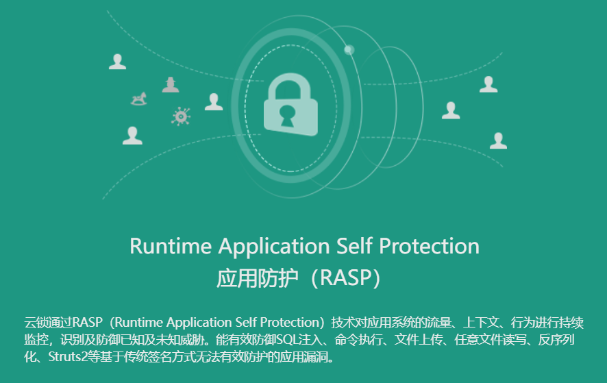

为什么这里要提到这个呢？因为云锁的“高级防护”功能需要RASP的支持，如果对应的系统在开通高级防护后没有安装RASP插件，则云锁无法监控应用上下文及行为信息。

## **版本要求**

1.云锁公有云版需要V3.1.20.24及以上版本；
2.php版本>=5.2，<=7.4。

## 安装插件

## **linux安装**

云锁防护界面如果可以识别到php进程，可以直接一键安装，如图：

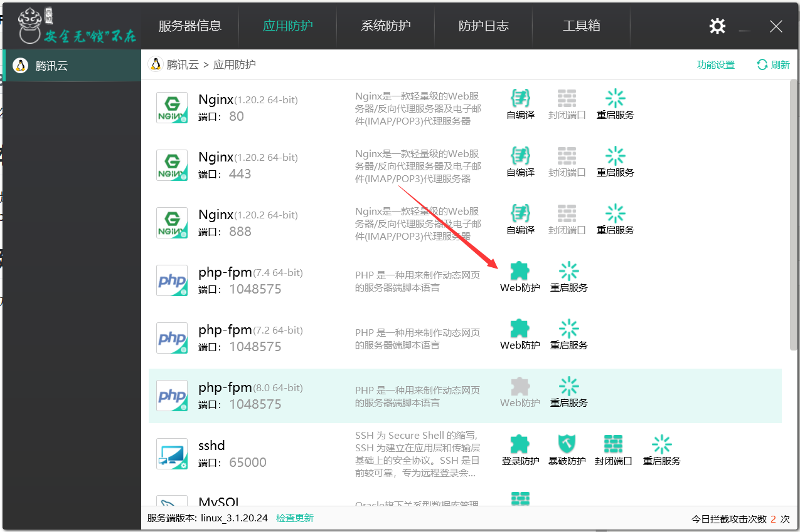

点击RASP图标，云锁会自动完成php语言RASP插件的加载，和php的重启，完成后即可使用。

### **手动安装**

当你同时安装了多个版本的php时，云锁自动完成第一个php版本的RASP加载之后，就无法再从这里一键加载了，我们可以通过手动方式加载RASP插件，如果宝塔的php位置只有关闭端口选项，也可尝试手动加载。

1.先确认php是运行在安全模式下还是非安全模式（nts）下，还是安全模式下（ts），如果是宝塔面板就是nts；
2.拷贝php拓展插件到php拓展库目录。
云锁php.so存放位置：/usr/local/yunsuo_agent/php/，php拓展存放位置：php安装目录/lib/php/extensions/no-debug-non-zts-xxxx，复制到这里，请注意是nts还是ts；
3.编辑php配置文件，php安装目录/etc/php.ini在“Module Settings”输入如下配置：

```ini
extension=****
[CLI Server]
; Whether the CLI web server uses ANSI color coding in its terminal output.
cli_server.color = On
```

***替换为复制的那个.so的文件名

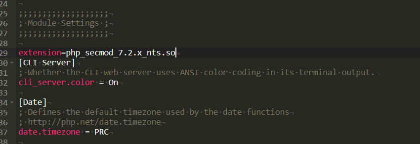

4.保存后重启php，然后刷新云锁应用防护查看phpRASP插件按钮是否已经亮起（由灰色变为绿色）

## Windows安装

### 自动安装

当你的服务器使用IIS时，在安装IIS防护插件时，云锁会自动完成php插件的安装，但如果你的服务器中安装了多个版本的php时，只会加载最后安装的php插件，你可以在php.ini文件中搜索secmod，如果能搜索到“extension=php_secmod.dll”则说明使用该版本的php可以享受到RASP带来的保护，如果搜索不到就说明没有RASP，因此，本站推荐windows用户如无特殊需求，只安装一个php版本就行了，经过实测，RASP可以正常工作并防护未知木马和命令执行。

如果你是IIS用户，且PHP只安装了一个版本，缺无法搜索到“extension=php_secmod.dll”，在云锁应用防护里，将IIS防护插件卸载再重装即可安装RASP。

### 手动安装


如果你安装了多个php版本或者使用的apache，总之，就是php.ini里搜不到“extension=php_secmod.dll”的都可以尝试手动安装，安装方法：

1.首先你要确定自己的php是32位版本还是64位版本，可以到phpinfo中去查看，如果是32为版本，则插件存在于云锁安装根目录下，如果是64位版本则插件存在于云所安装目录的x64目录下，在相应位置找到secmod开头的dll文件，那就是了；云锁默认安装路径为C:/Program Files (x86)/YunSuo/YunSuoAgent；

2.确定php版本是安全线程版本（ts）还是非安全线程版本（nts），查看方法可自行百度，这里不再赘述，在插件存放位置找到对应版本的插件，如php5.6非安全线程版本对应的插件文件为“secmod_5.6.x_nts.dll”

3.将dll文件拷贝到php程序目录/ext/目录下并重命名为“php_secmod.dll”；

4.打开php.ini文件，搜索“[CLI Server]”，在上方输入

```solidity
extension=php_secmod.dll
```

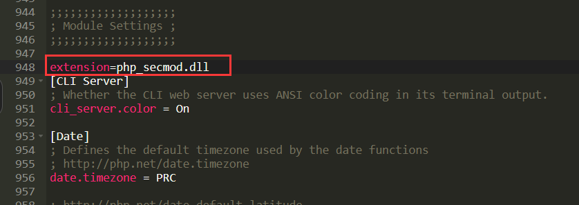

4.保存php.ini文件并重启php，windows下不会再应用防护里显示，开通高级防护后，防护会实时生效。

## 怎样开启

云锁RASP需要开启高级防护（150元/月），开启后，云锁会持续监听应用流量、上下文及行为信息，拦截未知webshell、命令执行、上传漏洞以及未知SQL注入等攻击。

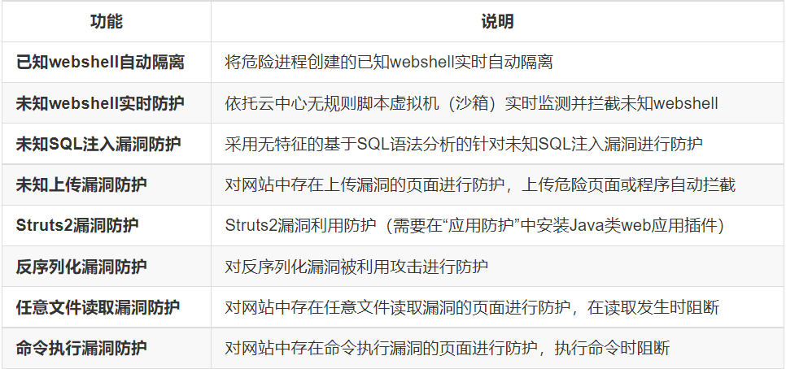

如果安装RASP插件后，没有开通高级防护，当云锁检测到未知攻击后，将只报警不拦截，若开通高级防护后没有安装RASP插件，则防护无法生效，云锁RASP拦截到的攻击不会在云锁PC端上查询到，而是会在云中心生成事件报告，你需要登录到云锁云中心web端查看事件报告（查看报告需要开通事件管理，150元/月/账户）。

## 拓展：防护原理

1.什么是RASP

RASP“Runtime application self-protection”应用运行时自我保护技术，是奇安信椒图云锁服务器安全管理系统（简称云锁）web攻击防护的核心组件之一，是构建在WEB语言解释器中的异常行为检测引擎。RASP通过HOOK函数的方式，可以细粒度的监控应用脚本的行为及函数调用上下文信息，及时发现恶意代码和漏洞利用行为，缩小攻防信息不对称的时间差，有效降低未知安全威胁造成的破坏。

2.云锁的RASP工作原理

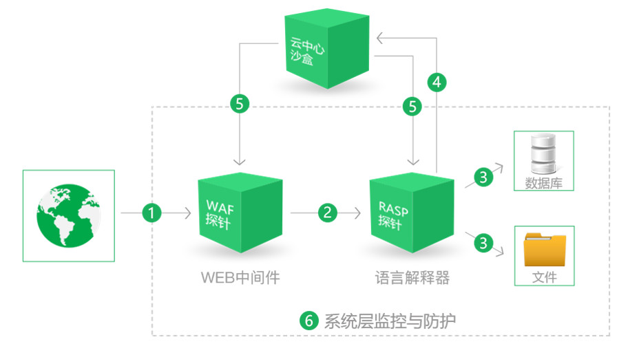

通过上图我们可以看到云锁大致的工作流程，

①WEB攻击流量，首先经过⑥系统层监控及防护模块内置的防火墙模块后到达web中间件（IIS、apache、nginx、tomcat等）时会经过WAF探针模块的监控及过滤，通过防护规则（基于签名）可以有效的防御已知安全漏洞攻击，用户也可以自定义防护规则。

②WEB流量在中间件内部会被转发给语言解释器内部运行的WEB业务脚本文件，此时RASP探针模块开始工作，探针会对WEB流量以及③文件操作及数据库操作等行为进行监控，基于无签名的方式对已知及未知威胁进行监控及防护。同时⑥系统层监控及防护模块也会对WEB进程的危险行为进行监控及防御。

④⑤当RASP探针模块以及系统层监控及防护模块检测到异常脚本行为时，首先通过本地基于特征库的WebShell引擎进行检测，当本地引擎无法检出时，会将脚本文件上传到私有云中心上的WebShell检测沙箱进行检测，并根据检测结果及当前的防护模块的工作模式进行处置，防护模式下，会对WebShell文件进行自动隔离（可恢复）。

注：WebShell沙箱是基于脚本虚拟机的无签名Webshell检测技术，工作在云中心上，可以有效检测一句话木马，以及加密、变形的Webshell。

参考来源：云锁官方微信公众号。

由上可知，云锁防护是多层次、立体化的纵深防御，防御涵盖了web应用、后端语言脚本解释器、系统防护，由于未知webshell检测需要依托云沙箱，因此，如果的你服务器在海外，网络原因导致与云锁云安全中心连接不稳定的话，也可能也会造成高级防护不稳定。

## 拦截测试

本次采用直接将php大马上传到服务器上，并执行php木马，测试仅依靠云锁的rasp插件能否阻止木马运行、以及命令执行。

1.本次准备的php大马如下：

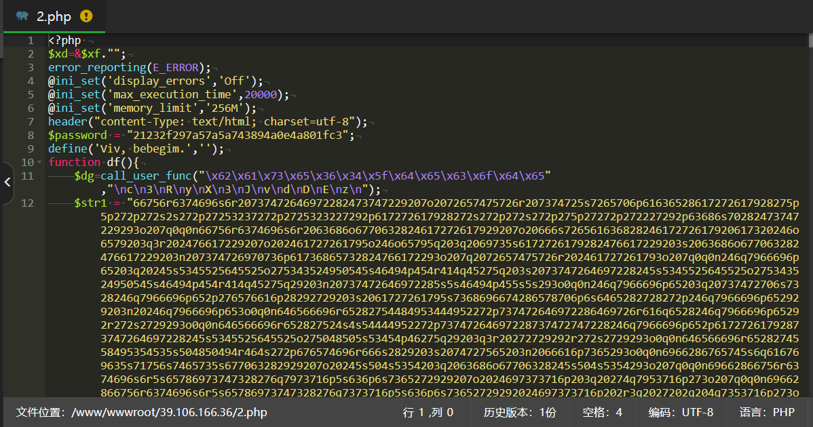

php大马功能完善，并且核心代码加密以躲避杀毒软件查杀，传统防护手段难以防御。

运行截图：

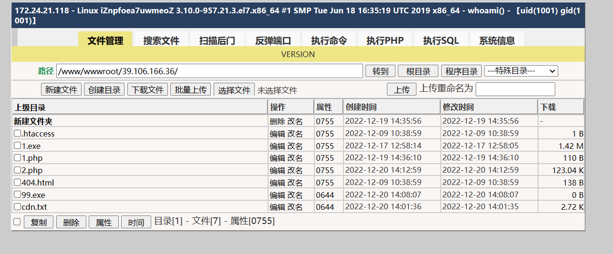

可以看到该php webshell拥有多种功能，十分强大。

在无防护手段的情况下，木马可以读取系统目录文件并进行读取、修改、删除，木马可以执行命令，反弹shell等进一步对服务器进行提权、植入二进制后门，达到长期控制目的。

一、测试云锁拦截命令执行
在命令执行时，云锁会在命令执行时拦截命令执行，请保持高级防护的“命令执行漏洞防护”为开启状态、

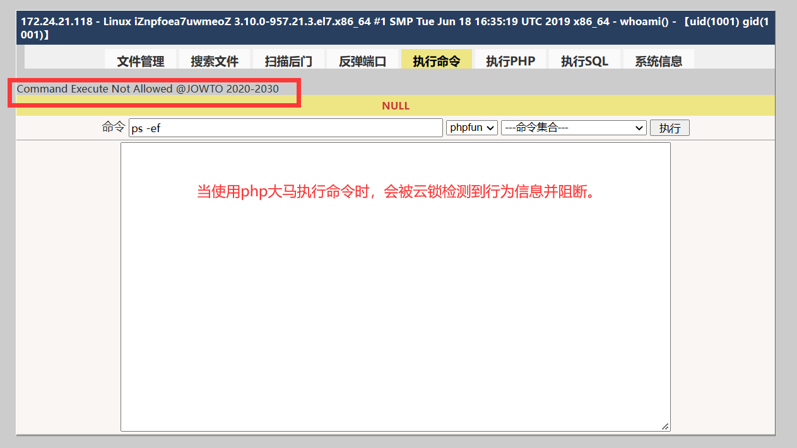

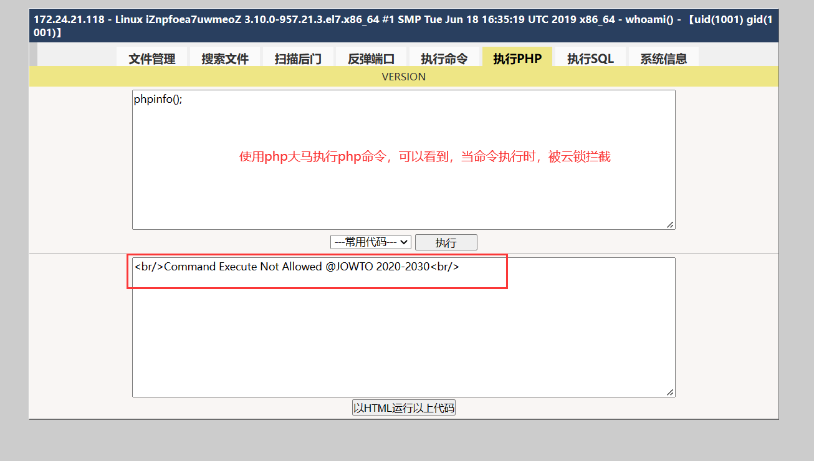

可见，当webshell尝试执行命令时，无论是低危命令还是高危命令，云锁都会将其拦截，保护服务器不被进一步入侵。

二、云锁拦截任意文件上传漏洞，当应用存在上传漏洞时，攻击者可以直接上传webshell文件到服务器，是非常危险的，云锁可以通过RASP获取到应用的流量及行为信息，在webshell上传时将其拦截，为保证防护效果，请保持云锁的“未知上传漏洞防护”为开启状态。

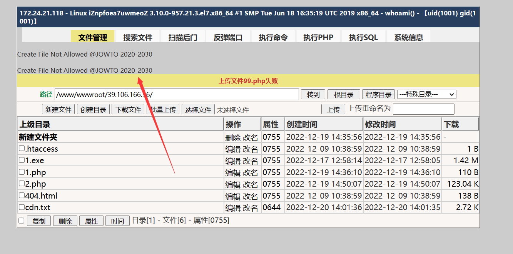

从图中我们可以看到，当通过上传点上传php及其他可执行程序时，云锁会立刻阻断。

三、云锁依托云中心脚本沙盒可直接拦截webshell执行并隔离文件，80%以上加密、变形的webshell都无法逃脱云锁的动态防御，云锁可以在脚本执行危险操作之前就可以将其拦截，并将未知webshell文件进行隔离。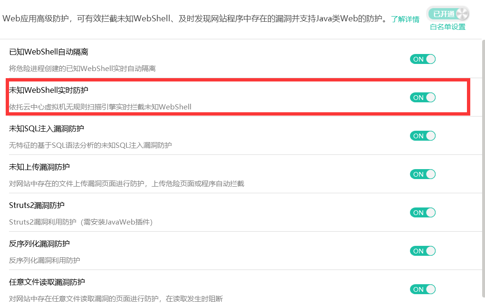

拦截webshell执行会显示如下页面，并将webshell程序自动隔离：

