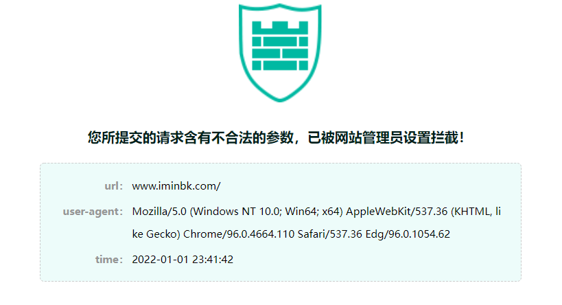

# 宝塔nginx云锁自编译文件替换安装

使用本站编译文件进行防护开启有以下优点：

1.操作简单，无需复杂的编译过程；

2.编译过程完整，可正常开启防护，post检测与内容过滤均可正常使用；

3.最大化与宝塔兼容性最佳，可与宝塔nginx免费防火墙、宝塔openRASP联合使用。

## 安装步骤


1.下载本站已预先编译好的nginx文件
下载地址：[点击下载](http://fj.iqblog.cn/web/nginx18.zip)

2.上传nginx18.bak到目录/www/server/nginx/sbin
关闭云锁PC端操作系统加固和web防护，ssh登陆服务器，按顺序执行以下命令
3.进入nginx可执行目录

```
cd /www/server/nginx/sbin/
```

4.复制宝塔nginx备份文件

```
cp nginx nginx.bak
```

5.进入宝塔nginx可执行文件目录

```
cd /www/server/nginx/sbin/
```

6.删除原来的nginx

```
rm -rf nginx
```

7.重命名为nginx

```
mv nginx18.bak nginx
```

8.给予755权限

```
chmod 755 nginx
```

9.重启nginx

```
service nginx restart
```

到这里我们就已经成功将宝塔nginx替换成了本站预先编译好的宝塔nginx文件了，打开云锁PC控制端，可以看到应用防护下的nginx自编译状态指示已经亮起，表示防护已成功开启

## 注意事项

1.为保证替换顺利进行，可先关闭云锁的“操作系统加固”功能；

2.在替换前，请先重启一遍nginx以便确保nginx重启后业务可正常运行；

3.替换过程中，会导致业务暂时中断，请在不影响客户使用业务的情况下进行操作；

4.云锁web防护开关默认为监控模式，请在及时修改为防护模式。

## **测试防护**

在你的域名后输入/123.sql，弹出拦截页面表示防护成功开启。

