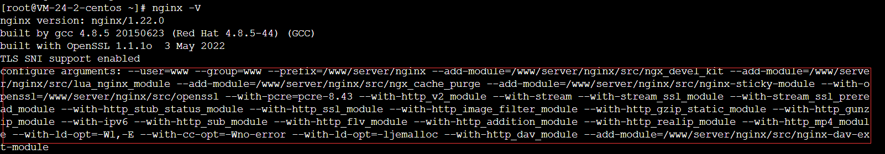
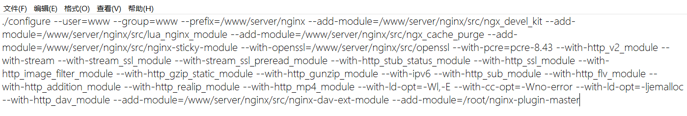
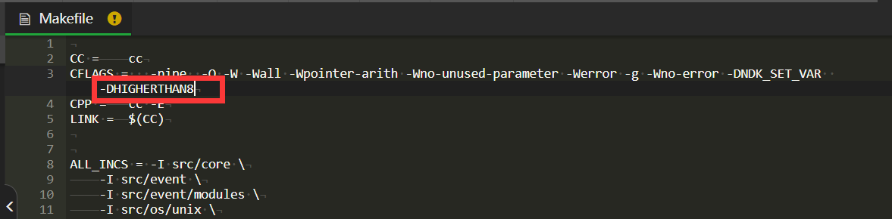
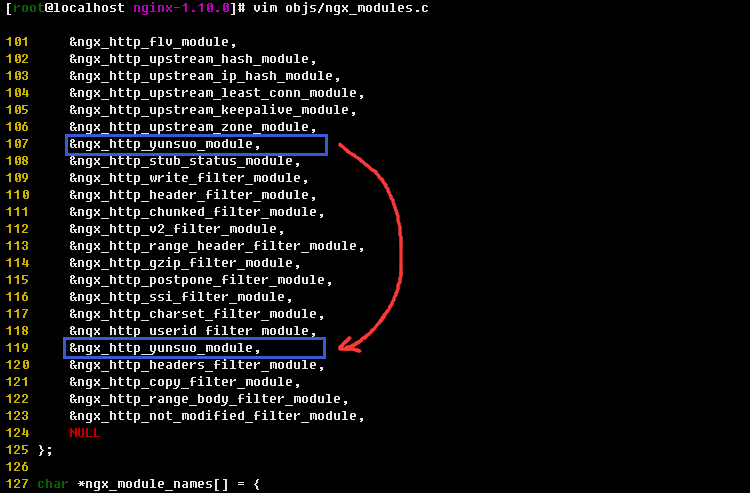
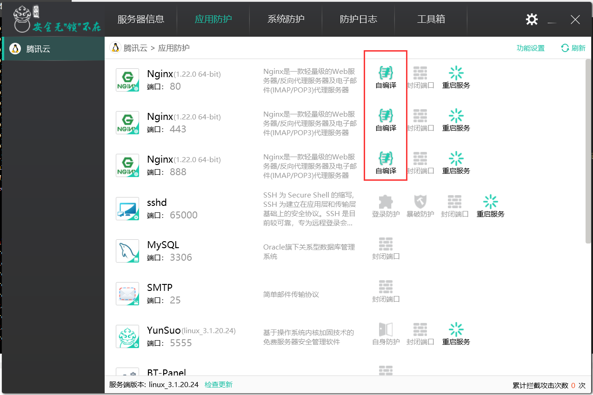
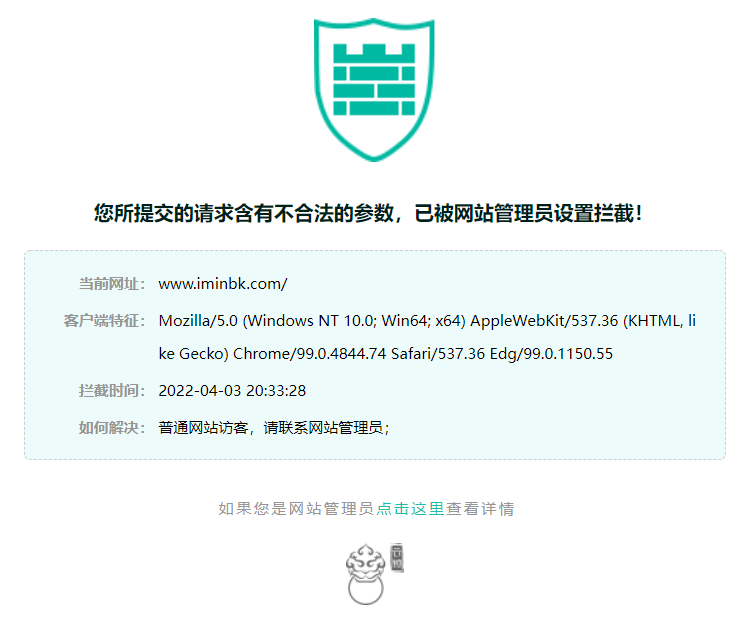

# 宝塔+云锁Nginx自编译web防护教程（IN-APP WAF）

!> 对于非宝塔面板用户，也可以使用本教程进行编译，过程是一样的，只需要修改路径为正确路径即可。

## 编译教程

配置编译环境，宝塔面板默认已有环境，无需再安装。

```
yum install -y gcc gcc-c++ pcre-devel openssl openssl-devel
```

查看nginx位置

```
ps -elf | grep nginx
```

进入宝塔nginx目录

```
cd /www/server/nginx/sbin/
```

说明：如果你的宝塔没有更改过安装路径，可以不用查看nginx位置，直接执行本步骤，如果你更改了宝塔安装路径或非宝塔用户，请修改正确。

备份nginx

```
cp nginx nginx.bak
```

说明：备份的目的是如果自编译出现问题，可以将nginx还原为原有版本，防止业务瘫痪，如果你是宝塔面板，可以忽略这一步，因为宝塔的特性，如果编译出现问题，可以在宝塔直接重装nginx，且网站数据和配置不受影响，非宝塔用户请一定要备份，以免出现问题后无法补救。

进入root目录

```
cd /root
```

下载云锁防护模块压缩包

```
wget https://codeload.github.com/yunsuo-open/nginx-plugin/zip/master -O nginx-plugin-master.zip
```

解压云锁防护模块压缩包

```
unzip nginx-plugin-master.zip
```

查看宝塔编译好的nginx加载模块，在重新编译加载云锁防护模块的时候仍需加载这些模块

```
nginx -V
```

注意这个命令是大写的V，如果小写v是不会显示模块的 



将./configure arguents：之后的内容复制到记事本备用。

进入nginx源码目录，对nginx进行重新编译，操作之前请确认自己的nginx是编译模式安装的，而不是宝塔面板的极速安装，极速安装不存在src目录，也无法进行二次编译

```
cd /www/server/nginx/src
```

说明：如果你的宝塔没有更改过安装路径，可以直接执行本步骤，如果你更改了宝塔安装路径或非宝塔用户，请修改正确。

编译内容

```
./configure 上一步记事本中的备用内容 --add-module=/root/nginx-plugin-master
```

./configure和记事本复制的内容之间有个空格，后面的--add-module前面也有个空格。



等待命令结束，需要修改objs/Makefile文件和objs/ngx_modules.c来支持post过滤和内容过滤。

首先，在Makefile文件中的CFLAGS=...-Werror -g后追加宏定义 -DHIGHERTHAN8

```
CFLAGS =   -pipe  -O -W -Wall -Wpointer-arith -Wno-unused-parameter -Werror -g -Wno-error -DNDK_SET_VAR -DHIGHERTHAN8
```



宝塔用户可以用宝塔面板打开/www/server/nginx/src/objs/（说明：如果你的宝塔没有更改过安装路径，可以直接执行本步骤，如果你更改了宝塔安装路径或非宝塔用户，请修改正确。）找到makefile，使用宝塔编辑器进行修改，非宝塔用户或对linux命令行较为熟悉的用户可以通过vi命令使用vim修改。

然后将**ngx_modules.c**中的&ngx_http_yunsuo_module,向下移动到ngx_http_userid_filter_module和ngx_http_headers_filter_module之间(已在此之间的则可忽略)。



请注意：这两个文件的修改非常重要，如果没有修改，会导致云锁防护不完整，造成大量绕过！

修改完成后，输入编译命令

```
make
```

等待编译完成（根据服务器性能不同，在10分钟左右）完成后将系统中原有的nginx用重新编译生成的nginx文件替换

停止nginx

```
service nginx stop
```

删除原来的nginx

```
rm -rf /www/server/nginx/sbin/nginx
```

说明：如果你的宝塔没有更改过安装路径，可以直接执行本步骤，如果你更改了宝塔安装路径或非宝塔用户，请修改正确。

复制新编译的nginx

```
cp /www/server/nginx/src/objs/nginx /www/server/nginx/sbin/
```

说明：如果你的宝塔没有更改过安装路径，可以直接执行本步骤，如果你更改了宝塔安装路径或非宝塔用户，请修改正确。

启动nginx

```
service nginx start
```

通过PC端登陆云锁，PC端刷新后可以看到已识别nginx插件（由灰色变为绿色）



输入你的网址后面加上/?order%20by，测试云锁



出现以上拦截页面即代表成功开启防护，如没有出现拦截页面，请检查云锁是否处于监控模式，修改为防护模式即可，如仍无法拦截可联系本站站长付费解决。

## 常见问题：

1.为什么编译成功了但是访问/? order by，测试发现无法拦截？
答：云锁的防护功能均默认关闭，需要手动打开才可防护，点击云锁PC控制端主页的功能快捷设置区的“网站漏洞防护”按钮，进入后在右上角的防护级别选择到“防护模式”即可；

2.为什么云锁的IP黑名单、网络层CC防护失效、云锁防篡改也无效？
答：云锁防护默认关闭，需要手动开启，请依次点击云锁PC控制端主页上方菜单栏的“系统防护”选项。然后选择“防护开关”将其中所有开关均打开即可。

3.访问网站出现：“您所提交的请求含有不合法的参数，已被网站管理员设置拦截！”是怎么回事？
答：这是云锁帮你成功拦截了攻击而对攻击者展示的页面，如果你未对网站进行渗透入侵，请依次检查：自己输入的url是否合规，清除浏览器cookie后再试，如果依旧不行可能是误报，可以在确认可信的情况下将对方IP加白。
温馨提示：云锁351规则的误报较大且该规则默认开启，建议直接关闭，方法：主页-应用防护-点击web服务器后面的拼图图标或自编译图标，选择“虚拟补丁”，找到编号为351的规则，并点击关闭按钮。

4.为什么安装云锁之后网站依旧被挂马了？
答：云锁免费版基于规则、签名等传统防护手段，只能防护已知攻击和已知webshell且免费版本规则库更新慢，无法覆盖最新已知威胁，而对0day、定向渗透、未知webshell并无防护能力，如果你有更高的安全防护需求，请使用付费版本，拨打奇安信客服热线95015可咨询报价，企业级产品价格较贵，请量力而行。
云锁企业版采用RASP、webshell脚本沙盒、ASVE等基于行为的防护技术以及其他各项奇安信最先进技术，可以对0day、APT攻击和未知webshell、病毒、木马、后门进行有效的缓解。
如果你没这么多钱，公有云版的150元/月的高级防护也是可以的，防护效果弱于企业版，但基本可以绞杀大部分webshell及提权。

5.为什么开启防护之后我的网站总是出现链接被重置，链接被断开的情况？
答：出现此问题说明你网站流量还不错，云锁官方已确认问题原因并给出解决方案，本站也同步了相关进展，请[点击这里](/ys/宝塔面板安装云锁nginx自编译防护后网站访问异常解决方法)查看决办法吧！

6.开通高级防护也没有效果是怎么回事？
答：高级防护依赖于RASP，请先检查RASP工作是否正常，RASP插件是否已经安装，phpRASP请[点击这里](/ys/云锁安装php语言RASP插件教程)。

